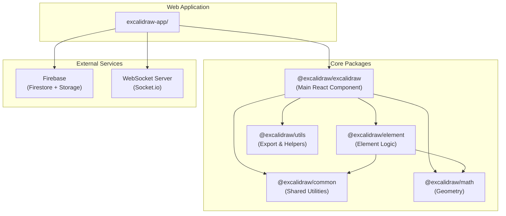
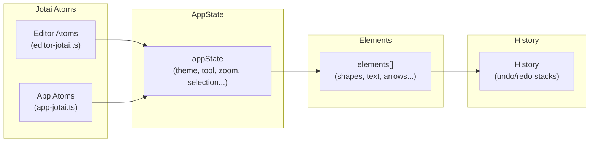
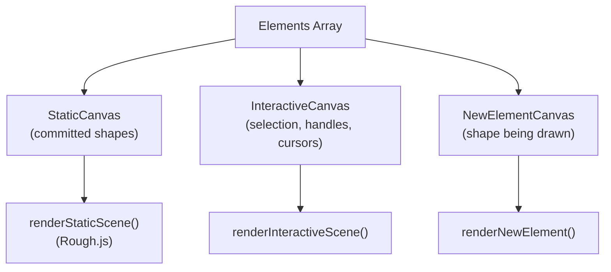
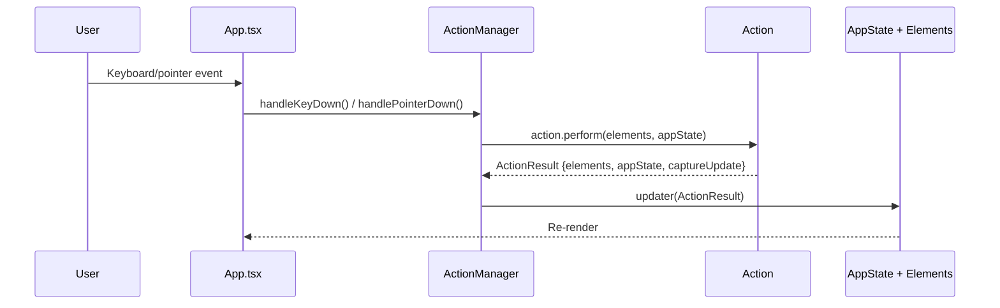

# Architecture Overview

## High-Level Summary

Excalidraw is an open-source virtual whiteboard built with **React** and **TypeScript**. The codebase is organized as a **Yarn workspaces monorepo** with a clear separation between the **reusable library** (published to npm as `@excalidraw/excalidraw`) and the **web application** (excalidraw.com).

### Tech Stack

| Layer | Technology |
|-------|-----------|
| UI Framework | React 19 + TypeScript 5.9 |
| State Management | Jotai (atomic state) + imperative `AppState` |
| Build System | Vite (app), esbuild (packages) |
| Testing | Vitest + jsdom + @testing-library/react |
| Canvas Rendering | HTML Canvas 2D + [Rough.js](https://roughjs.com/) (hand-drawn style) |
| Real-time Collaboration | Socket.io (WebSocket) |
| Backend Storage | Firebase Firestore + Firebase Storage |
| Styling | SCSS modules |
| Package Manager | Yarn (workspaces) |
| CI/CD | GitHub Actions |
| Containerization | Docker + nginx |

---

## Monorepo Architecture



---

## Package Responsibilities

### `packages/excalidraw/` — Main Editor Component

The heart of the project. Published to npm as `@excalidraw/excalidraw`.

- **`components/App.tsx`** — Main editor: canvas rendering, pointer/keyboard events, tool management, state orchestration
- **`actions/`** — Atomic operations (copy, paste, delete, style changes, zoom, etc.)
- **`renderer/`** — Canvas rendering pipeline (static scenes, interactive overlays, SVG export)
- **`scene/`** — Scene export (PNG, SVG, clipboard), render configurations
- **`data/`** — Serialization, deserialization, encryption, compression, reconciliation
- **`components/`** — All UI: menus, sidebars, color picker, font picker, library, command palette
- **`hooks/`** — Custom React hooks
- **`fonts/`** — Font loading and subsetting (Virgil, Excalifont, Nunito, etc.)
- **`locales/`** — i18n translations (managed via Crowdin)

### `packages/element/` — Element System

All logic for manipulating drawing elements (shapes, text, arrows, images, frames).

- **`types.ts`** — Element type definitions (`ExcalidrawRectangleElement`, `ExcalidrawArrowElement`, etc.)
- **`Scene.ts`** — Scene state management with fractional indexing
- Modules: binding, bounds, collision detection, crop, delta, duplicate, groups, transform, z-index

### `packages/common/` — Shared Utilities

Cross-package utilities used by all other packages.

- Constants (`APP_NAME`, `CURSOR_TYPE`, `POINTER_BUTTON`, `THEME`, `MIME_TYPES`)
- Binary heap, color utilities, key constants, event emitter, queue
- Font metadata, URL helpers, random ID generation

### `packages/math/` — Geometry Primitives

Pure mathematical operations with no UI dependencies.

- Points, vectors, angles, segments, lines
- Curves, ellipses, polygons, rectangles, triangles

### `packages/utils/` — Export & Bounds Utilities

Higher-level utilities for consumers of the library.

- `exportToCanvas`, `exportToSvg`, `exportToBlob`
- `withinBounds`, shape utilities, bounding box calculations

### `excalidraw-app/` — Web Application

The full-featured application at excalidraw.com, built on top of `@excalidraw/excalidraw`.

- **`App.tsx`** — App shell: scene initialization, URL routing, localStorage, collaboration wiring
- **`collab/`** — Real-time collaboration (Socket.io + Firebase)
- **`data/`** — Firebase integration, local persistence, file management, tab sync
- **`components/`** — App-specific UI (menus, share dialog, welcome screen, AI features)

---

## Dependency Graph

```
@excalidraw/excalidraw
├── @excalidraw/element
│   ├── @excalidraw/common
│   └── @excalidraw/math
├── @excalidraw/common
├── @excalidraw/math
└── @excalidraw/utils

excalidraw-app
└── @excalidraw/excalidraw (+ Firebase, Socket.io, Sentry)
```

Key rule: packages only depend **downward**. `common` and `math` have no internal dependencies. `element` depends on `common` and `math`. `excalidraw` depends on everything.

---

## State Management Architecture



State is managed through two complementary systems:

1. **Jotai atoms** — Fine-grained reactive state for UI components. The editor uses `EditorJotaiProvider` (scoped per editor instance) and the app adds `AppJotaiProvider`.
2. **`AppState`** — A large flat object containing all editor state (current tool, theme, zoom, selection, collaborators, etc.). Defined in `packages/excalidraw/appState.ts`.
3. **Elements array** — The source of truth for all drawing content. Each element is immutable; changes create new objects with incremented `version`.

---

## Rendering Architecture



The editor uses a **multi-canvas architecture**:

- **StaticCanvas** — Renders all committed elements using Rough.js for the hand-drawn aesthetic
- **InteractiveCanvas** — Overlays selection boxes, resize handles, remote cursors
- **NewElementCanvas** — Renders the element currently being drawn (before commit)

This separation allows the static layer to be cached and only re-rendered when elements change, while the interactive layer updates on every pointer move.

---

## Data Flow: User Action → State Update



Every user interaction flows through the **Action system**. Actions are pure functions that receive current state and return new state, making them predictable and testable.
