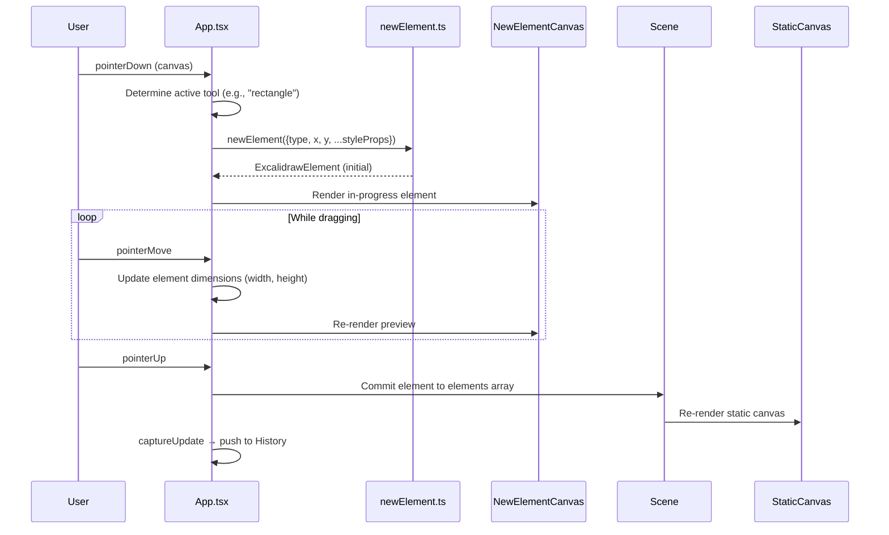
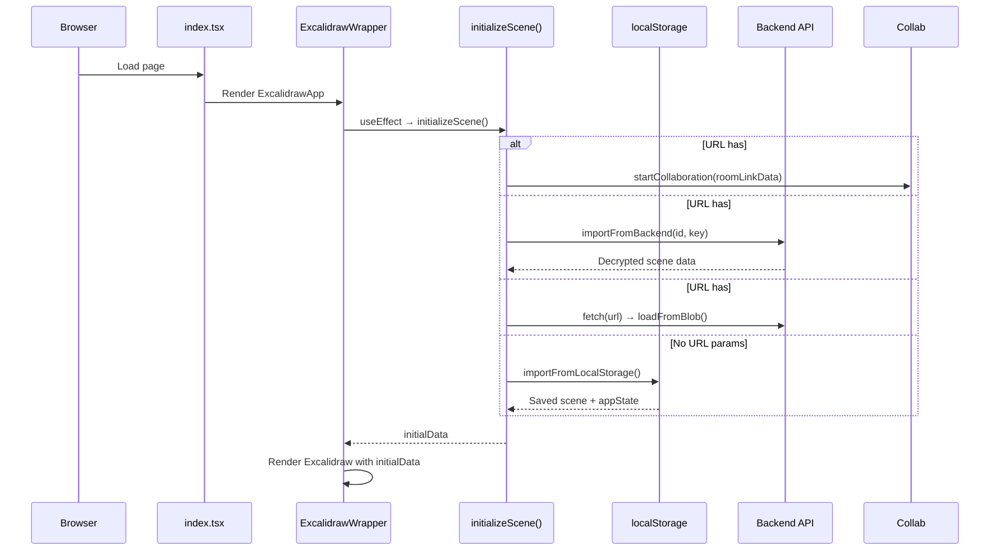
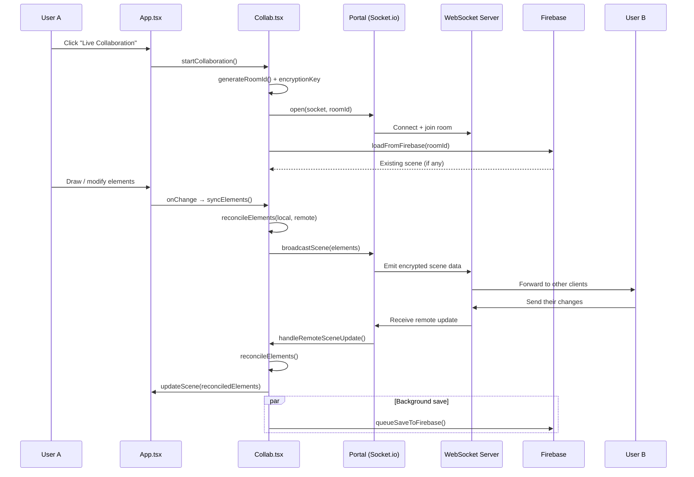
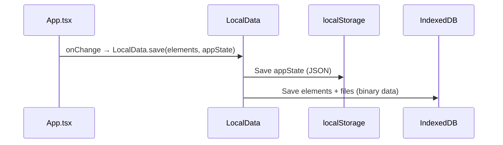
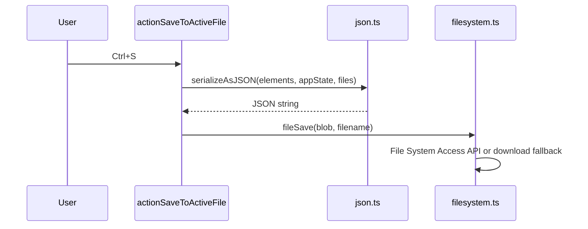
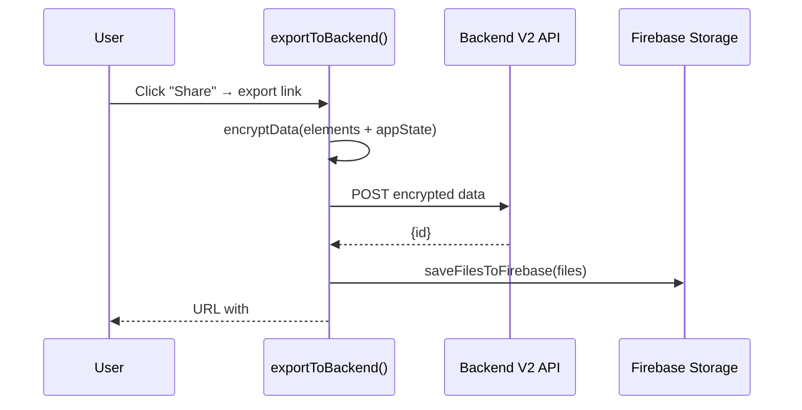
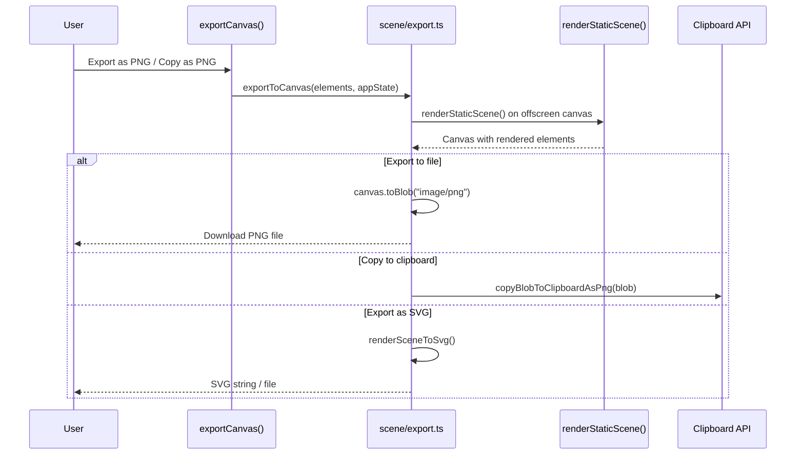
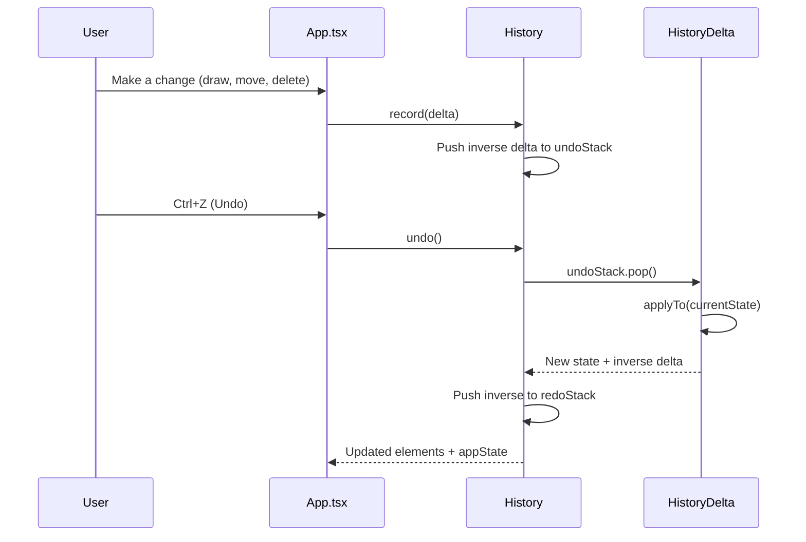
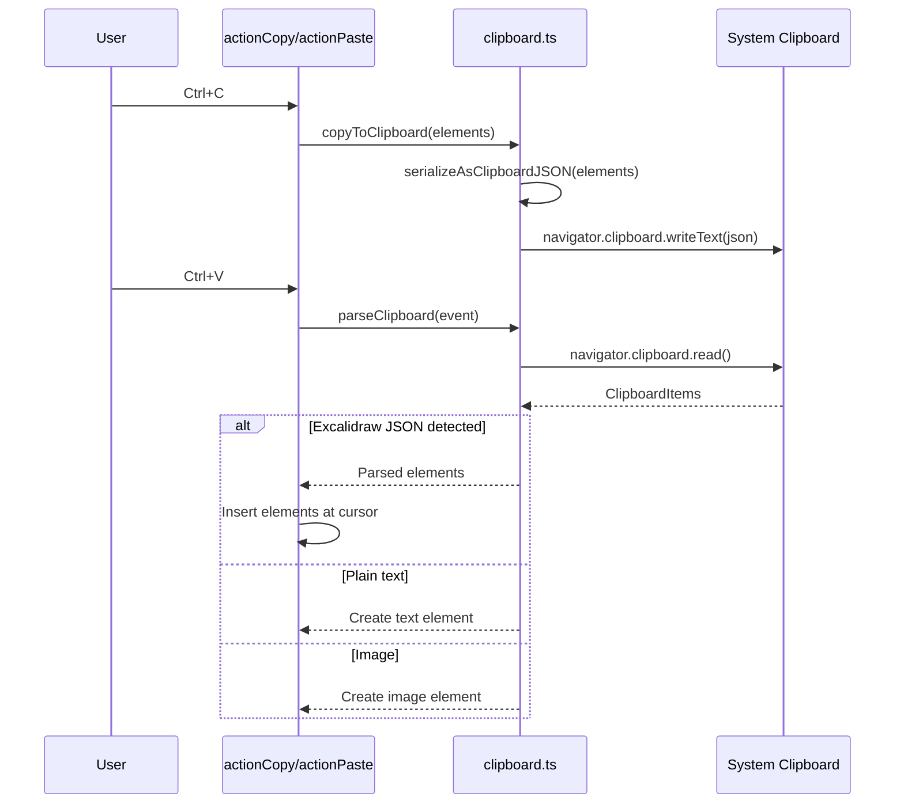
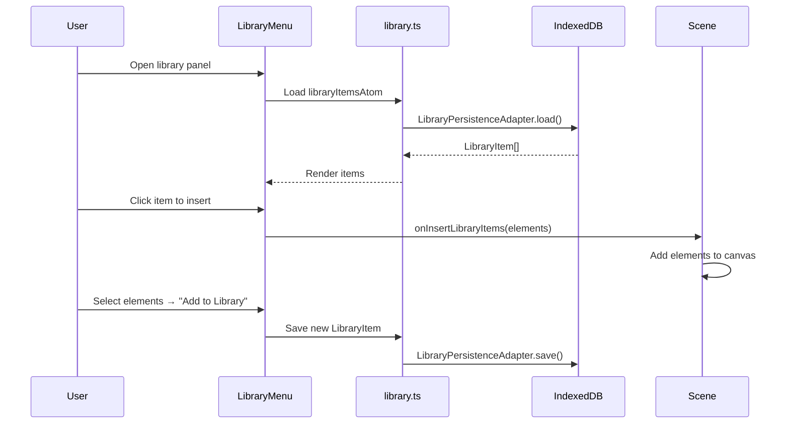

# Key Business Flows

This document covers the most important data flows in Excalidraw. Understanding these will help you reason about how user interactions translate to state changes, persistence, and collaboration.

---

## 1. Drawing an Element

When a user clicks and drags on the canvas to draw a shape:

**Key files:**
- `packages/excalidraw/components/App.tsx` — pointer event handlers
- `packages/element/src/newElement.ts` — element factory functions
- `packages/excalidraw/components/canvases/NewElementCanvas.tsx` — preview rendering
- `packages/element/src/Scene.ts` — scene state management

---

## 2. App Bootstrap & Scene Loading

When the app first loads:

**Key files:**
- `excalidraw-app/App.tsx` — `initializeScene()` function (lines ~215–370)
- `excalidraw-app/data/index.ts` — `importFromBackend()`
- `excalidraw-app/data/localStorage.ts` — `importFromLocalStorage()`
- `packages/excalidraw/data/blob.ts` — `loadFromBlob()`

---

## 3. Real-Time Collaboration

When a user starts or joins a collaborative session:

**Key concepts:**
- **Room ID + encryption key** are encoded in the URL hash (never sent to server)
- **Reconciliation** merges local and remote elements by comparing `version` numbers — the higher version wins
- **Cursor sync** is a separate channel: `broadcastMouseLocation()` sends pointer position + username
- **Firebase** acts as durable storage; Socket.io is for real-time relay only

**Key files:**
- `excalidraw-app/collab/Collab.tsx` — orchestrates the collaboration lifecycle
- `excalidraw-app/collab/Portal.tsx` — Socket.io wrapper
- `packages/excalidraw/data/reconcile.ts` — `reconcileElements()` merge algorithm
- `packages/excalidraw/data/encryption.ts` — end-to-end encryption

---

## 4. Save & Load

### Local Persistence (Auto-save)

Every change triggers a debounced save to `localStorage` + `IndexedDB`:

### Export to File

### Share via Link

**Key files:**
- `excalidraw-app/data/LocalData.ts` — auto-save logic
- `packages/excalidraw/data/json.ts` — `serializeAsJSON()`, `saveAsJSON()`, `loadFromJSON()`
- `packages/excalidraw/data/filesystem.ts` — File System Access API wrapper
- `excalidraw-app/data/index.ts` — `exportToBackend()`, `importFromBackend()`

---

## 5. Export to Image (PNG/SVG)

**Key files:**
- `packages/excalidraw/scene/export.ts` — `exportToCanvas()`, `exportToSvg()`
- `packages/excalidraw/renderer/staticScene.ts` — `renderStaticScene()`
- `packages/excalidraw/renderer/staticSvgScene.ts` — `renderSceneToSvg()`
- `packages/excalidraw/data/image.ts` — PNG metadata embedding (scene data inside PNG)

---

## 6. Undo/Redo

**Key concepts:**
- History uses **deltas**, not full snapshots — this is memory-efficient
- Each `HistoryDelta` extends `StoreDelta` from `@excalidraw/element`
- `captureUpdate` in `ActionResult` controls whether the action is recorded in history

**Key files:**
- `packages/excalidraw/history.ts` — `History` class with `undoStack`/`redoStack`
- `packages/excalidraw/actions/actionHistory.tsx` — undo/redo action definitions

---

## 7. Clipboard (Copy/Paste)

**Key files:**
- `packages/excalidraw/clipboard.ts` — `copyToClipboard()`, `parseClipboard()`
- `packages/excalidraw/actions/actionClipboard.tsx` — copy/paste/cut actions

---

## 8. Library (Reusable Components)

**Key files:**
- `packages/excalidraw/components/LibraryMenu.tsx` — UI
- `packages/excalidraw/data/library.ts` — persistence adapter and Jotai atom
