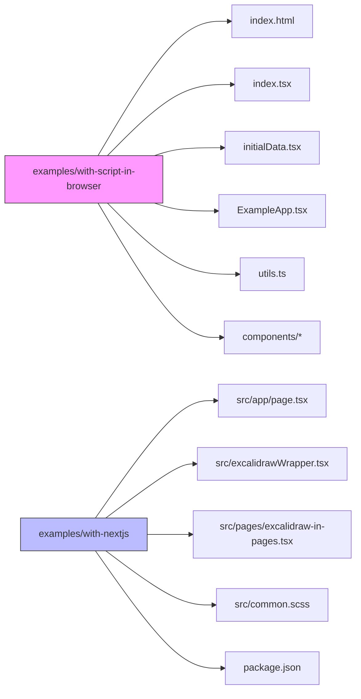
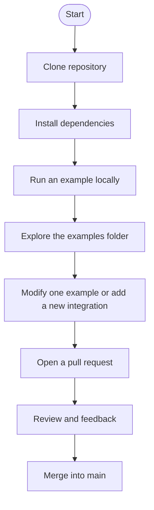

# Excalidraw Onboarding Guide

Welcome to the Excalidraw onboarding documentation. This guide is intended for new employees joining the Excalidraw project and focuses on the `examples/` folder from the Excalidraw repository.

---

## 1. Project Overview

Excalidraw is an open-source virtual whiteboard tool. The repository contains the core library, app features, and integration examples.

The `examples/` directory demonstrates how Excalidraw can be embedded and used in real applications.

### Key example projects

- `examples/with-script-in-browser`
  - A vanilla browser integration using Vite and plain HTML/TypeScript.
  - Good for understanding how to embed Excalidraw with minimal dependencies.
- `examples/with-nextjs`
  - A Next.js integration showing server-side rendering, routing, and app directory support.
  - Useful for React and Next.js developers.

---

## 2. Why the examples matter

The `examples/` folder serves several purposes:

- onboarding and learning for developers
- integration reference for library consumers
- regression testing for supported environments
- sample patterns for embedding Excalidraw in frameworks

## 3. Example architecture

This diagram shows the two main example apps and the key files used in each.

---

## 4. Onboarding flow for a new contributor

### Recommended first tasks

1. Clone the Excalidraw repository.
2. Open `examples/with-script-in-browser` and run the example.
3. Open `examples/with-nextjs` and inspect how Excalidraw is wrapped.
4. Explore the UI and the integration-specific code.

---

## 5. Running the example applications

### with-script-in-browser

1. Navigate to `examples/with-script-in-browser`
2. Install dependencies with `npm install` or `yarn install`
3. Start the dev server with `npm run dev` or `yarn dev`
4. Open the browser at the local URL shown in the terminal

### with-nextjs

1. Navigate to `examples/with-nextjs`
2. Install dependencies with `npm install` or `yarn install`
3. Start the Next.js app with `npm run dev` or `yarn dev`
4. Open `http://localhost:3000`

---

## 6. Example folder evaluation in tokens

The current token evaluation is based on the Excalidraw repository examples directory from the `master` branch.

### Text file token summary

- Total text files evaluated: 24
- Total tokens in examples text files: **27,470 tokens**
- Largest single text file by token count: `examples/with-script-in-browser/initialData.tsx` with **9,336 tokens**
- Second largest: `examples/with-script-in-browser/components/ExampleApp.tsx` with **6,372 tokens**

### Token distribution by example

- `examples/with-script-in-browser`: ~**19,000 tokens** across source files and configuration
- `examples/with-nextjs`: ~**8,400 tokens** across source files and configuration

> This token evaluation is useful for planning documentation, review scope, and understanding the size of code examples in natural language model contexts.

---

## 7. What to focus on first

- `examples/with-script-in-browser/index.tsx` and `ExampleApp.tsx` to learn the simplest Excalidraw integration flow.
- `examples/with-nextjs/src/excalidrawWrapper.tsx` to understand React and Next.js embedding.
- `examples/with-nextjs/src/pages/excalidraw-in-pages.tsx` to see page-based routing with Excalidraw.

## 8. Helpful tips

- Use the examples to test bug fixes in real embedding scenarios.
- Check if changes in Excalidraw core affect both example apps.
- Keep example apps minimal and focused on a single integration pattern.

---

## 9. Recommended follow-up reading

- Excalidraw core API documentation
- Excalidraw project CONTRIBUTING guide
- React and Next.js integration patterns

Good luck, and welcome to the Excalidraw team! If you want, I can also add a second document that compares the core library structure against the example apps.