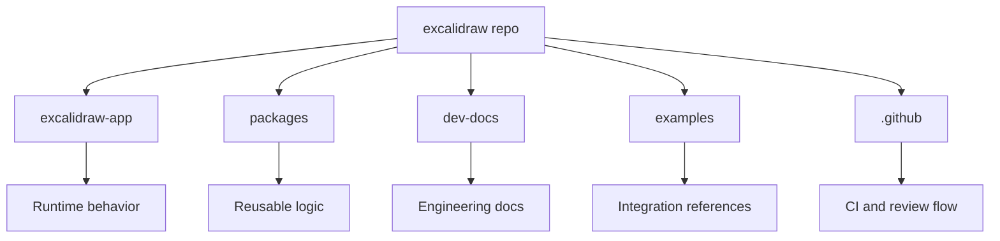
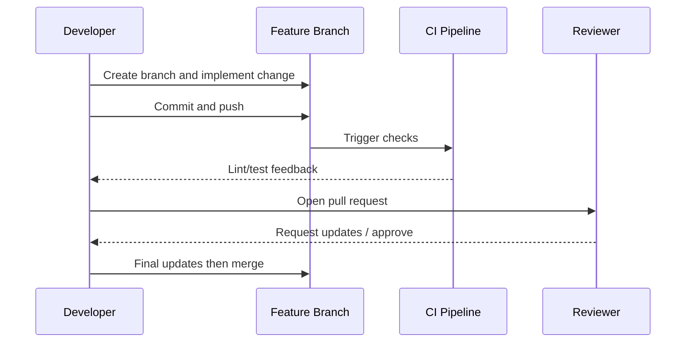

# Excalidraw Onboarding Guide

<div align="center">
  <p>
    <strong>Virtual whiteboard for sketching hand-drawn like diagrams.</strong><br/>
    Collaborative and end-to-end encrypted.
  </p>
</div>

[Upstream repository](https://github.com/excalidraw/excalidraw) • [Docs](https://docs.excalidraw.com) • [Contributing guide](https://docs.excalidraw.com/docs/introduction/contributing)

## What New Employees Should Know First

Excalidraw is a TypeScript-first monorepo. During onboarding, focus on understanding the app runtime (`excalidraw-app`), shared packages (`packages`), and contribution workflow (PR quality + tests + CI checks).

### Core Features (product context)

- Infinite hand-drawn style canvas
- Real-time collaboration and encrypted sharing
- Rich drawing tools and shape libraries
- Export to PNG, SVG, clipboard, and `.excalidraw` JSON
- Dark mode, i18n, and local-first behavior

## Repository Structure (Practical View)

```text
packages/            # Reusable editor modules and utilities
excalidraw-app/      # Main application (excalidraw.com)
dev-docs/            # Docusaurus technical docs
examples/            # Integration examples
scripts/             # Tooling, build and release scripts
.github/             # CI and contribution automation
```

### Diagram: Codebase Orientation



## First 5 Working Days Plan

### Day 1 - Setup and product context
- Read `README.md` and contribution docs.
- Run the app locally.
- Identify where the app bootstraps and where state lives.

### Day 2 - Trace one feature end-to-end
- Choose one feature (e.g., export, frames, dark mode).
- Follow UI interaction -> state change -> render/update.
- Note key files and boundaries.

### Day 3 - Package and docs deep-dive
- Inspect related modules in `packages/`.
- Compare behavior with docs in `dev-docs/`.
- Read one merged PR to match team style.

### Day 4 - First contribution
- Submit a safe docs/small fix PR.
- Run project checks locally.
- Include clear validation steps in PR text.

### Day 5 - Knowledge handoff
- Share a concise onboarding report:
  - explored modules,
  - delivered change,
  - open technical questions.

## Development Workflow



## Team Quality Expectations

- Keep PR scope focused.
- Explain problem, approach, and validation clearly.
- Add or update tests for behavior changes.
- Surface uncertainty early during review.

## Token Evaluation (Onboarding Scope)

The estimates below help plan AI-assisted exploration sessions.

Method:
- Approximation: `tokens ~= characters / 4`
- Usage: prompt/context planning, not billing-exact values

| Project Area | Approx chars | Approx tokens | Onboarding value |
|---|---:|---:|---|
| Root `README.md` | 8,000 | 2,000 | Product and setup overview |
| Contribution docs (`CONTRIBUTING`, intro docs) | 14,000 | 3,500 | Team workflow and standards |
| `dev-docs/docs/codebase/*` | 25,000 | 6,250 | Internal architecture understanding |
| `excalidraw-app/` selected feature files | 120,000 | 30,000 | Main runtime behavior |
| `packages/` selected modules | 80,000 | 20,000 | Shared APIs and logic |
| 3-5 merged PRs and discussions | 18,000 | 4,500 | Review style and expected quality |

Estimated first-pass onboarding budget: **~66,250 tokens**.

## Recommended AI Study Strategy

- Start docs-first, then move to one feature slice.
- Use narrow prompts (single question, single module).
- Avoid full-repo ingestion in one context window.
- Maintain onboarding notes as external memory across sessions.

