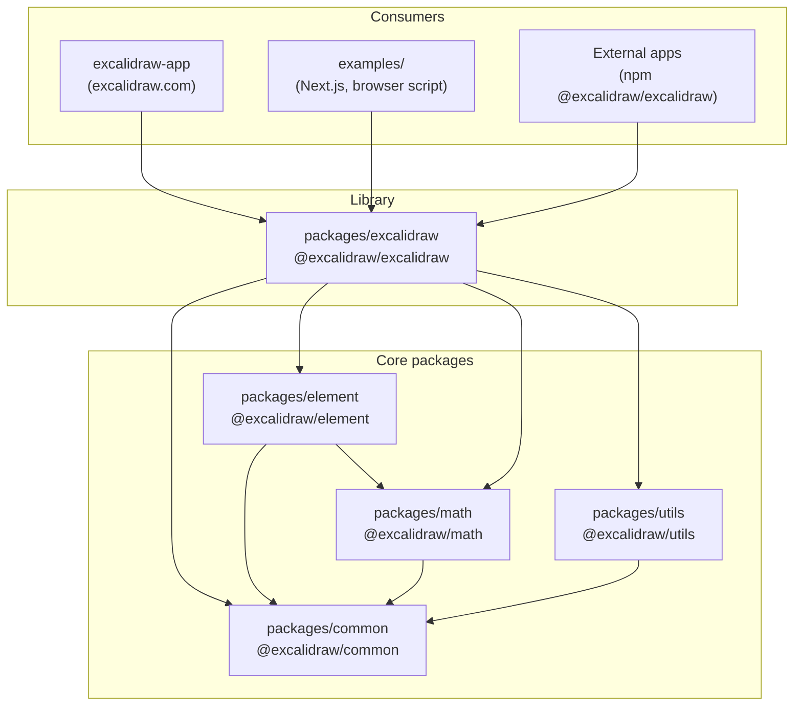
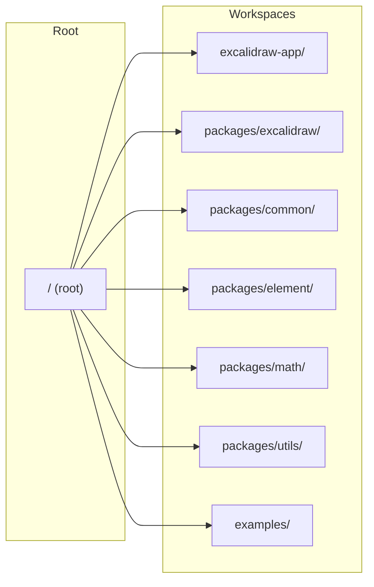
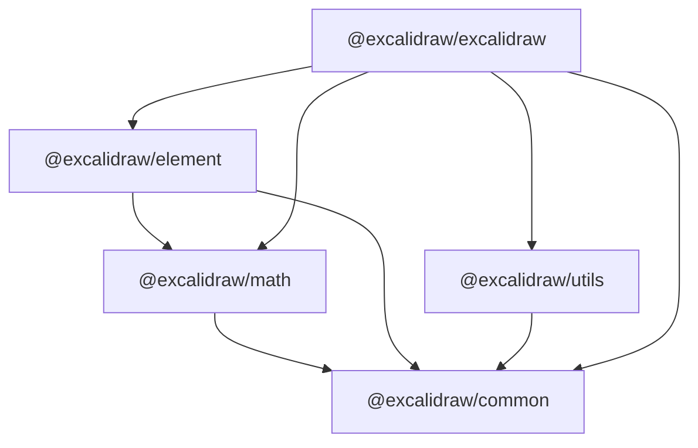
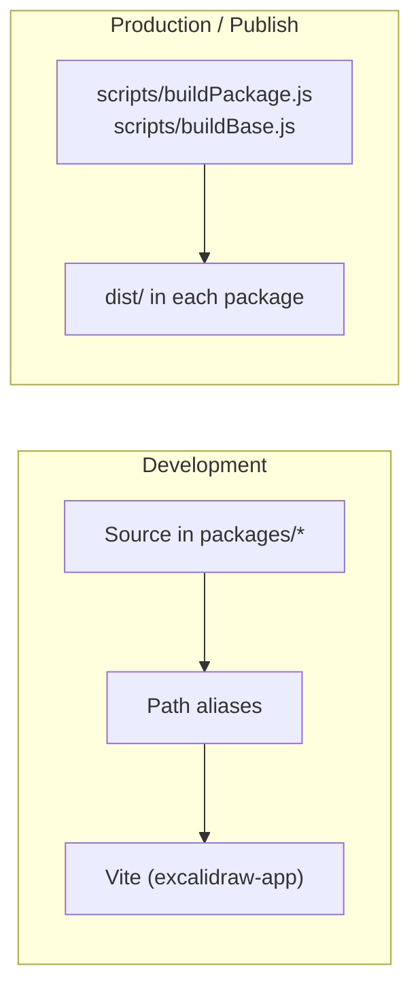

# Excalidraw — Onboarding for New Team Members

This guide helps new engineers get oriented in the Excalidraw monorepo: what the project is, how it’s structured, and how to work in it day to day.

---

## 1. What is Excalidraw?

Excalidraw is an **open-source virtual whiteboard** with a hand-drawn style. It is:

- **A React library** — The editor is published as `@excalidraw/excalidraw` on npm and can be embedded in any React app.
- **A hosted app** — [excalidraw.com](https://excalidraw.com) is a full-featured app (PWA, collaboration, E2E encryption, local-first) built on top of that library.

The repo is a **monorepo**: it contains both the library and the app, plus shared packages and examples.

---

## 2. High-Level Architecture

The following diagram shows how the main pieces of the repo relate.



**Takeaway:** All editor functionality lives in `packages/excalidraw`. The app in `excalidraw-app/` is one consumer of that library; the rest of the world uses it via npm.

---

## 3. Monorepo Layout



| Path | Purpose |
|------|--------|
| **`packages/excalidraw/`** | Main React editor component. Published as `@excalidraw/excalidraw`. |
| **`packages/common/`** | Shared constants, types, and utilities (e.g. theme, events). |
| **`packages/element/`** | Element types and logic (rectangles, arrows, text, etc.). Depends on `common`, `math`. |
| **`packages/math/`** | 2D math (vectors, bounds, collisions). Depends on `common`. |
| **`packages/utils/`** | Higher-level helpers (export, freehand, etc.). Used by the main package. |
| **`excalidraw-app/`** | Full web app (excalidraw.com): collaboration, persistence, UI shell. Uses the library via path aliases. |
| **`examples/`** | Integration examples (e.g. Next.js, plain browser script). |
| **`dev-docs/`** | Docusaurus site for [docs.excalidraw.com](https://docs.excalidraw.com). |
| **`scripts/`** | Build and release scripts (e.g. `buildPackage.js`, `buildBase.js`, `release.js`). |

---

## 4. Package Dependencies (Detail)

This diagram shows how the internal packages depend on each other.



- **common** — No internal Excalidraw deps; base for types and shared utilities.
- **math** — Only `common`.
- **element** — Element model and helpers; depends on `common` and `math`.
- **utils** — Depends on `common` (and may use other libs like Rough.js, etc.).
- **excalidraw** — The React editor; depends on all four.

When you change a lower-level package (e.g. `element`), you may need to rebuild that package (or run `yarn build:packages`) for the app and tests to see the change, depending on how you run the app (see below).

---

## 5. Where to Work

| Goal | Where to work |
|------|----------------|
| **Editor behavior, tools, rendering, elements** | `packages/excalidraw/` |
| **Element types and element-level logic** | `packages/element/` |
| **Math (bounds, vectors, hit-testing)** | `packages/math/` |
| **Shared constants, theme, events** | `packages/common/` |
| **Export, freehand, blob helpers** | `packages/utils/` |
| **excalidraw.com-only features** (collab, Firebase, share dialog, PWA, etc.) | `excalidraw-app/` |

**Important:** The app does **not** list `@excalidraw/excalidraw` in its `package.json`. At development time, **path aliases** in `tsconfig.json` and `excalidraw-app/vite.config.mts` resolve `@excalidraw/*` to the source under `packages/`. So when you run the app with `yarn start`, it uses the library (and other packages) from source.

---

## 6. Development Setup

### Prerequisites

- **Node.js** ≥ 18
- **Yarn** (v1 or v2.4.2+)
- **Git**

### One-time setup

```bash
git clone https://github.com/excalidraw/excalidraw.git
cd excalidraw
yarn
```

### Run the main app (excalidraw.com locally)

```bash
yarn start
```

This runs the **excalidraw-app** (Vite) and opens the app in the browser (default: http://localhost:3000). The app resolves `@excalidraw/excalidraw` and other `@excalidraw/*` packages to the monorepo source, so edits in `packages/excalidraw` (and other packages) are picked up by the dev server.

### Run the example app (library only)

To run the minimal example that uses the built library:

```bash
yarn build:packages
yarn start:example
```

This builds all packages and starts the example (e.g. http://localhost:3001). Use this when you want to test the library in isolation.

---

## 7. Essential Commands

Run these from the **repository root**.

| Command | Description |
|--------|-------------|
| `yarn` | Install dependencies for the whole monorepo. |
| `yarn start` | Start the excalidraw-app dev server (main way to develop). |
| `yarn build:packages` | Build all packages (common → math → element → excalidraw). |
| `yarn build` | Build the excalidraw-app for production. |
| `yarn test` | Run tests (Vitest) in watch mode. |
| `yarn test:update` | Run tests and update snapshots (run before committing). |
| `yarn test:typecheck` | Type-check the repo with TypeScript. |
| `yarn test:all` | Typecheck + lint + format checks + tests (no watch). |
| `yarn fix` | Auto-fix formatting (Prettier) and lint (ESLint). |

**Before committing:** run `yarn test:typecheck`, then `yarn test:update`, and `yarn fix` if needed.

---

## 8. Testing and Quality

- **Test runner:** Vitest (see root `vitest.config.mts`).
- **Path aliases:** Tests use the same `@excalidraw/*` aliases as the app, so they run against package **source**, not built output.
- **Coverage:** `yarn test:coverage`; thresholds are defined in `vitest.config.mts`.
- **TypeScript:** Strict mode; run `yarn test:typecheck` to verify.
- **Linting:** ESLint; `yarn fix:code` to auto-fix.
- **Formatting:** Prettier; `yarn fix:other` or `yarn fix` to format.

---

## 9. Build System (Simplified)



- **Development:** No need to build packages to run the app. `yarn start` uses Vite and path aliases so the app and tests use source from `packages/`.
- **Production / npm:** Packages are built with the scripts in `scripts/` (esbuild for packages, Vite for the app). Output goes to `dist/` in each package.

---

## 10. Key Concepts (for the editor)

- **Elements:** Everything drawn on the canvas (rectangle, ellipse, arrow, text, etc.) is an *element*. Types and helpers live in `@excalidraw/element`.
- **App state:** UI and canvas state (selection, zoom, tool, etc.) is separate from the element list; it’s often used via hooks and Jotai atoms in the library and app.
- **Library vs app:** The **library** (`packages/excalidraw`) is UI-agnostic about persistence and collaboration. The **app** (`excalidraw-app`) adds file handling, Firebase, Socket.io, share links, etc.

---

## 11. Where to Learn More

| Resource | Description |
|----------|-------------|
| [README.md](../README.md) | Project overview, features, quick start for npm users. |
| [CLAUDE.md](../CLAUDE.md) | Short project-structure and workflow summary (for AI/editors). |
| [docs.excalidraw.com](https://docs.excalidraw.com) | Official docs (source in `dev-docs/`). |
| [Development](https://docs.excalidraw.com/docs/introduction/development) | Setup and run instructions. |
| [Contributing](https://docs.excalidraw.com/docs/introduction/contributing) | PR flow, semantic commits, testing. |
| [Roadmap](https://github.com/orgs/excalidraw/projects/3) | Good place to pick issues (e.g. “Easy” for new contributors). |
| [Discord](https://discord.gg/UexuTaE) | Community and questions. |

---

## 12. Quick Checklist for New Engineers

1. Clone repo and run `yarn` then `yarn start`; confirm the app loads.
2. Skim this doc and the [Contributing](https://docs.excalidraw.com/docs/introduction/contributing) guide.
3. Run `yarn test:typecheck` and `yarn test:update` (and `yarn fix` if needed) so you know the baseline.
4. Decide your first task (e.g. from the roadmap); work in the right package (`packages/excalidraw`, `excalidraw-app`, etc.).
5. Use semantic PR titles (`feat:`, `fix:`, `docs:`, etc.) and ensure tests and typecheck pass before submitting.

Welcome to the team.
