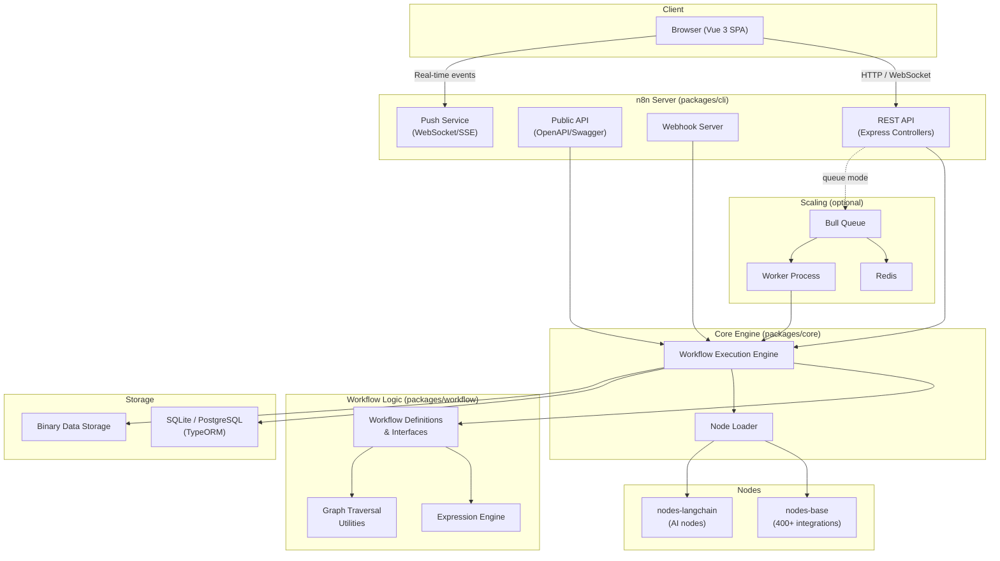
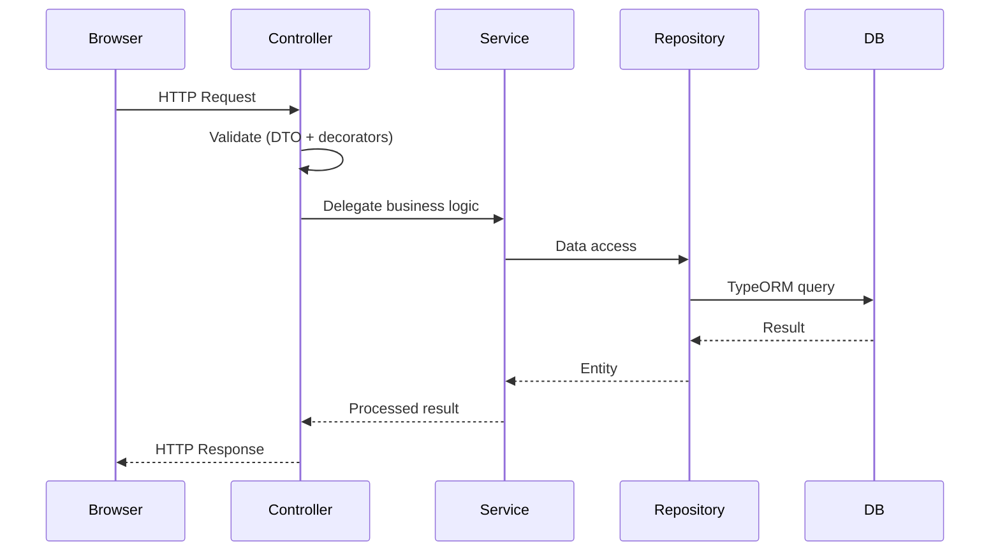
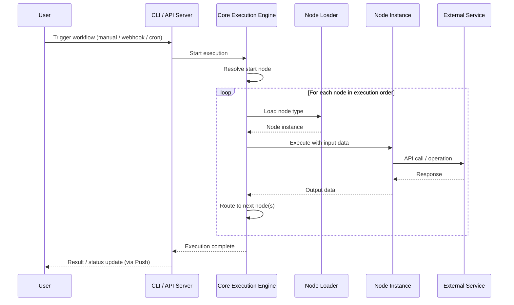
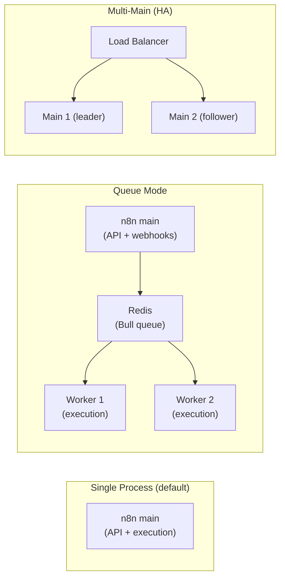

# 🚀 n8n Onboarding Guide for Software Engineers

Welcome to the **n8n** team! This guide will help you get up to speed with our
codebase, architecture, technologies, and development workflows. By the end of
this document you should be able to set up a local environment, understand how
the pieces fit together, and start contributing confidently.

---

## Table of Contents

- [What is n8n?](#what-is-n8n)
- [Technology Stack](#technology-stack)
- [Architecture Overview](#architecture-overview)
  - [High-Level Architecture](#high-level-architecture)
  - [Monorepo Structure](#monorepo-structure)
  - [Key Packages In-Depth](#key-packages-in-depth)
  - [Request Lifecycle](#request-lifecycle)
  - [Workflow Execution Flow](#workflow-execution-flow)
- [Key Architectural Patterns](#key-architectural-patterns)
- [Configuration System](#configuration-system)
- [Database & Migrations](#database--migrations)
- [Enterprise Edition (EE) Features](#enterprise-edition-ee-features)
- [Scaling Modes](#scaling-modes)
- [Development Environment Setup](#development-environment-setup)
  - [Prerequisites](#prerequisites)
  - [First-Time Setup](#first-time-setup)
  - [Running n8n Locally](#running-n8n-locally)
- [Day-to-Day Development Workflow](#day-to-day-development-workflow)
  - [Essential Commands](#essential-commands)
  - [Selective Development](#selective-development)
  - [Hot Reload](#hot-reload)
- [Code Quality & Testing](#code-quality--testing)
  - [Linting & Formatting](#linting--formatting)
  - [Type Checking](#type-checking)
  - [Unit Tests](#unit-tests)
  - [E2E Tests](#e2e-tests)
- [Coding Standards & Conventions](#coding-standards--conventions)
  - [TypeScript](#typescript)
  - [Backend](#backend)
  - [Frontend](#frontend)
  - [Error Handling](#error-handling)
- [Backend Modules System](#backend-modules-system)
- [Working with the Git Workflow](#working-with-the-git-workflow)
  - [PR Title Conventions](#pr-title-conventions)
- [Common Environment Variables](#common-environment-variables)
- [Troubleshooting](#troubleshooting)
- [Your First Week Checklist](#your-first-week-checklist)
- [Key Resources & Links](#key-resources--links)
- [Glossary](#glossary)

---

## What is n8n?

n8n (pronounced "n-eight-n") is a **workflow automation platform** that allows
users to connect different services and build automated workflows through a
visual, node-based editor. Think of it as an open-source alternative to Zapier
or Make (Integromat), but with the flexibility of a self-hosted, code-extensible
platform.

Key capabilities:
- **Visual workflow builder** – drag-and-drop node editor
- **400+ integrations** – built-in nodes for popular services
- **Code nodes** – write custom JavaScript/Python within workflows
- **AI/LangChain nodes** – native AI agent and chain support
- **Self-hostable** – run on your own infrastructure
- **Extensible** – build custom nodes and community packages

---

## Technology Stack

| Layer | Technology | Purpose |
|-------|-----------|---------|
| **Frontend** | Vue 3 + TypeScript | SPA workflow editor |
| **UI Framework** | Pinia | State management |
| **Build Tool (FE)** | Vite | Fast dev server & bundling |
| **Component Library** | `@n8n/design-system` | Reusable Vue components |
| **Storybook** | Storybook | Component documentation & development |
| **Backend** | Node.js + TypeScript + Express | REST API & CLI server |
| **ORM** | TypeORM | Database abstraction |
| **Database** | SQLite (dev) / PostgreSQL (prod) | Persistent storage |
| **DI Container** | `@n8n/di` | Dependency injection (IoC) |
| **Configuration** | `@n8n/config` | Centralized env-based config |
| **Monorepo Tooling** | pnpm workspaces + Turborepo | Package management & build orchestration |
| **Code Quality** | ESLint + Biome (formatting) | Linting & formatting |
| **Git Hooks** | Lefthook | Pre-commit checks |
| **Unit Tests (BE)** | Jest | Backend testing |
| **Unit Tests (FE)** | Vitest | Frontend testing |
| **E2E Tests** | Playwright | Browser-based integration tests |
| **HTTP Mocking** | nock | Server mocking in tests |
| **i18n** | `@n8n/i18n` | UI internationalization |
| **Feature Flags** | PostHog | Gradual rollouts |
| **Ticket Tracking** | Linear | Project management |

---

## Architecture Overview

### High-Level Architecture



### Monorepo Structure

The project is a **pnpm monorepo** with Turborepo orchestrating builds. Here is
how the packages are organized:

```
packages/
├── @n8n/
│   ├── api-types/           # Shared TypeScript interfaces (FE ↔ BE)
│   ├── backend-common/      # Shared backend utilities
│   ├── backend-test-utils/  # Shared test helpers for backend
│   ├── config/              # Centralized configuration management
│   ├── constants/           # Shared constants
│   ├── db/                  # Database entities, repositories & migrations
│   ├── decorators/          # TypeScript decorators
│   ├── di/                  # Dependency Injection (IoC container)
│   ├── errors/              # Shared error classes
│   ├── i18n/                # Internationalization strings
│   ├── nodes-langchain/     # AI/LangChain integration nodes
│   ├── permissions/         # Role & permission definitions
│   └── ...                  # More shared packages
├── cli/                     # Express server, REST API, CLI commands
├── core/                    # Workflow execution engine
├── frontend/
│   ├── @n8n/
│   │   ├── design-system/   # Vue component library
│   │   ├── i18n/            # UI translations
│   │   ├── rest-api-client/ # Typed API client
│   │   └── stores/          # Pinia state stores
│   └── editor-ui/           # Main Vue 3 frontend application
├── nodes-base/              # 400+ built-in integration nodes
├── workflow/                # Core workflow types & expression engine
├── node-dev/                # CLI tool for node development
└── testing/                 # E2E test suites (Playwright)
```

### Key Packages In-Depth

#### `packages/workflow` – The Heart of n8n

Defines the fundamental types and interfaces that everything else depends on:
- **Workflow definitions** – `Workflow` class and interfaces (`INode`,
  `IConnection`, `IWorkflowSettings`)
- **Expression engine** – Evaluates `{{ $json.field }}` expressions
- **Graph traversal** – Utilities for walking the workflow DAG (directed
  acyclic graph)
- **Type guards** – Runtime type checking helpers
- **Node interfaces** – `INodeType`, `INodeExecutionData`, etc.

#### `packages/core` – The Execution Engine

Responsible for **actually running** workflows:
- **Execution engine** – Orchestrates node-by-node execution
- **Node loader** – Dynamically loads node packages
- **Binary data** – Handles file/binary storage during execution
- **Credentials** – Encrypts/decrypts credential data
- **HTTP utilities** – Shared HTTP request handling

> ⚠️ **Contact the team before making significant changes to `packages/core`.**
> This is the most sensitive part of the codebase.

#### `packages/cli` – The Server

The Express-based application server:
- **Controllers** – REST API endpoints (auth, workflows, executions, etc.)
- **Services** – Business logic layer
- **Repositories** – TypeORM-based data access (via `@n8n/db`)
- **Modules** – Self-contained feature modules (insights, source control, LDAP,
  SSO, etc.)
- **Webhooks** – Incoming webhook handling
- **Push** – Real-time communication (WebSocket/SSE)
- **Scaling** – Queue-based execution (Bull/Redis)
- **Event bus** – Internal event-driven communication
- **Public API** – OpenAPI/Swagger-documented REST API at `packages/cli/src/public-api/`

#### `packages/frontend/editor-ui` – The Frontend

The Vue 3 single-page application:
- **`app/`** – App shell, router, global components, Pinia stores
- **`features/`** – Feature-based modules (AI, execution, credentials,
  workflows, settings, etc.)
- **`views/`** – Route-level page components
- **`components/`** – Shared UI components (in `app/components/`)
- **`composables/`** – Vue composition API utilities

#### `packages/@n8n/api-types` – The API Contract

Shared TypeScript interfaces and DTOs used by both frontend and backend. This
is the **single source of truth** for API request/response shapes. Always
define new API types here.

#### `packages/@n8n/db` – Database Layer

Contains all TypeORM **entities** (models), **repositories** (data access), and
**migrations** (schema changes). This is separate from `cli` so that other
packages can import entities without pulling in the entire server.

### Request Lifecycle



### Workflow Execution Flow



---

## Key Architectural Patterns

### 1. Dependency Injection (`@n8n/di`)

The backend uses an **IoC (Inversion of Control) container** for managing
service dependencies. Classes are registered and resolved automatically:

```typescript
import { Service } from '@n8n/di';

@Service()
class MyService {
  constructor(private readonly otherService: OtherService) {}
}
```

### 2. Controller → Service → Repository

Backend follows a strict layered pattern:

| Layer | Responsibility | Example |
|-------|---------------|---------|
| **Controller** | HTTP request/response handling, validation | `workflows.controller.ts` |
| **Service** | Business logic, orchestration | `workflows.service.ts` |
| **Repository** | Database access via TypeORM | `workflow.repository.ts` |

> 💡 Controllers must **never** contain business logic. They only validate the
> request, call a service method, and return the result.

### 3. Backend Modules

Self-contained feature units with their own controllers, services, entities,
and configuration. Activated via `N8N_ENABLED_MODULES` environment variable.
See [Backend Modules System](#backend-modules-system) for details.

### 4. Event-Driven Communication

The internal event bus allows decoupled communication between components.
Services emit events; other services subscribe without direct dependencies.

### 5. Frontend State Management (Pinia)

All frontend state lives in **Pinia stores** under
`packages/frontend/editor-ui/src/app/stores/` and
`packages/frontend/@n8n/stores/`. Stores are the single source of truth for
UI state and API data caching.

### 6. Design System

All reusable, pure Vue components live in `@n8n/design-system`. Feature-specific
components live in `editor-ui`. This ensures consistency and reusability
across the application.

---

## Configuration System

n8n uses the **`@n8n/config`** package for environment-based configuration.
Config classes use **decorators** to bind environment variables to typed
properties:

```typescript
import { Config, Env, Nested } from '@n8n/config';

@Config
class DatabaseConfig {
  @Env('DB_TYPE')
  type: 'sqlite' | 'postgresdb' = 'sqlite';

  @Env('DB_POSTGRESDB_HOST')
  host: string = 'localhost';

  @Nested
  logging: LoggingConfig;
}
```

Key points:
- All env vars are **typed and validated** at startup
- Supports `_FILE` suffixes for secrets (e.g., `DB_POSTGRESDB_PASSWORD_FILE`
  reads from a file – useful for Docker/Kubernetes secrets)
- The root config is `GlobalConfig` in `@n8n/config`, which nests all other
  configs
- **Never add new env vars to the deprecated `packages/cli/src/config/schema.ts`**
  – always use `@n8n/config` decorators

> 💡 To find which env var controls a behavior, search for `@Env('N8N_...')` in
> the `@n8n/config` package.

---

## Database & Migrations

### Supported Databases

| Database | Usage | Connection Env Var |
|----------|-------|--------------------|
| **SQLite** | Default for development & small deployments | `DB_TYPE=sqlite` |
| **PostgreSQL** | Recommended for production | `DB_TYPE=postgresdb` |

### Entities & Repositories

- **Entities** (TypeORM models) live in `packages/@n8n/db/src/entities/`
- **Repositories** (data access) live in `packages/@n8n/db/src/repositories/`
- Module-specific entities can be defined inside the module and registered via
  the `entities()` method in the module entrypoint

### Migrations

Migrations live in `packages/@n8n/db/src/migrations/` and are split by
database type:

```
migrations/
├── common/              # Shared migrations (use DSL)
├── postgresdb/          # PostgreSQL-specific migrations
├── sqlite/              # SQLite-specific migrations
└── dsl/                 # Migration DSL helpers
```

> ⚠️ Migrations are **always** centralized (even for module features) because
> conditionally running migrations would introduce unwanted complexity. This
> means schema changes are applied to the database regardless of whether a
> module is enabled.

---

## Enterprise Edition (EE) Features

n8n has a **Community Edition** (open source) and an **Enterprise Edition**
(licensed). You'll encounter this distinction frequently in the codebase.

### File Naming Convention

Files and directories related to Enterprise Edition use the **`.ee.`** infix:

```
my-feature.controller.ee.ts     # Enterprise-only controller
my-feature.service.ee.ts         # Enterprise-only service
external-secrets.ee/             # Enterprise-only module directory
SettingsSecretsProviders.ee.vue  # Enterprise-only Vue component
```

This convention makes it easy to identify which code is license-gated.

### License Flags

Enterprise features are gated by license flags. There are two approaches:

1. **Module-level**: The entire module is skipped on startup if the license is
   absent:
   ```typescript
   @BackendModule({
     name: 'external-secrets',
     licenseFlag: 'feat:externalSecrets',
   })
   ```

2. **Endpoint-level**: Individual endpoints are gated using the `@Licensed()`
   decorator:
   ```typescript
   @Get('/dashboard')
   @Licensed('feat:insights:viewDashboard')
   async getDashboard() { ... }
   ```

### Testing Enterprise Features

- Enterprise E2E tests use the `@licensed` tag and only run in container mode
- Ask your team in Slack for the sandbox license key if you need to test
  enterprise features locally

---

## Scaling Modes

n8n can run in different modes depending on the deployment size:



| Mode | Description | Key Env Vars |
|------|-------------|-------------|
| **Default** | Single process, everything runs together | (none needed) |
| **Queue** | Separates API from execution via Redis/Bull | `EXECUTIONS_MODE=queue` |
| **Multi-Main** | Multiple main instances with leader election | `N8N_MULTI_MAIN_SETUP_ENABLED=true` |

You can test different configurations locally using **Testcontainers**:

```bash
pnpm --filter n8n-containers stack:sqlite    # SQLite
pnpm --filter n8n-containers stack:postgres  # PostgreSQL
pnpm --filter n8n-containers stack:queue     # Queue mode
pnpm --filter n8n-containers stack:multi-main # Multi-main HA
```

---

## Development Environment Setup

### Prerequisites

| Tool | Version | Installation |
|------|---------|-------------|
| **Node.js** | ≥ 22.16 | [nodejs.org](https://nodejs.org/) |
| **pnpm** | ≥ 10.22.0 | Via corepack (see below) |
| **Git** | Latest | [git-scm.com](https://git-scm.com/) |
| **Docker** | Latest (optional) | For container-based testing |

**Enable corepack (recommended):**

```bash
corepack enable
corepack prepare pnpm@10.22.0 --activate
```

> ⚠️ **Windows users:** Run `corepack enable` in an **Administrator** terminal.

**Build tools (Windows):**

```bash
npm add -g windows-build-tools
```

### First-Time Setup

```bash
# 1. Clone the repository
git clone https://github.com/n8n-io/n8n.git
cd n8n

# 2. Install all dependencies (links workspace packages automatically)
pnpm install

# 3. Build all packages (redirect output to log file per convention)
pnpm build > build.log 2>&1

# 4. Check for build errors
# Linux/macOS:
tail -n 20 build.log
# Windows PowerShell:
Get-Content build.log -Tail 20
```

> 💡 The first build takes several minutes. Subsequent builds are faster thanks
> to Turborepo caching.

### Running n8n Locally

**Full-stack development (recommended for most work):**

```bash
pnpm dev
```

This starts the backend, frontend dev server, and watchers in parallel.

**After startup, open:** [http://localhost:5678](http://localhost:5678)

On first launch, you'll be prompted to create an **owner account** – this is
stored in the local database at `~/.n8n/`.

---

## Day-to-Day Development Workflow

### Essential Commands

| Command | Description |
|---------|-------------|
| `pnpm install` | Install dependencies |
| `pnpm build > build.log 2>&1` | Build all packages |
| `pnpm dev` | Start full-stack development mode |
| `pnpm dev:be` | Backend-only development |
| `pnpm dev:fe` | Frontend-only development |
| `pnpm dev:ai` | AI/LangChain nodes development |
| `pnpm start` | Start in production mode |
| `pnpm test` | Run all tests |
| `pnpm test:affected` | Run tests affected by recent changes |
| `pnpm lint` | Lint all packages |
| `pnpm typecheck` | Type-check all packages |
| `pnpm format` | Format code with Biome |
| `pnpm clean` | Clean all build artifacts |
| `pnpm reset` | Full reset (clean + remove `node_modules`) |

### Selective Development

For better performance, run only the packages you need:

```bash
# Terminal 1: Backend only
cd packages/cli
pnpm dev

# Terminal 2: Frontend only
cd packages/frontend/editor-ui
pnpm dev
```

> 💡 Use `pushd` / `popd` to navigate directories and easily return.

> ⚠️ If you change code outside `packages/cli` or `packages/frontend/editor-ui`
> (e.g., in `packages/workflow` or `packages/core`), you need to **rebuild**
> that package before your changes take effect: `cd packages/workflow && pnpm build`

### Hot Reload

- **Frontend:** Vite HMR – changes appear instantly in the browser
- **Backend:** Nodemon auto-restarts on file changes
- **Nodes:** Set `N8N_DEV_RELOAD=true` for node hot reload:

```bash
cd packages/cli
N8N_DEV_RELOAD=true pnpm dev
```

### Clean Database for Testing

```bash
# Use a separate data folder to avoid losing your main setup
N8N_USER_FOLDER=~/.n8n-test/ pnpm dev

# Or just delete ~/.n8n to start completely fresh (you'll lose local data!)
```

---

## Code Quality & Testing

### Linting & Formatting

```bash
# Lint a specific package (recommended during development)
cd packages/cli
pnpm lint

# Format code
pnpm format
```

> ⚠️ Always run lint and typecheck **before committing**. Lefthook git hooks
> will also run checks automatically.

### Type Checking

```bash
# Typecheck a specific package
cd packages/cli
pnpm typecheck

# Typecheck everything (before final PR)
pnpm typecheck
```

> If your changes affect type definitions or cross-package interfaces, **build
> first** then typecheck.

### Unit Tests

| Area | Framework | Run Command |
|------|-----------|-------------|
| Backend | Jest | `cd packages/cli && pnpm test` |
| Frontend | Vitest | `cd packages/frontend/editor-ui && pnpm test` |
| Nodes | Jest | `cd packages/nodes-base && pnpm test` |

```bash
# Run a specific test file
cd packages/cli
pnpm test src/modules/insights/__tests__/insights.service.test.ts
```

- **Mock all external dependencies** in unit tests
- Use **nock** for HTTP server mocking
- Backend tests use **jest-mock-extended** for type-safe mocks
- Set `COVERAGE_ENABLED=true` to generate coverage reports in `coverage/`

### E2E Tests

```bash
# Run Playwright E2E tests locally
pnpm --filter=n8n-playwright test:local

# Interactive UI mode (great for debugging)
pnpm --filter=n8n-playwright test:local --ui

# Run specific test by name
pnpm --filter=n8n-playwright test:local --grep="workflow execution"
```

> 💡 Tests tagged with `@licensed` are **skipped** in local mode and only run
> in container mode where an enterprise license is available.

See `packages/testing/playwright/README.md` for the full guide.

---

## Coding Standards & Conventions

### TypeScript

- ❌ **NEVER use `any`** – use proper types or `unknown`
- ❌ **Avoid `as` type casting** – use type guards or type predicates instead
  (exception: test code where `as` is acceptable)
- ❌ **Never use `ts-ignore`**
- ✅ **Define shared interfaces** in `@n8n/api-types` for FE/BE communication
- ✅ **Use strict TypeScript** – the project enforces strict mode

### Backend

- Use **`@n8n/di`** for dependency injection – don't manually instantiate
  services
- Follow the **Controller → Service → Repository** pattern
- Import error classes from the appropriate package (`UnexpectedError`,
  `OperationalError`, or `UserError`)
- ❌ Don't use `ApplicationError` – it's deprecated
- Use **backend modules** for new features (see below)
- Add new configuration via `@n8n/config` decorators, **not** the deprecated
  `packages/cli/src/config/schema.ts`
- Use the **workflow traversal utilities** from `n8n-workflow`:

```typescript
import {
  getParentNodes,
  getChildNodes,
  mapConnectionsByDestination,
} from 'n8n-workflow';

// Parent nodes require inverted connections
const connectionsByDest = mapConnectionsByDestination(workflow.connections);
const parents = getParentNodes(connectionsByDest, 'NodeName', 'main', 1);

// Child nodes use connections directly
const children = getChildNodes(workflow.connections, 'NodeName', 'main', 1);
```

### Frontend

- ✅ **All UI text must use i18n** – add translations in `@n8n/i18n`
- ✅ **Use CSS variables** – never hardcode spacing as `px` values
- ✅ **`data-testid` must be a single value** (no spaces)
- ✅ **Use design system components** from `@n8n/design-system`
- ✅ **Use centralized debounce constants** from `@/app/constants/durations`

**CSS variables quick reference:**

```css
/* Spacing: --spacing--5xs (2px) through --spacing--5xl (256px) */
/* Font sizes: --font-size--3xs (10px) through --font-size--2xl (28px) */
/* Colors: --color--primary, --color--success, --color--danger, etc. */
/* Borders: --radius--sm (2px), --radius (4px), --radius--lg (8px) */
```

See `packages/frontend/AGENTS.md` for the complete CSS variables reference.

### Error Handling

```typescript
// ✅ Correct – use specific error classes
import { UnexpectedError } from '@n8n/errors';
import { OperationalError } from '@n8n/errors';

throw new UnexpectedError('Something went wrong internally');
throw new OperationalError('External service unavailable');

// ❌ Wrong – ApplicationError is deprecated
throw new ApplicationError('...');
```

---

## Backend Modules System

New backend features should be implemented as **modules** – self-contained
units with their own controllers, services, entities, and configuration.

**Create a new module:**

```bash
pnpm setup-backend-module
```

**Module structure:**

```
packages/cli/src/modules/my-feature/
├── __tests__/
│   ├── my-feature.controller.test.ts
│   └── my-feature.service.test.ts
├── my-feature.module.ts        # Entrypoint (@BackendModule decorator)
├── my-feature.controller.ts    # REST endpoints
├── my-feature.service.ts       # Business logic
├── my-feature.repository.ts    # Data access
├── my-feature.entity.ts        # TypeORM entity
├── my-feature.config.ts        # Environment variables
└── my-feature.constants.ts     # Constants
```

**Module entrypoint example:**

```typescript
@BackendModule({ name: 'my-feature' })
export class MyFeatureModule implements ModuleInterface {
  async init() {
    await import('./my-feature.controller');
    const { MyFeatureService } = await import('./my-feature.service');
    Container.get(MyFeatureService).start();
  }
}
```

Key module decorators:
- `@BackendModule()` – defines the module entrypoint
- `@RestController('/path')` – defines a REST controller
- `@Get()`, `@Post()`, `@Put()`, `@Delete()` – HTTP method decorators
- `@Query()`, `@Body()` – request validation
- `@GlobalScope()` / `@ProjectScope()` – permission gating
- `@Licensed('feat:...')` – license-flag gating
- `@OnShutdown()` – cleanup on instance shutdown

Modules are enabled/disabled via environment variables:
- `N8N_ENABLED_MODULES=my-feature,other-feature`
- `N8N_DISABLED_MODULES=insights`

Modules can be restricted to specific instance types:
```typescript
@BackendModule({
  name: 'my-feature',
  instanceTypes: ['main', 'webhook'],  // won't run on workers
})
```

For the full guide, see `scripts/backend-module/backend-module-guide.md`.

---

## Working with the Git Workflow

### Branch Naming

We use **Linear** for ticket tracking. When starting a new ticket:

1. Go to the Linear ticket
2. Use the **branch name suggested by Linear**
3. Create a branch from a fresh `master`:

```bash
git checkout master
git pull origin master
git checkout -b <linear-suggested-branch-name>
```

### Pull Requests

- Create **draft PRs** with `gh pr create --draft`
- Follow conventions in `.github/pull_request_title_conventions.md`
- Reference the Linear ticket: `https://linear.app/n8n/issue/[TICKET-ID]`
- Link to the GitHub issue if mentioned in the Linear ticket
- Keep PRs **small and focused** – one feature or fix per PR
- **Tests are required** – unit tests, workflow tests for nodes, UI tests
  when applicable

### PR Title Conventions

PR titles follow the [Angular Commit Convention](https://github.com/angular/angular/blob/master/CONTRIBUTING.md#commit):

```
<type>(<scope>): <summary>
```

**Types:**

| Type | Description | In Changelog? |
|------|------------|---------------|
| `feat` | A new feature | ✅ |
| `fix` | A bug fix | ✅ |
| `perf` | Performance improvement | ✅ |
| `refactor` | Code restructuring | ❌ |
| `test` | Test changes | ❌ |
| `docs` | Documentation | ❌ |
| `build` | Build system / dependencies | ❌ |
| `ci` | CI configuration | ❌ |
| `chore` | Routine maintenance | ❌ |

**Scopes:** `API`, `core`, `editor`, `* Node` (e.g., `Slack Node`)

**Examples:**
- `feat(editor): Add dark mode toggle`
- `fix(core): Prevent duplicate webhook registrations`
- `refactor(Slack Node): Simplify message formatting`

> 💡 Append `(no-changelog)` to the summary if the PR should not appear in
> release notes.

### Pre-Commit Checklist

```bash
# 1. Lint your package
cd packages/cli   # (or whichever package you changed)
pnpm lint

# 2. Type-check your package
pnpm typecheck

# 3. Run tests
pnpm test

# 4. Build if you changed cross-package types
pnpm build > build.log 2>&1
```

---

## Common Environment Variables

| Variable | Default | Description |
|----------|---------|-------------|
| `N8N_PORT` | `5678` | HTTP port |
| `N8N_HOST` | `localhost` | Host name |
| `N8N_PROTOCOL` | `http` | Protocol (http/https) |
| `N8N_PATH` | `/` | Base path |
| `N8N_USER_FOLDER` | `~` | Parent of the `.n8n` data directory |
| `N8N_ENCRYPTION_KEY` | (auto-generated) | Key for credential encryption |
| `DB_TYPE` | `sqlite` | Database type (`sqlite` / `postgresdb`) |
| `DB_POSTGRESDB_HOST` | `localhost` | PostgreSQL host |
| `DB_POSTGRESDB_PORT` | `5432` | PostgreSQL port |
| `DB_POSTGRESDB_DATABASE` | `n8n` | PostgreSQL database name |
| `EXECUTIONS_MODE` | `regular` | Execution mode (`regular` / `queue`) |
| `N8N_ENABLED_MODULES` | – | Comma-separated modules to enable |
| `N8N_DISABLED_MODULES` | – | Comma-separated modules to disable |
| `N8N_DEV_RELOAD` | `false` | Enable hot reload for nodes |
| `N8N_LOG_LEVEL` | `info` | Log level (`debug`, `info`, `warn`, `error`) |
| `N8N_DIAGNOSTICS_ENABLED` | `true` | Enable telemetry |

> 💡 All env vars support `_FILE` suffix for Docker/Kubernetes secrets
> (e.g., `DB_POSTGRESDB_PASSWORD_FILE=/run/secrets/db-password`).

---

## Troubleshooting

### Build Fails

```bash
# Check the build log for errors
Get-Content build.log -Tail 50   # Windows
tail -n 50 build.log             # macOS/Linux

# Try a clean rebuild
pnpm clean
pnpm install
pnpm build > build.log 2>&1
```

### `pnpm install` Issues

```bash
# Full reset if node_modules are corrupted
pnpm reset
pnpm install
```

### TypeScript Errors After Pulling New Changes

If you see type errors after `git pull`, it's likely because a dependency
package's types changed:

```bash
pnpm build > build.log 2>&1   # Rebuild everything first
pnpm typecheck                  # Then typecheck
```

### Port Already in Use

Another process is using port 5678:

```bash
# Change the port
N8N_PORT=5679 pnpm dev
```

### Database Schema Errors

If you see migration errors after switching branches:

```bash
# Delete the local database and start fresh
rm -rf ~/.n8n/database.sqlite  # Linux/macOS
Remove-Item ~\.n8n\database.sqlite  # Windows PowerShell
```

Or use a separate data folder per branch:

```bash
N8N_USER_FOLDER=~/.n8n-branch-name/ pnpm dev
```

---

## Your First Week Checklist

- [ ] **Day 1:** Clone the repo, run `pnpm install && pnpm build`, start with
  `pnpm dev`, and create your owner account at `localhost:5678`
- [ ] **Day 1:** Create a simple test workflow in the UI (e.g., Manual Trigger →
  Set → IF → NoOp) to understand the product
- [ ] **Day 2:** Read through this guide and the `CONTRIBUTING.md`
- [ ] **Day 2:** Explore the codebase – look at a controller, a service, and a
  repository to see the backend pattern in action
- [ ] **Day 3:** Set up your IDE – install ESLint, Biome, and Vue extensions
- [ ] **Day 3:** Try running the linter, typechecker, and tests for one package
- [ ] **Day 4:** Pick a small "good first issue" or starter ticket from Linear
- [ ] **Day 4:** Create a branch, make the change, and run the pre-commit
  checklist
- [ ] **Day 5:** Open your first draft PR following the title conventions
- [ ] **Day 5:** Explore the Playwright E2E tests – run one in `--ui` mode to
  see how they work

---

## Key Resources & Links

| Resource | Link |
|----------|------|
| **n8n Documentation** | [docs.n8n.io](https://docs.n8n.io) |
| **Contributing Guide** | `CONTRIBUTING.md` (in repo root) |
| **Backend Module Guide** | `scripts/backend-module/backend-module-guide.md` |
| **Frontend CSS Guide** | `packages/frontend/AGENTS.md` |
| **PR Title Conventions** | `.github/pull_request_title_conventions.md` |
| **PR Template** | `.github/pull_request_template.md` |
| **E2E Testing Guide** | `packages/testing/playwright/README.md` |
| **Node Development** | [docs.n8n.io/integrations/creating-nodes](https://docs.n8n.io/integrations/creating-nodes/) |
| **Linear (Tickets)** | [linear.app/n8n](https://linear.app/n8n) |
| **Codecov (Coverage)** | [app.codecov.io/gh/n8n-io/n8n](https://app.codecov.io/gh/n8n-io/n8n) |

---

## Glossary

| Term | Definition |
|------|-----------|
| **Node** | A single step in a workflow (e.g., "HTTP Request", "Slack", "IF") |
| **Workflow** | A graph of connected nodes that defines an automation |
| **Execution** | A single run of a workflow with specific input data |
| **Trigger Node** | A node that starts a workflow (webhook, cron, polling) |
| **Credential** | Encrypted authentication data for external services |
| **Binary Data** | File/blob data passed between nodes during execution |
| **Expression** | Dynamic value syntax: `{{ $json.field }}`, evaluated at runtime |
| **Push** | Real-time server → client communication (WebSocket/SSE) |
| **Backend Module** | A self-contained feature unit in `packages/cli/src/modules/` |
| **Design System** | The `@n8n/design-system` package with reusable Vue components |
| **Pinia Store** | A Vue state management unit (replaces Vuex) |
| **TypeORM Entity** | A class mapping to a database table |
| **DTO** | Data Transfer Object – validated request/response shape |
| **IoC** | Inversion of Control – pattern used for dependency injection |
| **HMR** | Hot Module Replacement – instant browser updates during development |
| **Turborepo** | Build orchestration tool that caches and parallelizes builds |
| **EE** | Enterprise Edition – licensed features, indicated by `.ee.` in filenames |
| **Queue Mode** | Scaling mode where executions are processed by separate worker processes via Redis/Bull |
| **Multi-Main** | High-availability mode with multiple main instances and leader election |
| **Public API** | The externally documented REST API (OpenAPI/Swagger) at `/api/v1` |

---

> 💬 **Questions?** Don't hesitate to reach out to your team lead or check the
> internal documentation on Linear. Happy coding! 🎉

