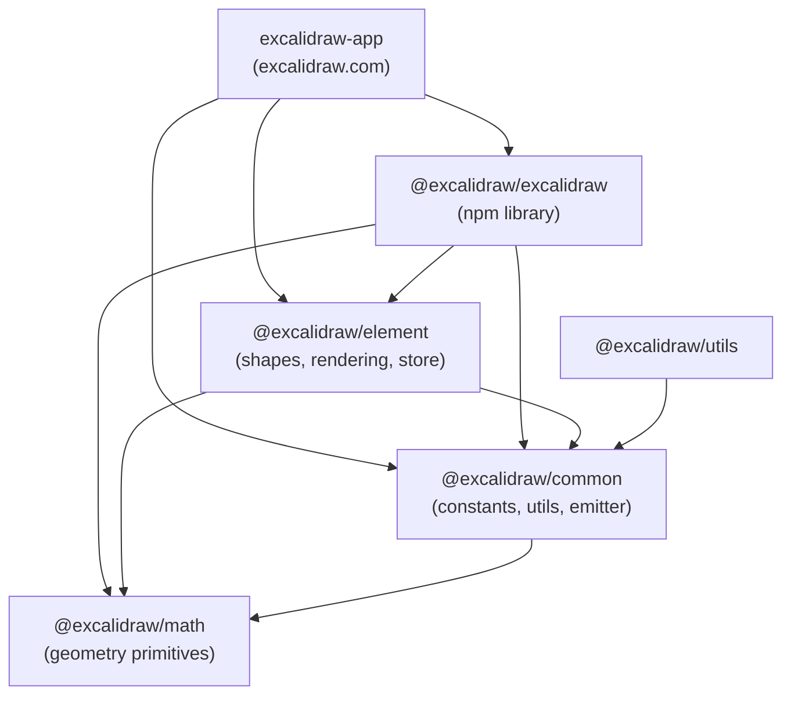
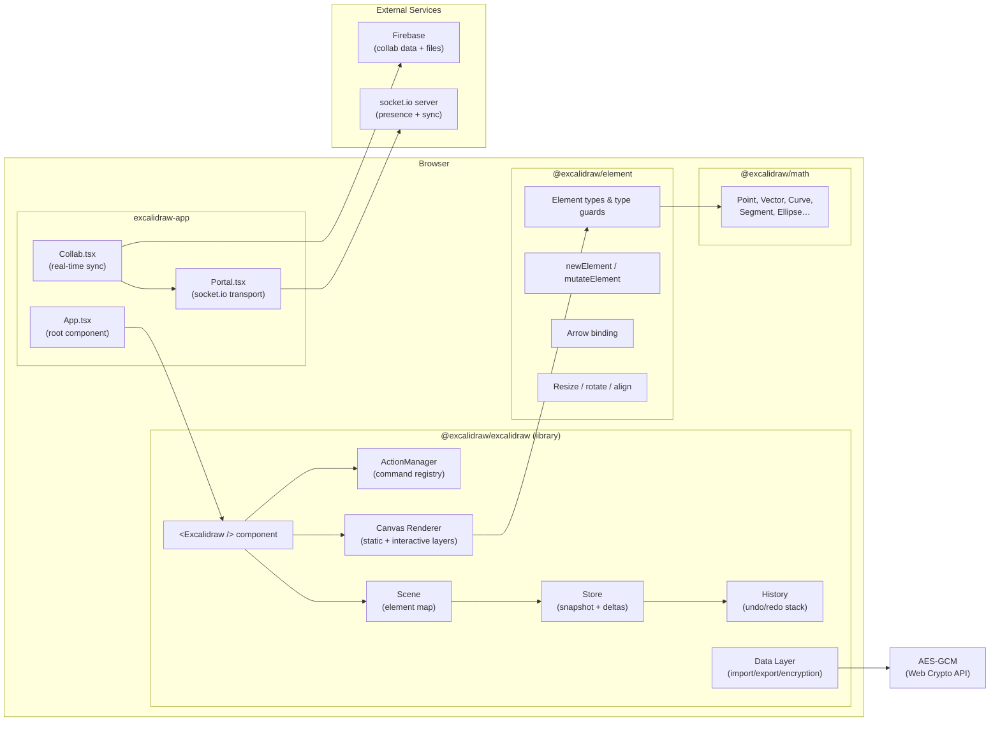
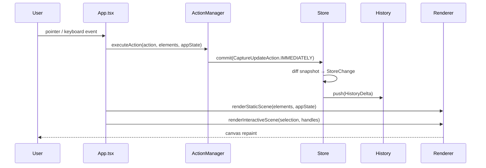
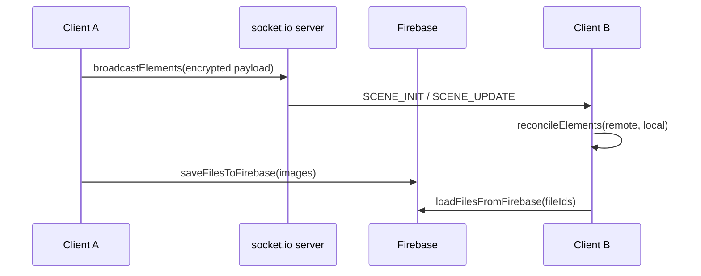

# Excalidraw — Developer Onboarding

## What is Excalidraw?

Excalidraw is an open-source, infinite canvas whiteboard with a hand-drawn aesthetic. It's both:

- **`@excalidraw/excalidraw`** — a React component library published to npm, embeddable in any app
- **excalidraw.com** — a full-featured PWA built on top of that library

Used in production by Google Cloud, Meta, Notion, Replit, CodeSandbox, and many others.

---

## Monorepo Structure

```
excalidraw/
├── excalidraw-app/        # The excalidraw.com web application
├── packages/
│   ├── excalidraw/        # @excalidraw/excalidraw — main React library (published to npm)
│   ├── element/           # @excalidraw/element — element types, rendering, mutation
│   ├── common/            # @excalidraw/common — shared constants, utils, event bus
│   ├── math/              # @excalidraw/math — geometry primitives (Point, Vector, Curve…)
│   └── utils/             # @excalidraw/utils — general-purpose utilities
├── examples/
│   ├── with-nextjs/
│   └── with-script-in-browser/
└── dev-docs/              # Docusaurus documentation site
```

Managed with **Yarn workspaces** (Yarn 1.22). Packages reference each other via path aliases resolved at dev-time (Vite) and build-time (esbuild).

---

## Architecture

### Package Dependency Graph



### Runtime Architecture



### Canvas Rendering Pipeline



### Collaboration Data Flow



---

## Key Concepts

### Element Model

Every drawn shape is an `ExcalidrawElement` — a plain, serialisable JSON object. Elements are **never mutated in place** outside of `mutateElement()`, keeping rendering predictable.

```
ExcalidrawElement
 ├── id, type, version, versionNonce
 ├── x, y, width, height, angle
 ├── strokeColor, backgroundColor, fillStyle
 ├── (text) → fontSize, fontFamily, text, containerId
 ├── (linear) → points[], startBinding, endBinding
 └── (image) → fileId, status, scale
```

Type guards live in `packages/element/src/typeChecks.ts`.

### Store & History

- **`Store`** holds a `StoreSnapshot` (frozen copy of all elements + observed app state).
- On every `commit()`, it diffs the new state against the snapshot and emits `StoreChange` events.
- **`History`** consumes those changes and builds a stack of `HistoryDelta`s (element delta + app-state delta) for undo/redo.
- `CaptureUpdateAction` enum controls whether a commit enters the undo stack (`IMMEDIATELY`), is deferred (`EVENTUALLY`), or never captured (`NEVER`).

### Action System

All editor commands are registered through `ActionManager`. An action declares:
- `name` — unique string key
- `perform(elements, appState, …)` → `{ elements, appState, commitToHistory }`
- Optional `PanelComponent` — renders a UI control in the properties panel

### Encryption (E2EE)

Shareable links embed an AES-GCM 128-bit key in the URL fragment (`#key=…`). The key never leaves the browser. Firebase only stores ciphertext. Implemented in `packages/excalidraw/data/encryption.ts` using the Web Crypto API.

---

## Main Features

| Feature | Location |
|---|---|
| Drawing tools (rect, ellipse, arrow, free-draw…) | `packages/excalidraw/components/App.tsx` |
| Property panel (color, stroke, fill, font…) | `packages/excalidraw/actions/actionProperties.tsx` |
| Shape libraries | `packages/excalidraw/data/library.ts` |
| Export (PNG / SVG / JSON / clipboard) | `packages/excalidraw/scene/export.ts` |
| Mermaid → diagram import | `packages/excalidraw/mermaid.ts` |
| Real-time collaboration | `excalidraw-app/collab/Collab.tsx` |
| PWA / offline support | `excalidraw-app/vite.config.mts` (VitePWA) |
| i18n (70+ languages) | `packages/excalidraw/locales/` + Crowdin |
| AI / diagram-to-code | `packages/excalidraw/components/DiagramToCodePlugin/` |
| Frames | `packages/element/src/frame.ts` |
| Elbow arrows | `packages/element/src/elbowArrow.ts` |
| Lasso selection | `packages/excalidraw/lasso/` |

---

## Local Development Setup

### Prerequisites

| Tool | Version |
|---|---|
| Node.js | ≥ 18 |
| Yarn | 1.22.x |
| Git | any recent |

### Steps

```bash
# 1. Clone
git clone https://github.com/excalidraw/excalidraw.git
cd excalidraw

# 2. Install all workspace dependencies
yarn

# 3. Start the dev server (excalidraw-app at http://localhost:3000)
yarn start
```

The Vite dev server resolves all `@excalidraw/*` package imports directly from their `src/` directories via path aliases — no pre-build step needed.

### Environment Variables

Create a `.env` file in the repo root (optional — the app works without them):

```env
# Collaboration backend
VITE_APP_WS_SERVER_URL=https://your-socket-server.com

# Firebase (for collab storage)
VITE_APP_FIREBASE_CONFIG={"apiKey":"...","authDomain":"...","projectId":"...","storageBucket":"..."}

# Sentry error reporting
VITE_APP_SENTRY_DSN=https://...

# Port override (default: 3000)
VITE_APP_PORT=3000
```

### Useful Commands

```bash
yarn start                  # Dev server
yarn test:app               # Run tests (Vitest)
yarn test:update            # Run tests + update snapshots
yarn test:typecheck         # TypeScript type check (tsc)
yarn test:code              # ESLint
yarn fix                    # Auto-fix formatting + lint
yarn build                  # Production build of excalidraw-app
yarn build:packages         # Build all packages (common → math → element → excalidraw)
```

### Building Packages (for npm release)

Packages must be built in dependency order:

```bash
yarn build:common && yarn build:math && yarn build:element && yarn build:excalidraw
```

Or in one command: `yarn build:packages`

---

## Testing

Tests use **Vitest** with `jsdom`. Canvas APIs are mocked via `vitest-canvas-mock`.

```bash
yarn test:app               # watch mode
yarn test:update            # CI-style (no watch, updates snapshots)
yarn test:coverage          # Coverage report
```

Test files live next to their subjects as `*.test.ts(x)` files, plus `packages/excalidraw/tests/` for integration tests.

---

## Code Style & Conventions

- **TypeScript everywhere** — strict mode enabled
- Functional React components + hooks only
- CSS Modules for component styles (`.scss` files alongside components)
- `PascalCase` — components, interfaces, type aliases
- `camelCase` — variables, functions
- `ALL_CAPS` — constants
- Geometry code must use the `Point` type from `@excalidraw/math` (never `{ x, y }`)
- Prefer immutable data (`const`, `readonly`)
- Use `?.` and `??` over explicit null checks

---

## Where to Go Next

- **[docs.excalidraw.com](https://docs.excalidraw.com)** — full API reference & integration guides
- **`packages/excalidraw/CHANGELOG.md`** — release history
- **`dev-docs/`** — Docusaurus site source (run with `yarn start` inside that folder)
- **Discord** — https://discord.gg/UexuTaE

