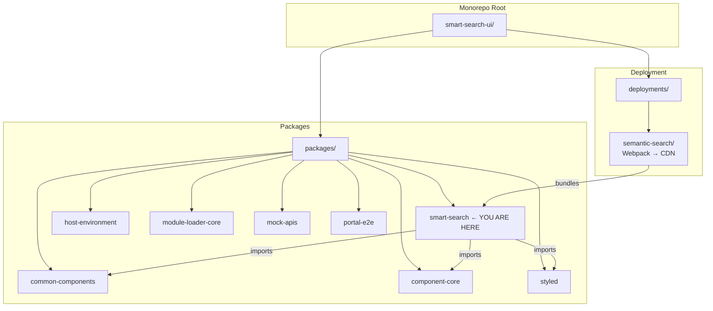
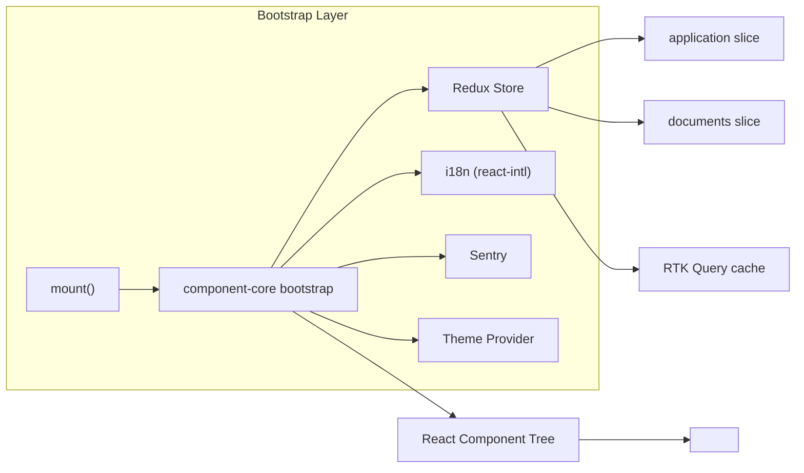
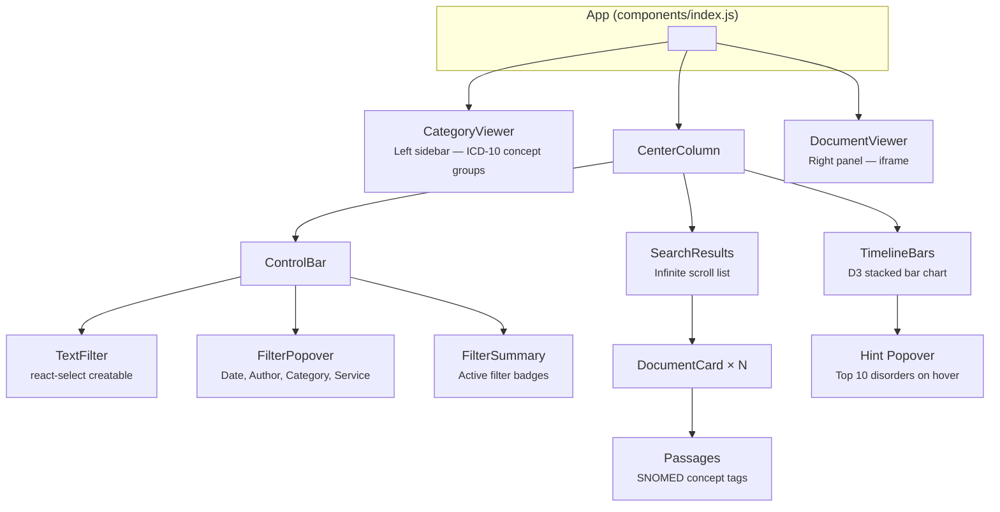
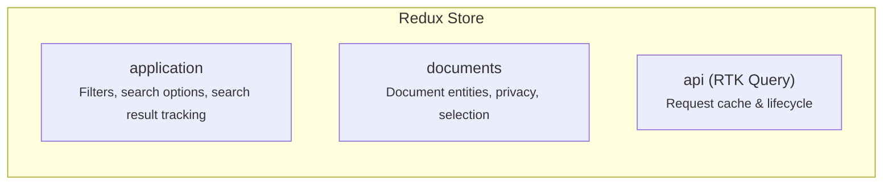
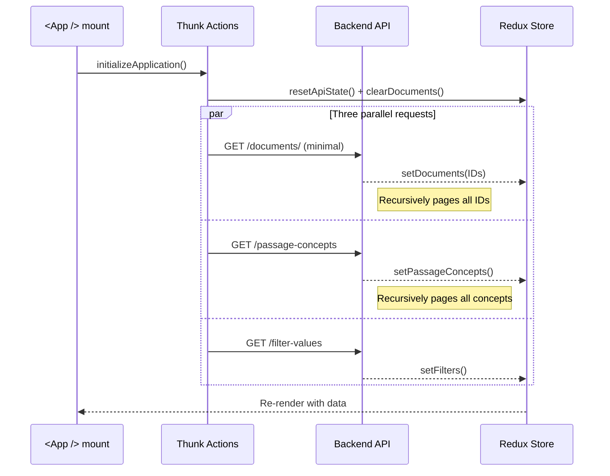
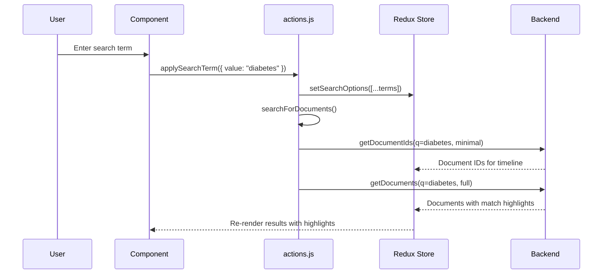

# Smart Search — Onboarding Guide

Welcome to the **Smart Search** package (`@portal/smart-search`). This is a
healthcare-focused semantic search application for querying patient clinical
documents. It runs inside the Clinical Portal shell via module federation.

---

## Table of Contents

- [What is Smart Search?](#what-is-smart-search)
- [Monorepo Context](#monorepo-context)
- [Getting Started](#getting-started)
- [Architecture Overview](#architecture-overview)
- [Component Hierarchy](#component-hierarchy)
- [State Management](#state-management)
- [API Layer](#api-layer)
- [Data Flow](#data-flow)
- [Directory Structure](#directory-structure)
- [Key Files Reference](#key-files-reference)
- [Healthcare Domain Concepts](#healthcare-domain-concepts)
- [Token Size Estimates](#token-size-estimates)
- [Common Development Tasks](#common-development-tasks)
- [Testing](#testing)
- [Troubleshooting](#troubleshooting)

---

## What is Smart Search?

Smart Search enables clinicians to semantically search across a patient's
clinical documents. Key features:

- **Free-text search** with match highlighting across documents
- **SNOMED disorder concept** filtering (passage concepts)
- **Timeline visualization** of document distribution over time (D3 bar charts)
- **Category/Author/Service/Date** filtering
- **Infinite-scroll** paginated results
- **Document viewer** (iframe-based) for reading full documents
- **Privacy/Break-the-Seal** support for protected health information (PHI)

---

## Monorepo Context

Smart Search lives inside a Lerna + Yarn Workspaces monorepo. Understanding
where it fits is important:



| Package              | What it provides to Smart Search                         |
| -------------------- | -------------------------------------------------------- |
| `component-core`     | `bootstrap()`, Redux store setup, i18n, Sentry, RTK      |
| `common-components`  | `PrivacyModal`, shared UI utilities                      |
| `styled`             | `Box`, `Flex`, `Typography`, `css` — MUI + SC wrappers   |
| `host-environment`   | Base styles (Blueprint, Font Awesome)                    |
| `mock-apis`          | Development API server (`connect-api-mocker`)            |
| `portal-e2e`         | Dev server that hosts the app + Playwright/Cypress tests |
| `module-loader-core` | Dynamic module loading in production                     |

---

## Getting Started

```bash
# 1. Install all dependencies (from repo root)
yarn install

# 2. Start the development server (hosts smart-search + mock APIs)
yarn start

# 3. Open http://localhost:18443/en/home in your browser

# 4. Run unit tests for smart-search only
npx jest packages/smart-search

# 5. Start Storybook for component development
yarn storybook

# 6. Lint a specific file after editing
npx eslint packages/smart-search/src/path/to/file.js
```

---

## Architecture Overview

Smart Search follows a standard React + Redux Toolkit pattern with RTK Query for
API calls. It is bootstrapped as a **module federation remote** via
`component-core`'s `bootstrap()` function.



**How the app boots:**

1. `deployments/semantic-search/` bundles the package via Webpack
2. `src/index.js` exports `mount()` — the module federation entry point
3. `mount()` calls `bootstrap()` from `component-core` with reducers,
   middleware, and theme
4. The `<App />` component initializes by dispatching parallel API calls:
   - `searchForDocuments()` — fetch initial document set
   - `getAllPassageConcepts()` — load SNOMED disorder concepts
   - `getFilterValues()` — load available filter options (authors, categories,
     services)

---

## Component Hierarchy

The UI is organized as a **three-column layout**:

```
┌──────────────────────────────────────────────────────────────────┐
│                         Smart Search                             │
├────────────┬───────────────────────────┬─────────────────────────┤
│            │       ControlBar          │                         │
│            │ ┌──────────┬────────────┐ │                         │
│            │ │TextFilter│FilterPopov.│ │                         │
│ Category   │ └──────────┴────────────┘ │                         │
│ Viewer     │   FilterSummary badges    │    Document Viewer      │
│            ├───────────────────────────┤    (iframe)             │
│ ┌────────┐ │    Timeline Bars (D3)     │                         │
│ │ICD-10  │ │   ▇▇▇ ▇▇ ▇▇▇▇ ▇▇ ▇▇▇   │                         │
│ │Groups  │ ├───────────────────────────┤  ┌───────────────────┐  │
│ │        │ │    Search Results         │  │ Full document     │  │
│ │ ○ Tag1 │ │  ┌─────────────────────┐  │  │ content rendered  │  │
│ │ ○ Tag2 │ │  │  DocumentCard       │  │  │ in iframe         │  │
│ │ ○ Tag3 │ │  │  title, author, ... │  │  │                   │  │
│ │        │ │  │  [Passages tags]    │  │  │                   │  │
│ └────────┘ │  └─────────────────────┘  │  └───────────────────┘  │
│            │  ┌─────────────────────┐  │                         │
│            │  │  DocumentCard  ...  │  │                         │
│            │  └─────────────────────┘  │                         │
│            │     ∞ infinite scroll     │                         │
└────────────┴───────────────────────────┴─────────────────────────┘
```



### Component Descriptions

| Component          | File                                         | Purpose                                                           |
| ------------------ | -------------------------------------------- | ----------------------------------------------------------------- |
| **App**            | `components/index.js`                        | Root layout, initialization, privacy modal integration            |
| **CategoryViewer** | `components/category-viewer/index.js`        | Left sidebar, SNOMED disorder concepts grouped by ICD-10          |
| **ControlBar**     | `components/control-bar/index.js`            | Search input + filter UI + timeline toggle + error display        |
| **TextFilter**     | `components/control-bar/text-filter.js`      | Creatable select for search terms + passage concept autocomplete  |
| **FilterPopover**  | `components/control-bar/filter-popover.js`   | Date range picker + author/category/service dropdowns             |
| **FilterSummary**  | `components/control-bar/filter-summary.js`   | Active filter badges display with edit/remove/clear-all           |
| **TimelineBars**   | `components/timeline-bars/index.js`          | D3-based stacked bar chart of document distribution over time     |
| **Hint**           | `components/timeline-bars/hint.js`           | Hover tooltip showing top 10 disorders for a time bucket          |
| **SearchResults**  | `components/search-results/index.js`         | Infinite-scroll result list with sort, count, and privacy banners |
| **DocumentCard**   | `components/search-results/document-card.js` | Individual result card: metadata, match highlights, passages      |
| **Passages**       | `components/search-results/passages.js`      | SNOMED concept tags for a document (main + supplemental)          |
| **DocumentViewer** | `components/document-viewer.js`              | Iframe displaying full document content with BTS privacy          |

---

## State Management

The Redux store has three top-level slices:



### Application Slice (`store/application/slice.js`)

Manages search state, filters, and tracks which search results map to which URL.

```javascript
// State shape:
{
  activeSearchId: string | null,    // URL-based search identifier (bookmarkable)
  availableFilters: {
    authorFilters: [],              // From API
    categoryFilters: [],            // From API
    serviceFilters: [],             // From API
  },
  activeAuthor: 'All',             // Current filter selections
  activeCategory: 'All',
  activeService: 'All',
  activeTimeFilter: [null, null],  // [Date | null, Date | null]
  sortOrder: 'dateTime',           // dateTime | author | title | relevance
  searchOptions: [],               // Array of free-text + passage concept terms
  height: undefined,               // Container height for responsive layout

  // Entity Adapter — search result collections keyed by URL:
  entities: {
    'https://...?sort=-dateTime': {
      id: 'https://...',
      containsMatches: false,
      documentIds: ['doc1', 'doc2'],
      minDocumentIds: ['doc1', 'doc2', 'doc3'],
      next: 'https://...?cursor=...',
    }
  },
  ids: ['https://...?sort=-dateTime']
}
```

**Key concept**: `activeSearchId` is a URL string that acts as a unique
identifier for the current search. Filter changes update this URL. The entity
adapter stores document ID lists keyed by these URLs, so switching back to a
previous search can reuse cached results.

### Documents Slice (`store/documents/slice.js`)

Stores actual document data entities and privacy state.

```javascript
// State shape:
{
  entities: {
    'doc-uuid-1': {
      id: 'doc-uuid-1',
      title: 'Discharge Summary',
      author: 'Dr. Smith',
      category: 'Clinical Note',
      service: 'Cardiology',
      dateTime: '2025-01-15T10:30:00Z',
      passageConcepts: [...],        // SNOMED concepts found in document
      match: { ... },                // Highlighted match data (only for searches)
      _links: { ... },               // HAL links
    }
  },
  ids: ['doc-uuid-1', ...],
  btsLink: '',                       // "Break The Seal" privacy link
  privacyLevel: 'NONE',             // NONE | LIST_MORE
  privacyResolutionError: false,
  selectedDocumentId: null,          // Currently viewed document
}
```

**Two document modes:**

1. **Minimal** — only IDs and timestamps (for counting/timeline). Accept header:
   `application/vnd.orchestral.document.index.minimal.1_0+json`
2. **Full** — complete content with match highlights. Accept header:
   `application/vnd.orchestral.document.index.1_0+json`

### Selectors Pattern

Selectors follow a two-tier pattern:

```
store/application/selectors.js  — Application-domain selectors + hooks
store/documents/selectors.js    — Document-domain selectors + hooks
store/selectors.js              — Re-exports both + cross-domain selectors
```

Each selector file exports both raw selectors (for thunks) and `use*` React
hooks (for components). Example:

```javascript
// Raw selector (used in thunks/actions)
export const selectActiveCategory = (state) => state.application.activeCategory;

// React hook (used in components)
export const useActiveCategory = () => useSelector(selectActiveCategory);
```

---

## API Layer

RTK Query endpoints are defined in `store/api.js`. The API communicates with a
**Document Index** backend.

### Endpoints

| Endpoint               | Method | URL Pattern                                                  | Accept Header | Purpose                                 |
| ---------------------- | ------ | ------------------------------------------------------------ | ------------- | --------------------------------------- |
| `getFilterValues`      | GET    | `/document-index/patients/{path}/documents/filter-values`    | full          | Available authors, categories, services |
| `getPassageConcepts`   | GET    | `/document-index/patients/{path}/documents/passage-concepts` | full          | SNOMED disorder concepts (paginated)    |
| `getDocumentIds`       | GET    | `/document-index/patients/{path}/documents/`                 | minimal       | Document IDs only (fast)                |
| `getDocuments`         | GET    | `/document-index/patients/{path}/documents/`                 | full/minimal  | Full documents or paginated             |
| `getSpecificDocuments` | GET    | `/document-index/patients/{path}/documents/?documentId=...`  | full          | Specific documents by ID                |

### Custom API Pattern

This app uses `createInitiateWithCallbacks` from `component-core` which wraps
RTK Query endpoints with `onSuccess`/`onError` callback patterns. This enables
chaining async flows in thunks:

```javascript
const initiate = createInitiateWithCallbacks(api.endpoints.getDocuments);
dispatch(
  initiate({
    ...args,
    onSuccess: (response) => {
      /* handle success */
    },
    onError: () => {
      /* handle error */
    },
  }),
);
```

---

## Data Flow

### Initialization Sequence



### Search Flow

When a user types a search term or applies a filter:



### Search Optimization Logic

The `searchForDocumentsIfNecessary()` thunk is critical — it decides whether a
new API call is needed:

- **Skips search** when: switching sort order or filters if all documents are
  already known (cached)
- **Forces search** when: any free-text or passage concept terms are active
  (match highlights are volatile)

### Two-phase Document Fetching

For non-search browsing (no search terms):

1. **Phase 1**: Fetch all document IDs (minimal, fast, paginated) → populates
   timeline bars
2. **Phase 2**: Fetch first page of full documents → populates result cards
3. **Phase 3** (if needed): Fetch specific unknown documents by ID

For searches (with search terms):

1. **Phase 1**: Fetch all document IDs (minimal) → timeline bars
2. **Phase 2**: Fetch full documents with match data → result cards with
   highlights

---

## Directory Structure

```
packages/smart-search/
├── package.json                    # Dependencies and scripts
├── src/
│   ├── index.js                    # mount() entry point (bootstrap)
│   ├── constants.js                # ICD-10 groups, page sizes, dimensions
│   ├── types.js                    # PropTypes definitions
│   │
│   ├── components/
│   │   ├── index.js                # <App /> — main 3-column layout
│   │   ├── concept-tag.js          # Reusable SNOMED concept pill
│   │   ├── document-viewer.js      # Right panel iframe viewer
│   │   ├── loading-overlay.js      # Spinner overlay
│   │   ├── non-ideal-states.js     # Empty/loading states
│   │   ├── pending-retrieval.js    # Pending state
│   │   │
│   │   ├── control-bar/            # Search & filter controls
│   │   │   ├── index.js            # Container component
│   │   │   ├── text-filter.js      # Search input (react-select)
│   │   │   ├── filter-popover.js   # Advanced filter modal
│   │   │   └── filter-summary.js   # Active filter badges
│   │   │
│   │   ├── search-results/         # Document result list
│   │   │   ├── index.js            # Infinite scroll container
│   │   │   ├── document-card.js    # Single result card
│   │   │   └── passages.js         # Concept tags display
│   │   │
│   │   ├── timeline-bars/          # D3 timeline visualization
│   │   │   ├── index.js            # Stacked bar chart
│   │   │   ├── hint.js             # Hover tooltip
│   │   │   ├── skeleton.js         # Loading skeleton
│   │   │   └── utils.js            # D3 scale/bucketing helpers
│   │   │
│   │   └── category-viewer/        # Left sidebar
│   │       ├── index.js            # Concept category sidebar
│   │       ├── concept-tag-section.js  # Category group section
│   │       └── utils.js            # Grouping utilities
│   │
│   ├── store/                      # Redux state management
│   │   ├── actions.js              # Thunk action creators (778 lines)
│   │   ├── actions.test.js         # Action tests
│   │   ├── api.js                  # RTK Query endpoint definitions
│   │   ├── middleware.js           # RTK Query middleware
│   │   ├── reducer.js              # Root reducer combiner
│   │   ├── selectors.js            # Cross-domain selectors + hooks
│   │   ├── application/
│   │   │   ├── slice.js            # Application state (filters, search)
│   │   │   └── selectors.js        # Application selectors + hooks
│   │   └── documents/
│   │       ├── slice.js            # Document entities + privacy
│   │       └── selectors.js        # Document selectors + hooks
│   │
│   ├── lib/                        # Utility functions
│   │   ├── documents.js            # Document enhancement/processing
│   │   ├── format-duration.js      # Duration → human string
│   │   ├── get-filters.js          # Filter extraction helpers
│   │   ├── utils.js                # URL manipulation, sanitization
│   │   └── utils.test.js           # Utility tests
│   │
│   └── theme/                      # Theming
│       ├── index.js                # Theme configuration
│       └── colors.js               # Color palette constants
```

---

## Key Files Reference

**Start here** when working on a feature:

| Task                    | Read these files first                                                      |
| ----------------------- | --------------------------------------------------------------------------- |
| Add a new filter        | `store/application/slice.js`, `store/actions.js`, `components/control-bar/` |
| Modify search behavior  | `store/actions.js` (thunks), `store/api.js` (endpoints)                     |
| Change document display | `components/search-results/document-card.js`                                |
| Modify timeline bars    | `components/timeline-bars/index.js`, `timeline-bars/utils.js`               |
| Add a new selector      | `store/selectors.js` or domain-specific `store/*/selectors.js`              |
| Change concept tags     | `components/concept-tag.js`, `components/search-results/passages.js`        |
| Privacy/BTS changes     | `components/document-viewer.js`, `store/documents/slice.js`                 |
| Styling/theming         | `theme/colors.js`, `theme/index.js`                                         |

---

## Healthcare Domain Concepts

### SNOMED Disorders & Passage Concepts

Documents are analyzed by an NLP pipeline that extracts **SNOMED CT** medical
concepts (disorders/conditions) from the text. These are called **passage
concepts**. They are:

- Grouped by **ICD-10 categories** (e.g., "Diseases of the respiratory system")
- Displayed in the **CategoryViewer** sidebar and on **DocumentCards**
- Toggleable as search filters

### ICD-10 Groups

The app uses 21+ ICD-10 disease classification groups defined in `constants.js`
(e.g., "Infectious diseases", "Neoplasms", "Circulatory system diseases"). Each
passage concept is mapped to one of these groups.

### Privacy / Break The Seal (BTS)

Clinical documents may be protected by privacy levels:

- **NONE** — full access
- **LIST_MORE** — some documents hidden; user sees a "List More" banner and can
  request access via a Break The Seal (BTS) modal
- **Resolution Error** — privacy service couldn't resolve; error banner shown

The `PrivacyModal` from `common-components` handles the BTS workflow. After
breaking the seal, the entire application re-initializes.

---

## Token Size Estimates

Approximate **LLM token counts** for each part of the smart-search package
(estimated at ~3.5 characters per token for JavaScript code):

### By Area

| Area                              | Lines | Bytes   | ~Tokens | Notes                         |
| --------------------------------- | ----- | ------- | ------- | ----------------------------- |
| **Store (top-level)**             | 1,361 | 38,855  | ~11,100 | actions, api, selectors, etc. |
| **Store — application/**          | 298   | 10,303  | ~2,940  | slice + selectors             |
| **Store — documents/**            | 165   | 6,024   | ~1,720  | slice + selectors             |
| **Components (top-level)**        | 484   | 13,073  | ~3,735  | index, viewers, overlays      |
| **Components — control-bar/**     | 1,636 | 59,047  | ~16,870 | Largest area (incl. tests)    |
| **Components — search-results/**  | 670   | 25,708  | ~7,345  | Cards, passages, stories      |
| **Components — timeline-bars/**   | 907   | 31,780  | ~9,080  | D3 charts, stories, tests     |
| **Components — category-viewer/** | 373   | 11,215  | ~3,205  | ICD groups sidebar            |
| **Lib (utilities)**               | 274   | 9,209   | ~2,630  | documents, utils, filters     |
| **Theme**                         | 76    | 1,609   | ~460    | Colors, theme config          |
| **Entry + types + constants**     | 264   | 7,735   | ~2,210  | index.js, constants, types    |
| **TOTAL**                         | 6,767 | 214,558 | ~61,300 | Entire smart-search/src       |

### Individual Key Files

| File                                       | Lines | ~Tokens | Role                          |
| ------------------------------------------ | ----- | ------- | ----------------------------- |
| `store/actions.js`                         | 778   | ~7,800  | **Largest** — all thunk logic |
| `components/control-bar/index.js`          | 395   | ~3,950  | Search & filter container     |
| `components/timeline-bars/index.js`        | 436   | ~4,360  | D3 chart rendering            |
| `components/search-results/index.js`       | 318   | ~3,180  | Result list + infinite scroll |
| `components/control-bar/filter-summary.js` | 266   | ~2,660  | Filter badge display          |
| `components/control-bar/text-filter.js`    | 247   | ~2,470  | Search input                  |
| `store/api.js`                             | 225   | ~2,250  | RTK Query config              |
| `store/application/slice.js`               | 220   | ~2,200  | Application state             |
| `components/control-bar/filter-popover.js` | 224   | ~2,240  | Advanced filter modal         |

### Takeaways

- The **store/actions.js** file (~7,800 tokens) is the single most complex file
  — it orchestrates all search logic. Budget extra context when working with it.
- The **control-bar** directory (~16,870 tokens) is the largest component area
  due to complex UI interactions.
- The **entire package** (~61,300 tokens) fits within most LLM context windows
  but not all at once with conversation history.
- For focused work, individual directories (2,000–9,000 tokens) fit easily in
  context.

---

## Common Development Tasks

### Adding a New Filter

1. Add filter state to `store/application/slice.js` (initial state + reducer)
2. Create a selector in `store/application/selectors.js`
3. Add the filter to the search query in
   `store/actions.js → searchForDocuments()`
4. Add UI controls in `components/control-bar/`
5. Add the filter badge in `components/control-bar/filter-summary.js`

### Modifying Search Behavior

All search logic lives in `store/actions.js`. Key thunks:

- `searchForDocuments()` — full search pipeline (lines ~305–435)
- `searchForDocumentsIfNecessary()` — cache-aware search (lines ~440–470)
- `getNextDocuments()` — pagination (lines ~275–300)
- `toggleConcept()` — concept selection toggle (lines ~535–585)

### Adding a New Component

Follow existing patterns:

1. Create component in appropriate `components/` subdirectory
2. Use `useDispatchActions()` hook for actions
3. Use `use*` selector hooks for state
4. Add PropTypes for all props
5. Create `*.stories.js` for Storybook
6. Create `*.test.js` using `@testing-library/react` + `composeStories`

### Styling Guide

Priority order:

1. **Blueprint** — buttons, popovers, selects, cards (`@blueprintjs/core`)
2. **Styled (MUI)** — `Box`, `Flex`, `Typography`, `css` from `@portal/styled`
3. **Styled-components** — custom `styled()` components for unique needs
4. **Theme colors** — import from `../theme/colors.js`, never hardcode

---

## Testing

```bash
# Run smart-search unit tests only
npx jest packages/smart-search

# Run a specific test file
npx jest packages/smart-search/src/store/actions.test.js

# Run Playwright E2E tests
AI_AGENT_MODE=true yarn playwright test --project=smart-search

# Lint a file after editing
npx eslint packages/smart-search/src/path/to/file.js
npx prettier --check packages/smart-search/src/path/to/file.js
```

**Testing conventions:**

- Use `@testing-library/react` for component tests
- Use Storybook stories + `composeStories` for story-driven testing
- Avoid `data-testid`; prefer user-centric locators
- Mock APIs via `connect-api-mocker` (in `mock-apis` package)
- High coverage threshold: **98%**

---

## Troubleshooting

| Problem                           | Solution                                                          |
| --------------------------------- | ----------------------------------------------------------------- |
| App shows spinner forever         | Check mock-apis are running; check browser console for CORS       |
| Tests fail after store change     | Run `npx jest packages/smart-search --clearCache`                 |
| Storybook doesn't reflect changes | Restart Storybook; check for import path issues                   |
| Lint errors on save               | Run `npx eslint <file> --fix`                                     |
| Privacy modal not showing         | Check `_links` in API response for BTS link presence              |
| Timeline bars empty               | Check `getDocumentIds` response; ensure documents have `dateTime` |
| "Module not found" errors         | Run `yarn install` from repo root                                 |
