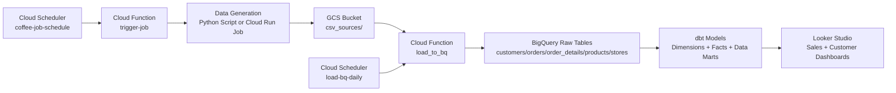
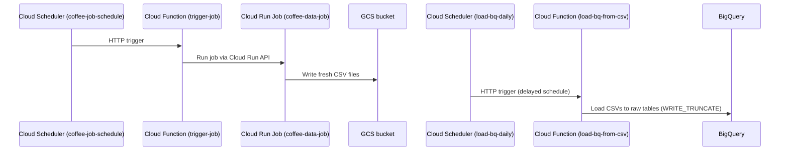
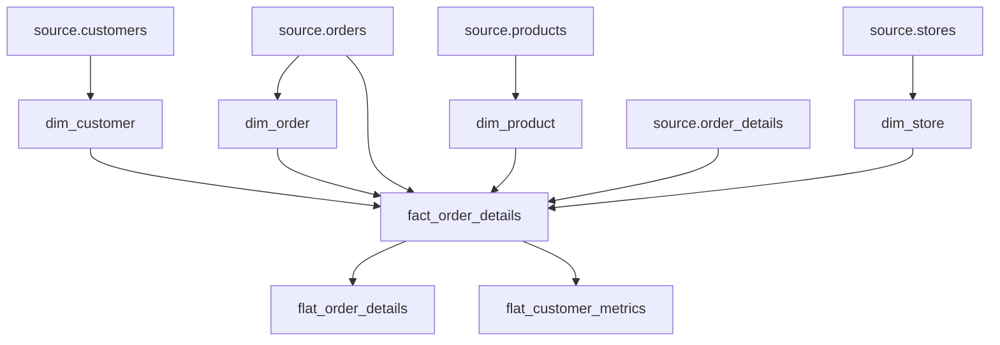

# Onboarding Guide: Local Coffee Shop Analytics Showcase

This document helps new team members become productive quickly on the `showcase_local_coffee_shop` project.

## 1. Project Purpose

This showcase demonstrates a full analytics lifecycle:
- generate synthetic operational data,
- upload/load it into BigQuery,
- transform it with dbt,
- expose analytics-ready datasets for BI dashboards.

Primary business questions covered:
- sales trends and store performance,
- customer behavior and loyalty segmentation,
- product mix and basket composition.

## 2. System Architecture



## 3. Repository Map

```text
showcase_local_coffee_shop/
  dataset_generation/      # Local synthetic data generation script
  dataset_upload/          # Local upload script to GCS
  dbt_models/              # dbt project for transformations
  google_cloud_run/        # Cloud Run jobs/functions for automation
    generate_and_store/
    load_to_bq/
    trigger_cloud_run_job/
```

## 4. Day-1 Setup Checklist

1. Install Python 3.9+.
2. Create and activate a virtual environment.
3. Install dependencies from root `requirements.txt`.
4. Install and authenticate Google Cloud SDK (`gcloud auth application-default login`).
5. Verify BigQuery and GCS access in the target GCP project.
6. Configure dbt profile in `dbt_models/profiles.yml`:
   - `project`
   - `dataset`
   - `keyfile` path (or preferred auth method)
7. Run a local end-to-end dry run (generation -> upload -> dbt).

Recommended local setup commands:

```bash
cd /Users/l-76/repos/ai-workshop/data-analyst-portfolio
python3 -m venv .venv
source .venv/bin/activate
pip install -r requirements.txt
```

## 5. Local Development Workflow

### 5.1 Generate CSV Data Locally

```bash
cd showcase_local_coffee_shop/dataset_generation
python generate_data.py
```

Expected output: CSV files for customers, orders, order details, products, and stores.

### 5.2 Upload CSVs to GCS

Before running, review values in `dataset_upload/upload_csv_to_gcs.py`:
- `BUCKET_NAME`
- `folder_path`
- `GCS_FOLDER`

```bash
cd showcase_local_coffee_shop/dataset_upload
python upload_csv_to_gcs.py
```

### 5.3 Run dbt Transformations

```bash
cd showcase_local_coffee_shop/dbt_models
dbt debug
dbt run
dbt test
```

## 6. Cloud Automation Flow

The production-style pipeline uses Cloud Scheduler + Cloud Functions + Cloud Run.



## 7. dbt Modeling Overview

The dbt project builds dimensional and reporting layers directly from source tables.



## 8. Operational Notes

- BigQuery load currently uses `WRITE_TRUNCATE` in `google_cloud_run/load_to_bq/main.py`.
- Scheduler ordering matters: generation must complete before load starts.
- Existing scripts include absolute Windows-style local paths in some files; update them for your machine.

## 9. Token Footprint Evaluation

Token sizing helps estimate AI context and prompt budget for each area.

Method used:
- measured total bytes per component,
- estimated tokens with `tokens ~= bytes / 4` (rough English/code heuristic).

### 9.1 Core Components

| Component | Files | Lines | Bytes | Approx Tokens |
|---|---:|---:|---:|---:|
| `showcase_local_coffee_shop/dataset_generation` | 1 | 285 | 10,760 | 2,690 |
| `showcase_local_coffee_shop/dataset_upload` | 1 | 25 | 829 | 207 |
| `showcase_local_coffee_shop/dbt_models` | 20 | 353 | 11,082 | 2,770 |
| `showcase_local_coffee_shop/google_cloud_run` | 9 | 274 | 10,536 | 2,634 |

Approx total for these implementation components: about `8,301` tokens.

### 9.2 Main Documentation + Root Config

| Path | Lines | Bytes | Approx Tokens |
|---|---:|---:|---:|
| `README.md` | 85 | 3,683 | 920 |
| `requirements.txt` | 6 | 314 | 78 |
| `showcase_local_coffee_shop/README.md` | 268 | 11,315 | 2,828 |

Approx total for these docs/config files: about `3,826` tokens.

### 9.3 Practical Prompting Guidance

- If you include all core implementation components and main docs together, budget roughly `12,100` tokens.
- Keep 20-30% headroom for instructions and model responses.
- For focused tasks, include only one subsystem:
  - data generation + upload: about `2,900` tokens,
  - dbt-only work: about `2,770` tokens,
  - cloud-run automation-only work: about `2,634` tokens.

## 10. Suggested 30-60-90 Minute Onboarding Plan

- First 30 minutes:
  - read this guide and `showcase_local_coffee_shop/README.md`,
  - confirm local Python and GCP auth.
- Next 60 minutes:
  - run local generation/upload,
  - validate raw tables in BigQuery.
- Next 90 minutes:
  - run `dbt run` + `dbt test`,
  - inspect final marts and one dashboard.

## 11. Definition of Done for New Team Members

A new team member is considered onboarded when they can:
1. Generate and upload synthetic data.
2. Load raw tables to BigQuery (manually or through cloud path).
3. Run dbt models successfully.
4. Explain source -> dimensional/fact -> mart flow.
5. Troubleshoot one failed step using logs.
