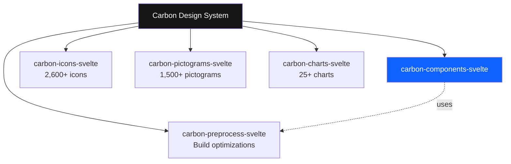
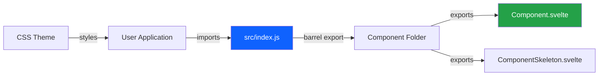
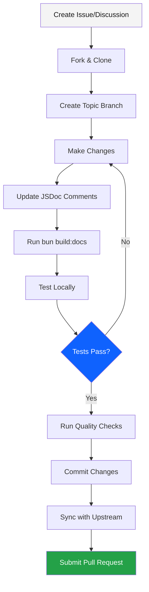
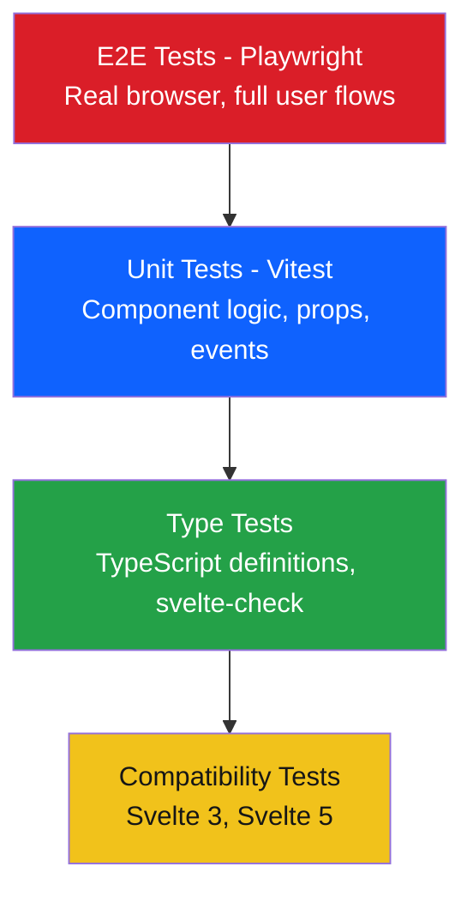
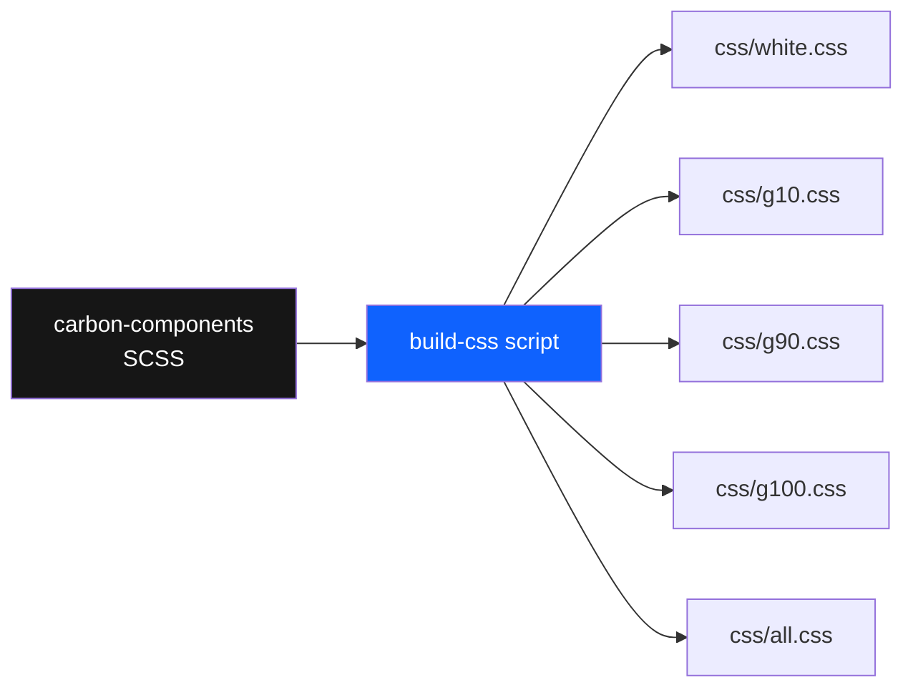
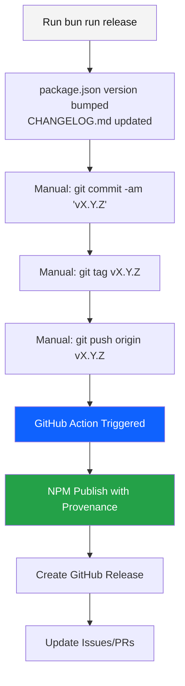
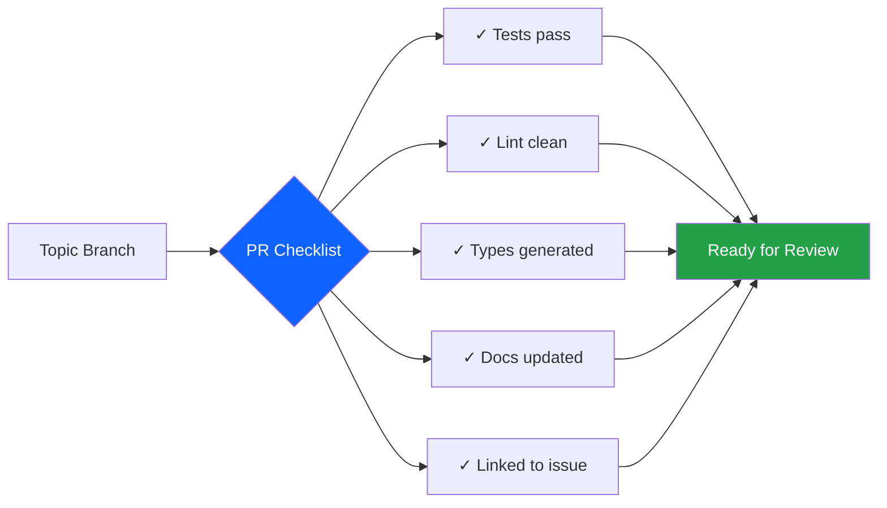

# 🚀 Employee Onboarding Guide
## Carbon Components Svelte

Welcome to the Carbon Components Svelte team! This guide will help you get up to speed with the project.

---

## 📋 Table of Contents

1. [Project Overview](#-project-overview)
2. [Quick Start](#-quick-start)
3. [Project Architecture](#-project-architecture)
4. [Development Workflow](#-development-workflow)
5. [Testing Strategy](#-testing-strategy)
6. [Build & Release Process](#-build--release-process)
7. [Key Resources](#-key-resources)
8. [Team Practices](#-team-practices)

---

## 🎯 Project Overview

**Carbon Components Svelte** is a Svelte component library implementing IBM's Carbon Design System—an open-source design system that facilitates design and development through reuse, consistency, and extensibility.

### Key Facts

- **Package Name**: `carbon-components-svelte`
- **Current Version**: 0.103.0
- **License**: Apache 2.0
- **Maintainer**: Eric Liu (@metonym)
- **Homepage**: https://svelte.carbondesignsystem.com/
- **Repository**: https://github.com/carbon-design-system/carbon-components-svelte

### Related Projects in the Carbon Svelte Portfolio



---

## ⚡ Quick Start

### Prerequisites

**For Main Codebase:**
- [Bun](https://bun.com/docs/installation) (JavaScript runtime & package manager)

**For Documentation Site:**
- [Node.js](https://nodejs.org/) v20
- [nvm](https://github.com/nvm-sh/nvm) (Node Version Manager, recommended)

### Initial Setup

```bash
# 1. Clone your fork
git clone <YOUR_FORK>
cd carbon-components-svelte

# 2. Set upstream remote
git remote add upstream git@github.com:carbon-design-system/carbon-components-svelte.git
git remote -v

# 3. Install dependencies
bun install

# 4. Build documentation (generates TypeScript definitions and API docs)
bun build:docs
```

### Running the Documentation Site

```bash
# Switch to Node.js v20
nvm use 20

# Navigate to docs and install
cd docs
npm install

# Start development server
npm run dev
# Visit http://localhost:5173/
```

### Your First Day Checklist

- [ ] Clone repository and set up remotes
- [ ] Install Bun and Node.js v20
- [ ] Run `bun install` and `bun build:docs`
- [ ] Start the docs site and explore components
- [ ] Read through CONTRIBUTING.md
- [ ] Join the [Discord community](https://discord.gg/J7JEUEkTRX)
- [ ] Browse recent issues and PRs on GitHub
- [ ] Review the Carbon Design System guidelines

---

## 🏗️ Project Architecture

### Directory Structure

```
carbon-components-svelte/
│
├── src/                          # Component source code
│   ├── Accordion/
│   ├── Button/
│   ├── DataTable/
│   ├── ...                       # 60+ component directories
│   ├── icons/                    # Icon utilities
│   ├── utils/                    # Shared utilities
│   └── index.js                  # Main export file
│
├── css/                          # Pre-compiled CSS themes
│   ├── white.css                 # Default light theme
│   ├── g10.css                   # Gray 10 (light)
│   ├── g80.css                   # Gray 80 (dark)
│   ├── g90.css                   # Gray 90 (dark)
│   ├── g100.css                  # Gray 100 (dark)
│   └── all.css                   # All themes (CSS variables)
│
├── docs/                         # Documentation website
│   └── src/
│       └── COMPONENT_API.json    # Auto-generated API docs
│
├── tests/                        # Unit tests (Vitest)
├── tests-svelte3/                # Svelte 3 compatibility tests
├── tests-svelte5/                # Svelte 5 compatibility tests
├── e2e/                          # E2E tests (Playwright)
│   └── fixtures/                 # Test fixtures
│
├── scripts/                      # Build scripts
├── examples/                     # Integration examples
│   ├── rollup/
│   ├── sveltekit/
│   ├── vite/
│   └── webpack/
│
└── package.json                  # Dependencies and scripts
```

### Component Structure Pattern

Every component follows a consistent structure:

```
src/ComponentName/
│
├── ComponentName.svelte          # Main component
├── ComponentNameSkeleton.svelte  # Loading skeleton (if applicable)
└── index.js                      # Exports
```

### Component Data Flow



### Technology Stack

| Layer | Technology |
|-------|-----------|
| **Framework** | Svelte 4.x (with Svelte 5 compatibility testing) |
| **Language** | JavaScript + JSDoc for types |
| **Type Generation** | sveld (generates TypeScript definitions) |
| **Testing (Unit)** | Vitest + @testing-library/svelte |
| **Testing (E2E)** | Playwright |
| **Linting** | Biome |
| **Build Tools** | Vite, Rollup |
| **Package Manager** | Bun (codebase), npm (docs) |
| **CSS** | SCSS from carbon-components, compiled to CSS |

---

## 💻 Development Workflow

### Typical Development Cycle



### Creating or Editing Components

#### 1. Create a Topic Branch

```bash
git checkout master
git pull upstream master
git checkout -b feature/new-component
```

#### 2. Component Development

When adding or editing component props, use JSDoc annotations:

```javascript
/**
 * Specify the size of the component
 * @type {"sm" | "default" | "lg"}
 */
export let size = "default";

/**
 * Set to `true` to disable the component
 * @type {boolean}
 */
export let disabled = false;
```

#### 3. Register New Components

Add exports to `src/index.js`:

```javascript
export { NewComponent } from "./NewComponent";
```

#### 4. Build Documentation

This regenerates TypeScript definitions and `COMPONENT_API.json`:

```bash
bun run build:docs
```

#### 5. Preview in Docs Site

```bash
cd docs
npm run dev
```

### Quality Checks (Run Before Committing)

```bash
# Linting (auto-fix enabled)
bun run lint

# Unit tests
bun run test

# Type checking
bun test:src-types      # Check src/ types
bun test:types          # Check test types

# E2E tests
bun run test:e2e

# Svelte compatibility tests
bun run test:svelte3
bun run test:svelte5
```

### Code Quality Standards

- **Prop Documentation**: All exported props must have JSDoc comments
- **Accessibility**: Follow Carbon Design System a11y guidelines
- **Testing**: New components require unit tests
- **Type Safety**: Ensure TypeScript definitions are generated correctly
- **Svelte Compatibility**: Test with both Svelte 3 and 4/5

---

## 🧪 Testing Strategy

### Testing Pyramid



### Unit Testing (Vitest + Testing Library)

**Location**: `tests/`

**Example Test Structure**:

```javascript
import { render, fireEvent } from "@testing-library/svelte";
import Button from "../src/Button/Button.svelte";

describe("Button", () => {
  it("should render with default props", () => {
    const { getByRole } = render(Button, { props: { children: "Click me" } });
    expect(getByRole("button")).toBeInTheDocument();
  });

  it("should handle click events", async () => {
    const { getByRole, component } = render(Button);
    const handleClick = vi.fn();
    component.$on("click", handleClick);

    await fireEvent.click(getByRole("button"));
    expect(handleClick).toHaveBeenCalled();
  });
});
```

**Run tests**:

```bash
bun run test              # All tests
bun run test Button       # Specific component
```

### E2E Testing (Playwright)

**Location**: `e2e/`

**Test Anatomy**:

1. **Fixture Component**: `e2e/fixtures/ComponentFixture.svelte`
2. **Entry Script**: `e2e/fixtures/component.ts`
3. **HTML Page**: `e2e/fixtures/component.html`
4. **Test Spec**: `e2e/component.test.ts`

**Example Test**:

```typescript
// e2e/button.test.ts
import { test, expect } from "@playwright/test";

test.beforeEach(async ({ page }) => {
  await page.goto("/button.html");
});

test("should be clickable", async ({ page }) => {
  const button = page.getByTestId("primary-button");
  await expect(button).toBeVisible();
  await button.click();
  await expect(page.getByTestId("click-count")).toHaveText("1");
});
```

**Running E2E Tests**:

```bash
# Full suite
bun run test:e2e

# Single test file
bunx playwright test e2e/button.test.ts

# Specific test pattern
bunx playwright test --grep "Button click"

# UI mode (interactive)
bunx playwright test --ui
```

**Important E2E Notes**:
- Use `data-testid` attributes for reliable selectors
- For hidden elements, check `aria-hidden` or classes, not `.toBeVisible()`
- Use `exact: true` with `getByRole()` to avoid partial matches
- Add fixture links to `e2e/fixtures/index.html`

---

## 🔨 Build & Release Process

### Build Scripts

```bash
# Build CSS themes from SCSS
bun scripts/build-css

# Generate TypeScript definitions and COMPONENT_API.json
bun scripts/build-docs

# Format component API documentation
bun scripts/format-component-api
```

### CSS Build Process



### Release Process (Maintainers Only)



**Release Steps**:

1. Ensure you're on `master` with a clean branch
2. Run `bun run release` (updates version & changelog)
3. Commit: `git commit -am "v0.103.0"`
4. Tag: `git tag v0.103.0`
5. Push tag: `git push origin v0.103.0`
6. GitHub Action automatically publishes to NPM
7. Create GitHub Release with generated notes
8. Update related issues/PRs with release version

---

## 📚 Key Resources

### Documentation

| Resource | URL |
|----------|-----|
| **Component Docs** | https://svelte.carbondesignsystem.com |
| **Carbon Design System** | https://carbondesignsystem.com |
| **GitHub Repository** | https://github.com/carbon-design-system/carbon-components-svelte |
| **NPM Package** | https://npmjs.com/package/carbon-components-svelte |
| **Discord Community** | https://discord.gg/J7JEUEkTRX |

### Related Repositories

- [carbon-icons-svelte](https://github.com/carbon-design-system/carbon-icons-svelte)
- [carbon-pictograms-svelte](https://github.com/carbon-design-system/carbon-pictograms-svelte)
- [carbon-charts](https://github.com/carbon-design-system/carbon-charts)
- [carbon-preprocess-svelte](https://github.com/carbon-design-system/carbon-preprocess-svelte)
- [sveld](https://github.com/carbon-design-system/sveld) (TypeScript definition generator)

### Important Files

| File | Purpose |
|------|---------|
| `CONTRIBUTING.md` | Contribution guidelines |
| `CHANGELOG.md` | Version history |
| `SECURITY.md` | Security policies |
| `package.json` | Dependencies & scripts |
| `src/index.js` | Main component exports |
| `tsconfig.json` | TypeScript configuration |

---

## 👥 Team Practices

### Before Starting Work

1. **Search existing issues** to avoid duplicate work
2. **Create or comment on an issue** to discuss approach
3. **Get feedback** from maintainers before large changes
4. **Keep PRs focused** on a single feature/fix

### Pull Request Guidelines



**PR Checklist**:
- [ ] Tests added/updated and passing
- [ ] `bun run lint` passes
- [ ] `bun run build:docs` completed
- [ ] TypeScript definitions generated
- [ ] Component props documented with JSDoc
- [ ] Issue linked in PR description
- [ ] Branch synced with upstream `master`

### Communication

- **Issues**: For bugs, feature requests, questions
- **Discussions**: For open-ended topics
- **Discord**: For real-time community support
- **PR Comments**: For code-specific feedback

### Code Review Process

1. Maintainer reviews code and provides feedback
2. Address feedback with additional commits
3. Once approved, maintainer merges (squash merge typically)
4. Delete your feature branch after merge

### Commit Message Style

Review recent commits for patterns:

```bash
git log --oneline -10
```

Example commit messages:
- `feat(Button): add small size variant`
- `fix(DataTable): resolve sort icon alignment`
- `docs(Accordion): update usage examples`
- `chore: update dependencies`

---

## 🎓 Learning Path

### Week 1: Orientation
- [ ] Complete Quick Start setup
- [ ] Explore documentation site
- [ ] Read Carbon Design System principles
- [ ] Browse component source code
- [ ] Run all quality checks

### Week 2: First Contribution
- [ ] Find "good first issue"
- [ ] Fix a typo or documentation issue
- [ ] Submit your first PR
- [ ] Learn review process

### Week 3-4: Component Work
- [ ] Pick a component to study deeply
- [ ] Write tests for edge cases
- [ ] Add or improve component features
- [ ] Participate in issue discussions

### Month 2+: Advanced Topics
- [ ] Understand build pipeline
- [ ] Learn Svelte 5 compatibility layer
- [ ] Contribute to E2E testing
- [ ] Help with releases (if maintainer)

---

## 🆘 Getting Help

### Common Issues

**Issue**: `bun install` fails
- **Solution**: Update to latest Bun version: `bun upgrade`

**Issue**: Docs site won't start
- **Solution**: Make sure you're on Node.js v20: `nvm use 20`

**Issue**: TypeScript errors in IDE
- **Solution**: Run `bun build:docs` to regenerate type definitions

**Issue**: Tests failing locally
- **Solution**: Clear cache: `bun run test --clearCache`

### Who to Ask

- **General questions**: Discord community
- **Bug reports**: GitHub issues
- **Feature proposals**: GitHub discussions
- **Security issues**: See SECURITY.md
- **Maintainer questions**: Mention @metonym in issues

---

## 🎉 Welcome Aboard!

You're now ready to contribute to Carbon Components Svelte! Remember:

- 🔍 **Explore** the codebase at your own pace
- 🤝 **Ask questions** early and often
- 📝 **Document** as you learn
- 🧪 **Test** your changes thoroughly
- 🌟 **Share** your knowledge with others

Happy coding! 🚀

---

*Last updated: March 2026*
*Carbon Components Svelte v0.103.0*
