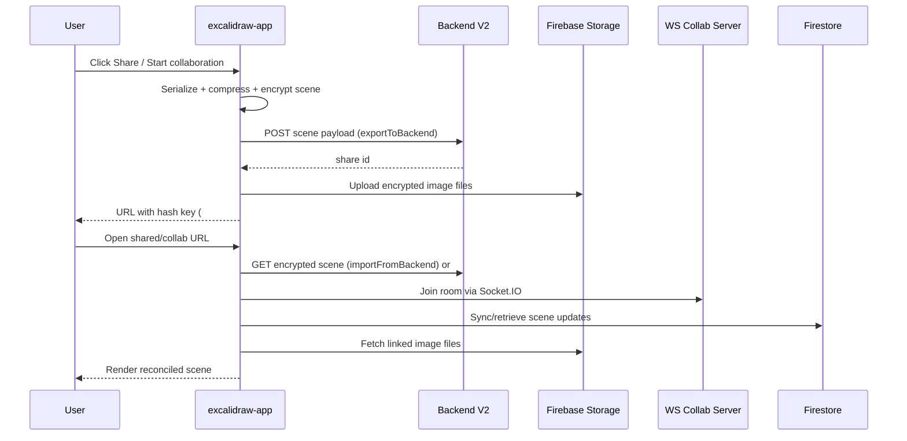

# Excalidraw Monorepo — Onboarding Documentation

## Table of Contents
- [1) Project Overview](#1-project-overview)
- [2) Architecture & System Design](#2-architecture--system-design)
- [3) Repository Map & Module Guide](#3-repository-map--module-guide)
- [4) Token-Based Complexity Evaluation](#4-token-based-complexity-evaluation)
- [5) Local Development Setup](#5-local-development-setup)
- [6) Key Workflows & Processes](#6-key-workflows--processes)
- [7) Glossary & Domain Knowledge](#7-glossary--domain-knowledge)
- [8) First-Week Onboarding Checklist](#8-first-week-onboarding-checklist)
- [9) FAQ](#9-faq)

---

## 1) Project Overview

**What it does (plain language)**  
**Excalidraw** is an open-source whiteboard for drawing hand-drawn-style diagrams. This repository contains both the embeddable React component package and the hosted web app experience, plus supporting packages, docs, and examples.

**Likely users and stakeholders (inferred from code/docs)**
- End users: people creating diagrams, wireframes, flows, and collaborative sketches.
- Integrators: developers embedding `@excalidraw/excalidraw` in their own apps.
- Maintainers: OSS contributors and release managers handling npm/docker/Sentry workflows.
- Product ecosystem: Excalidraw+, docs maintainers, localization contributors.

**Key technologies found**
- **Language/runtime:** TypeScript + React, Node.js (`>=18` in root and app package).
- **Build/tooling:** Vite, Yarn workspaces (`yarn@1.22.22`), Vitest, ESLint, Prettier, Husky.
- **Collaboration/data:** Socket.IO client, Firebase Firestore + Firebase Storage, localStorage + IndexedDB (`idb-keyval`).
- **Infra/deploy:** Docker + Nginx, GitHub Actions, Sentry release automation.
- **Docs:** Docusaurus (`dev-docs`).

**Current status indicators**
- Root package name: `excalidraw-monorepo` (`package.json`).
- Main published editor package: `@excalidraw/excalidraw` version `0.18.0`.
- Recent local git history shows active `fix` and `feat` commits.
- CI workflows exist for tests, lint, coverage, docker build/publish, size checks, PR title enforcement, and release automation.

---

## 2) Architecture & System Design

**High-level architecture (from code)**
- Monorepo with workspace packages:
  - `excalidraw-app`: web app entrypoint and app-specific behavior.
  - `packages/excalidraw`: embeddable React editor package.
  - `packages/common`, `packages/element`, `packages/math`, `packages/utils`: shared foundations.
- App runtime combines:
  - Local-first persistence (localStorage + IndexedDB).
  - Optional real-time collaboration via Socket.IO + Firebase storage.
  - Share-link import/export via backend v2 endpoints.
  - Feature hooks for AI backend and Excalidraw+ links via environment flags.

```mermaid
flowchart LR
  User[Browser User] --> App[excalidraw-app]
  App --> Pkg[@excalidraw/excalidraw]
  Pkg --> Common[@excalidraw/common]
  Pkg --> Element[@excalidraw/element]
  Pkg --> Math[@excalidraw/math]
  Pkg --> Utils[@excalidraw/utils]

  App --> LS[localStorage]
  App --> IDB[IndexedDB]

  App --> WS[Collab WebSocket Server]
  App --> FS[Firebase Firestore]
  App --> FStore[Firebase Storage]
  App --> ShareAPI[Backend V2 JSON API]
  App --> AIBE[AI Backend]
  App --> Plus[Excalidraw+]
```

**Critical flow: Share + collaborate on a scene**



### Inferred ADR-style decisions

- **Decision:** Use Yarn workspaces monorepo.  
  **Context:** Multiple packages (`packages/*`) and app/example/docs need coordinated builds and versions.  
  **Consequences:** Easier shared refactors and aliasing; increased repo size/complexity for newcomers.

- **Decision:** Keep app local-first with browser persistence.  
  **Context:** Whiteboard editing should work quickly and survive refresh/offline behavior.  
  **Consequences:** Better UX; requires sync/version reconciliation (`tabSync`, `LocalData`, file status handling).

- **Decision:** Collaboration uses WebSocket + Firebase with encryption boundaries.  
  **Context:** Real-time multi-user editing with share links and file blobs.  
  **Consequences:** Strong collaboration feature set; higher operational/config complexity (WS server + Firebase config + backend URLs).

- **Decision:** Build with Vite and package aliasing to workspace source.  
  **Context:** Active development across internal packages and app simultaneously.  
  **Consequences:** Fast dev loop; requires understanding alias mapping in `excalidraw-app/vite.config.mts`.

---

## 3) Repository Map & Module Guide

### Top-level structure
- `.github/workflows/` — CI/CD workflows.
- `excalidraw-app/` — browser app.
- `packages/` — publishable and shared packages.
- `examples/` — integration examples.
- `dev-docs/` — Docusaurus docs site.
- `public/` — static public assets.
- `scripts/` — build/release/helper scripts.
- `firebase-project/` — Firebase rules/index configuration.
- `docker-compose.yml`, `Dockerfile` — containerized build/run.

### Key module/service guide

- **`excalidraw-app`**
  - Purpose: production web app shell and app behavior (share/collab/storage/UI wrappers).
  - Entry points: `excalidraw-app/index.tsx`, `excalidraw-app/App.tsx`.
  - Read first: `excalidraw-app/App.tsx`, `excalidraw-app/data/index.ts`, `excalidraw-app/collab/Collab.tsx`, `excalidraw-app/data/firebase.ts`.
  - Communication: internal package imports, backend HTTP, Socket.IO, Firebase, browser storage APIs.

- **`packages/excalidraw`**
  - Purpose: embeddable editor React component package.
  - Entry point: `packages/excalidraw/index.tsx`.
  - Read first: `packages/excalidraw/index.tsx`, then `packages/excalidraw/components/App`.
  - Communication: depends on `@excalidraw/common`, `@excalidraw/element`, `@excalidraw/math`, `@excalidraw/utils`.

- **`packages/element`**
  - Purpose: element model and geometry/selection/transforms/render helpers.
  - Entry point: `packages/element/src/index.ts`.
  - Read first: `getSceneVersion`, `hashElementsVersion`, selection/render/mutation exports.
  - Communication: imported by app + core package.

- **`packages/common`**
  - Purpose: constants, utility primitives, event helpers, shared types.
  - Entry point: `packages/common/src/index.ts`.
  - Communication: cross-package shared dependency.

- **`packages/math`**
  - Purpose: math primitives for 2D operations.
  - Entry point: `packages/math/src/index.ts`.
  - Communication: consumed by `element` and editor logic.

- **`packages/utils`**
  - Purpose: exports and bounds helpers used by editor/package consumers.
  - Entry point: `packages/utils/src/index.ts`.
  - Communication: used by core package and integrations.

- **`dev-docs`**
  - Purpose: docs website for developer-facing docs.
  - Entry via scripts in `dev-docs/package.json`.

- **`examples/with-nextjs` / `examples/with-script-in-browser`**
  - Purpose: reference integrations.

---

## 4) Token-Based Complexity Evaluation

| Module / Component | Files | Est. Characters | Est. Tokens | Complexity | Priority to Learn | Notes |
|---|---:|---:|---:|---|---|---|
| `packages/excalidraw` | 813 | 22,221,307 | 5,555,327 | Critical | 1 | Core editor package; largest logic surface |
| `scripts` | 20 | 26,626,513 | 6,656,628 | Critical | 5 | Includes heavy build assets/tooling |
| `packages/element` | 78 | 1,314,943 | 328,736 | Critical | 2 | Core scene/element logic |
| `dev-docs` | 69 | 1,786,959 | 446,740 | Critical | 6 | Docs site + content |
| `excalidraw-app` | 50 | 256,790 | 64,198 | Critical | 3 | App shell, collab wiring, persistence |
| `packages/common` | 30 | 129,319 | 32,330 | High | 4 | Shared constants/utilities |
| `packages/math` | 26 | 65,403 | 16,351 | Medium | 7 | Focused math primitives |
| `packages/utils` | 17 | 58,318 | 14,580 | Medium | 8 | Export/bounds utilities |
| `examples/with-script-in-browser` | 18 | 347,969 | 86,992 | Critical | 9 | Example includes assets/config |
| `examples/with-nextjs` | 16 | 322,703 | 80,676 | Critical | 10 | Example files/assets |

Estimated total is roughly **13.3M tokens** across sampled modules, far above a ~200K-token window. Recommended chunking order for LLM analysis: `excalidraw-app` entrypoints and data/collab first, then `packages/excalidraw`, then `packages/element`, then shared layers (`common`, `math`, `utils`), and finally docs/examples/scripts as needed.

> **⚠️ Warning:** Token estimates include non-source assets in some modules, so they are intentionally conservative.

---

## 5) Local Development Setup

### Prerequisites
- Node.js `>=18.0.0`.
- Yarn `1.22.22`.

### Setup and run (commands found in project)
1. `yarn install`
2. `yarn start`
3. `yarn build`
4. `yarn start:production`

Optional Docker path:
- `docker build -t excalidraw .`

### Tests and quality checks
- `yarn test` / `yarn test:app`
- `yarn test:all`
- `yarn test:coverage`
- `yarn test:code`
- `yarn test:other`
- `yarn test:typecheck`
- `yarn fix`

### Environment variables reference

| Variable | Purpose (inferred) |
|---|---|
| `MODE` | Build/runtime mode selector |
| `VITE_APP_BACKEND_V2_GET_URL` | Read scene payload by ID |
| `VITE_APP_BACKEND_V2_POST_URL` | Create shareable scene payload |
| `VITE_APP_LIBRARY_URL` | Public library browse URL |
| `VITE_APP_LIBRARY_BACKEND` | Library submission backend |
| `VITE_APP_WS_SERVER_URL` | Collaboration WebSocket endpoint |
| `VITE_APP_PLUS_LP` | Excalidraw+ landing page URL |
| `VITE_APP_PLUS_APP` | Excalidraw+ app URL |
| `VITE_APP_AI_BACKEND` | AI feature backend endpoint |
| `VITE_APP_FIREBASE_CONFIG` | Firebase app config JSON |
| `VITE_APP_DEV_DISABLE_LIVE_RELOAD` | Disable HMR for debugging |
| `VITE_APP_ENABLE_TRACKING` | Analytics tracking toggle |
| `FAST_REFRESH` | React fast refresh behavior |
| `VITE_APP_PORT` | Dev server port |
| `VITE_APP_DEBUG_ENABLE_TEXT_CONTAINER_BOUNDING_BOX` | Debug render flag |
| `VITE_APP_COLLAPSE_OVERLAY` | Dev overlay initial state |
| `VITE_APP_ENABLE_ESLINT` | ESLint checker toggle in dev server |
| `VITE_APP_ENABLE_PWA` | Enable PWA in dev mode |
| `VITE_APP_DISABLE_PREVENT_UNLOAD` | Disable unload guard |
| `VITE_APP_PLUS_EXPORT_PUBLIC_KEY` | Public key used in Plus export flow |
| `VITE_APP_DISABLE_SENTRY` | Disable Sentry integration |
| `VITE_APP_GIT_SHA` | Build revision metadata |

> **⚠️ Warning:** Keep sensitive and machine-specific values out of committed files. Use local env override files when needed.

---

## 6) Key Workflows & Processes

- **Branch/trigger patterns (inferred from workflows)**
  - `master`: test workflow.
  - `release`: docker build/publish, Sentry release, auto-release.
  - `pull_request`: lint, coverage report, semantic PR title, size checks.
  - `l10n_master`: locale coverage automation.

- **Code quality tools**
  - ESLint, Prettier, TypeScript checks, Vitest, Husky/lint-staged.

- **CI/CD stages found**
  - Install deps -> lint/type/format checks -> test/coverage -> bundle size checks -> docker build/publish -> Sentry release -> npm auto-release.

- **Deployment evidence**
  - Dockerized static app serving via Nginx.
  - GitHub Actions publishes `excalidraw/excalidraw:latest`.

- 📋 **Not found in codebase** — Kubernetes/Terraform/Jenkins pipelines.
- 📋 **Not found in codebase** — explicit branching strategy document (only inferred from workflow triggers).

---

## 7) Glossary & Domain Knowledge

- **Scene**: full whiteboard state (elements + app state, optionally files).
- **Element**: drawable unit on canvas (shape/image/text/etc.).
- **SyncableExcalidrawElement**: element eligible for collaboration sync.
- **Collaboration link**: URL hash format `#room=<roomId>,<roomKey>`.
- **Shareable link**: backend-exported URL hash `#json=<id>,<key>`.
- **Room ID / Room Key**: collaboration session identifiers and encryption key.
- **Binary files**: image assets attached to scene elements.
- **Library items**: reusable drawing snippets.
- **TTD**: persisted chat-related storage (`TTDDialog`, `IDB_TTD_CHATS`).
- **Excalidraw+**: associated cloud/app ecosystem linked from app UI.
- **WS / PWA / IDB / HMR / Sentry**: stack acronyms used repeatedly in this codebase.

---

## 8) First-Week Onboarding Checklist

### Day 1 — Access & setup
- [ ] Open `Excalidraw/excalidraw`.
- [ ] Confirm Node `>=18`.
- [ ] Run `yarn install`.
- [ ] Run `yarn start`.
- [ ] Review `.env.development` and `.env.production`.

### Day 2 — Codebase exploration
- [ ] Read `README.md`, `CONTRIBUTING.md`, `package.json`.
- [ ] Follow startup flow: `excalidraw-app/index.tsx` -> `excalidraw-app/App.tsx`.
- [ ] Review package entrypoints: `packages/excalidraw/index.tsx`, `packages/element/src/index.ts`.
- [ ] Review alias/build config in `excalidraw-app/vite.config.mts`.

### Day 3 — First small task
- [ ] Pick a small UI/docs improvement in `excalidraw-app/components/` or `dev-docs/`.
- [ ] Run `yarn test:code` and `yarn test:app --watch=false`.
- [ ] Open PR with semantic title.

### Day 4 — Deeper module understanding
- [ ] Focus on `packages/excalidraw` and `packages/element`.
- [ ] Trace share/collab path in `excalidraw-app/data/index.ts`, `excalidraw-app/collab/Collab.tsx`, `excalidraw-app/data/firebase.ts`.
- [ ] Read targeted tests in `packages/excalidraw/tests` and `excalidraw-app/tests`.

### Day 5 — First meaningful contribution
- [ ] Implement a small bugfix or test in one module.
- [ ] Run `yarn test:all`.
- [ ] Verify lint/type/format/test all pass.
- [ ] Document unclear areas and ask maintainers for missing operational context.

---

## 9) FAQ

1. **Where does the app start?**  
   `excalidraw-app/index.tsx`.

2. **What is the difference between `excalidraw-app` and `packages/excalidraw`?**  
   App shell vs embeddable editor package.

3. **Where is collaboration logic implemented?**  
   `excalidraw-app/collab/Collab.tsx` and `excalidraw-app/collab/Portal.tsx`.

4. **How are scenes shared by link?**  
   `excalidraw-app/data/index.ts` (`exportToBackend` / `importFromBackend`).

5. **How are images/files handled in shared sessions?**  
   Firebase helpers in `excalidraw-app/data/firebase.ts` and file manager logic.

6. **Where is local autosave handled?**  
   `excalidraw-app/data/LocalData.ts`.

7. **Which command should I run before PR?**  
   `yarn test:all` (or at least lint, typecheck, and relevant tests).

8. **How do I run only the app in dev?**  
   `yarn start` from repo root.

9. **How do Docker builds work?**  
   `Dockerfile` builds app assets, serves via Nginx; workflows build/publish image.

10. **Where are docs maintained?**  
    `dev-docs/` (Docusaurus scripts in `dev-docs/package.json`).

11. **Is backend API implementation in this repo?**  
    📋 **Not found in codebase** — app calls external backend endpoints/services.

12. **Are there Kubernetes/Terraform deployment manifests?**  
    📋 **Not found in codebase**.

---

Last updated: Thursday Mar 26, 2026  
Auto-generated from codebase analysis — review and supplement with team knowledge
