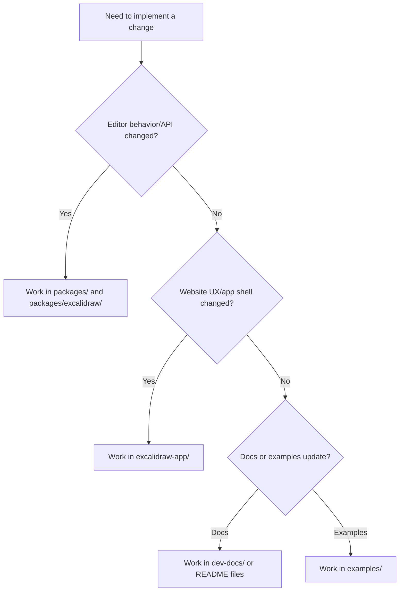
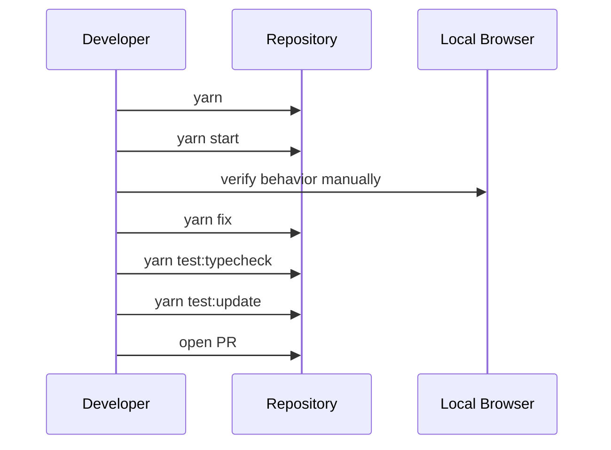

# Excalidraw New Employee Onboarding

This guide is designed to get a new engineer productive in the Excalidraw monorepo fast. It is organized as checklists, decision guides, and diagrams so you can jump to the section you need.

## Table of contents

- `1. Product and repository overview`
- `2. Technical stack`
- `3. Monorepo architecture diagrams`
- `4. Setup and first run`
- `5. Command reference`
- `6. How to choose where to work`
- `7. Daily development workflow`
- `8. Testing and quality gates`
- `9. PR and contribution conventions`
- `10. First week plan`
- `11. Troubleshooting`
- `12. Useful links and glossary`

## 1. Product and repository overview

Excalidraw in this repository includes:

- `@excalidraw/excalidraw`: React editor component library
- `excalidraw-app/`: web app used for `excalidraw.com`
- `packages/*`: internal shared packages (`common`, `element`, `math`, `utils`)
- `examples/`: integration samples (for example Next.js and browser script usage)
- `dev-docs/`: Docusaurus documentation source

## 2. Technical stack

- **Language**
  - TypeScript (strict)
  - JavaScript (some supporting code)
- **Frontend**
  - React
  - Browser-first canvas/editor UX
- **Monorepo and package management**
  - Yarn workspaces
- **Build/tooling**
  - esbuild for packages
  - Vite for app/dev tooling path in architecture notes
- **Testing and quality**
  - Automated tests and snapshots
  - Type checking
  - Formatting and code-style checks
- **Documentation**
  - Docusaurus in `dev-docs/`
- **Optional local runtime alternative**
  - Docker / Docker Compose

## 3. Monorepo architecture diagrams

### 3.1 Codebase structure map

```mermaid
flowchart LR
  subgraph CorePackages["packages/"]
    Common[@excalidraw/common]
    Element[@excalidraw/element]
    Math[@excalidraw/math]
    Utils[@excalidraw/utils]
  end

  Common --> EditorPkg[@excalidraw/excalidraw]
  Element --> EditorPkg
  Math --> EditorPkg
  Utils --> EditorPkg

  EditorPkg --> App[excalidraw-app]
  EditorPkg --> Examples[examples/]
  DevDocs[dev-docs/] -. docs for contributors .-> EditorPkg
```

### 3.2 Runtime view

```mermaid
flowchart TD
  Browser[User Browser] --> WebApp[excalidraw-app]
  WebApp --> Editor[@excalidraw/excalidraw]
  Editor --> Model[element/common/math/utils]
  WebApp --> LocalStorage[Local-first persistence]
  WebApp -. optional .-> Collab[Collab server setup]
```

### 3.3 Change routing decision tree



## 4. Setup and first run

### 4.1 Prerequisites

- Node.js
- Yarn (repo docs mention v1 or v2.4.2+)
- Git

### 4.2 Install dependencies

From repo root:

```bash
yarn
```

### 4.3 Start local development server

```bash
yarn start
```

Open `http://localhost:3000`.

### 4.4 Optional: run docs site locally

```bash
cd dev-docs
yarn
yarn start
```

### 4.5 Optional: Docker setup

```bash
docker-compose up --build -d
```

## 5. Command reference

### 5.1 Most-used commands

- `yarn` - install dependencies
- `yarn start` - run app locally
- `yarn fix` - auto-fix formatting/lint issues
- `yarn test` - run tests
- `yarn test:update` - update snapshots
- `yarn test:typecheck` - TypeScript checks
- `yarn test:code` - code-format/code-style checks

### 5.2 Command flow diagram



## 6. How to choose where to work

Use these rules:

- **Editor feature or API behavior**
  - Primary area: `packages/` and `packages/excalidraw/`
- **Product UI or app-level behavior**
  - Primary area: `excalidraw-app/`
- **Integration example updates**
  - Primary area: `examples/`
- **Contributor or API docs**
  - Primary area: `dev-docs/` and relevant `README.md` files

## 7. Daily development workflow

- Pull latest changes and ensure dependencies are installed (`yarn`)
- Start the app (`yarn start`)
- Implement a focused change in the correct folder
- Run quality checks (`yarn fix`, `yarn test:typecheck`, `yarn test:update`)
- Manually test in browser
- Open PR with clear title and scope

## 8. Testing and quality gates

Required before review:

- `yarn test:typecheck`
- `yarn test:update`

Recommended:

- `yarn test`
- `yarn test:code`
- Manual browser verification for changed flows

Notes:

- Snapshot updates are expected when intentional UI/output changes occur.
- For bug fixes, add or adjust tests when practical to prevent regressions.

## 9. PR and contribution conventions

- Keep PRs small and single-purpose where possible.
- Use semantic PR title prefixes:
  - `feat`, `fix`, `docs`, `refactor`, `test`, `chore`, and others from contributing docs
- Include context in PR description:
  - what changed
  - why it changed
  - how it was validated
- Verify local checks before requesting review.

## 10. First week plan

### Day 1

- Run setup (`yarn`, `yarn start`)
- Read:
  - `README.md`
  - `dev-docs/docs/introduction/development.mdx`
  - `dev-docs/docs/introduction/contributing.mdx`
- Map your likely ownership area (`packages/*` vs `excalidraw-app/`)

### Day 2

- Run core checks:
  - `yarn test:typecheck`
  - `yarn test:update`
- Explore one recent PR to understand team patterns
- Make a small local change and validate full workflow

### Day 3

- Ship a small scoped contribution
- Include tests or snapshot updates as needed
- Ask for review with a concise PR description

## 11. Troubleshooting

### Dev server fails to start

- Re-run `yarn` from repo root
- Verify Node and Yarn versions are supported
- Retry `yarn start`

### Canvas appears blank

- Ensure CSS import exists:
  - `import "@excalidraw/excalidraw/index.css";`
- Ensure parent container has non-zero height (for example `height: "100vh"`)

### SSR or hydration issues (for example Next.js)

- Use client-only rendering patterns:
  - `"use client"`
  - dynamic import with `{ ssr: false }`

### Tests or formatting fail unexpectedly

- Run `yarn fix`
- Re-run:
  - `yarn test:typecheck`
  - `yarn test:update`

### Docs changes not visible

- Run docs site from `dev-docs/` (`yarn start`)

## 12. Useful links and glossary

### Useful links in repo

- Root overview: `README.md`
- Main contributor docs: `dev-docs/docs/introduction/development.mdx`
- Contribution expectations: `dev-docs/docs/introduction/contributing.mdx`
- Package integration guide: `packages/excalidraw/README.md`

### Glossary

- **Editor component**: React component from `packages/excalidraw/`
- **Monorepo**: single repository containing multiple packages/apps
- **Snapshot test**: test comparing output to saved expected snapshots

