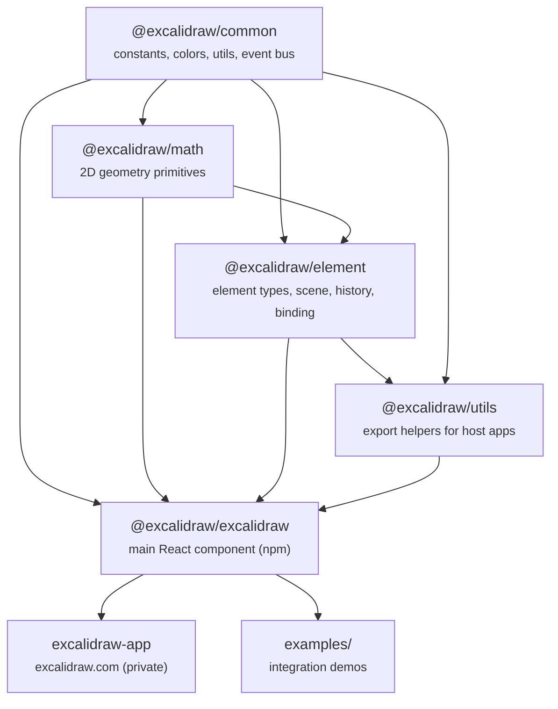
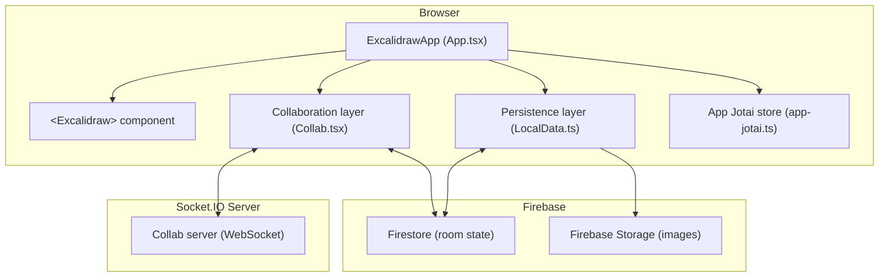
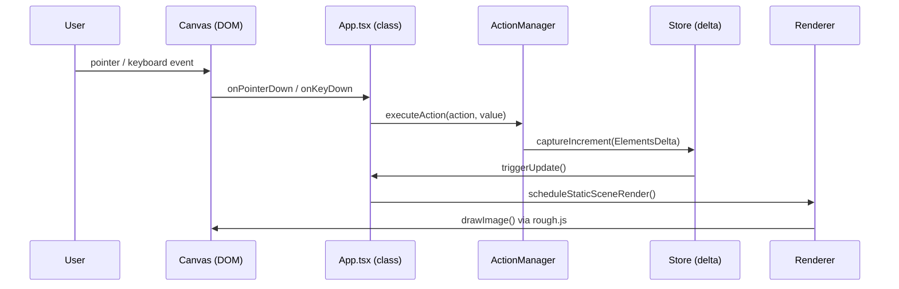
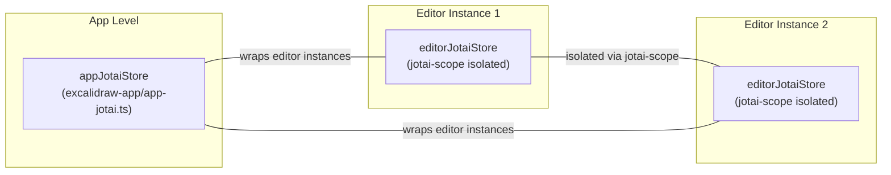
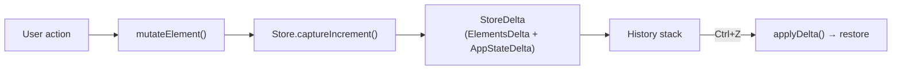
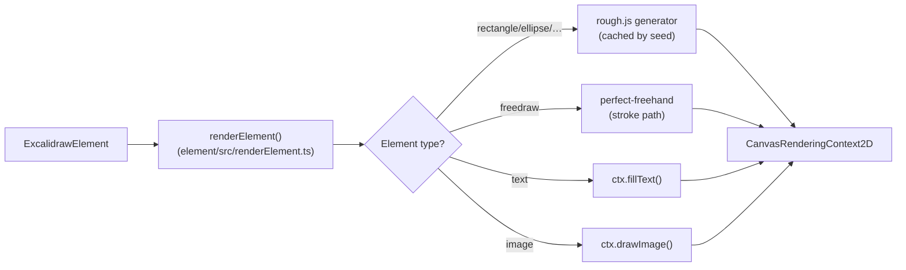
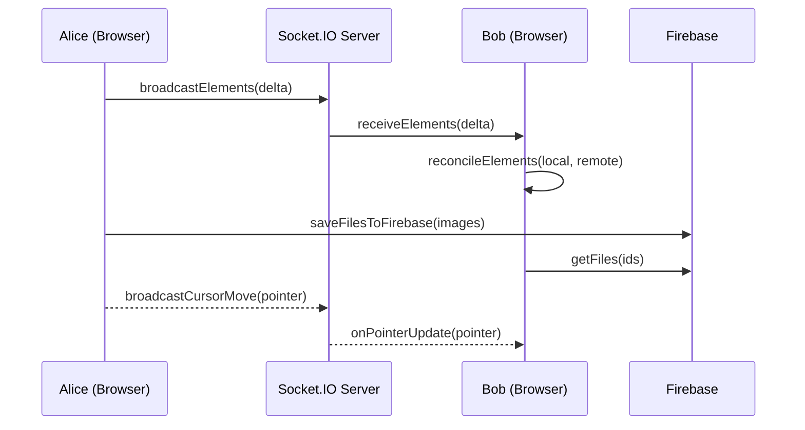
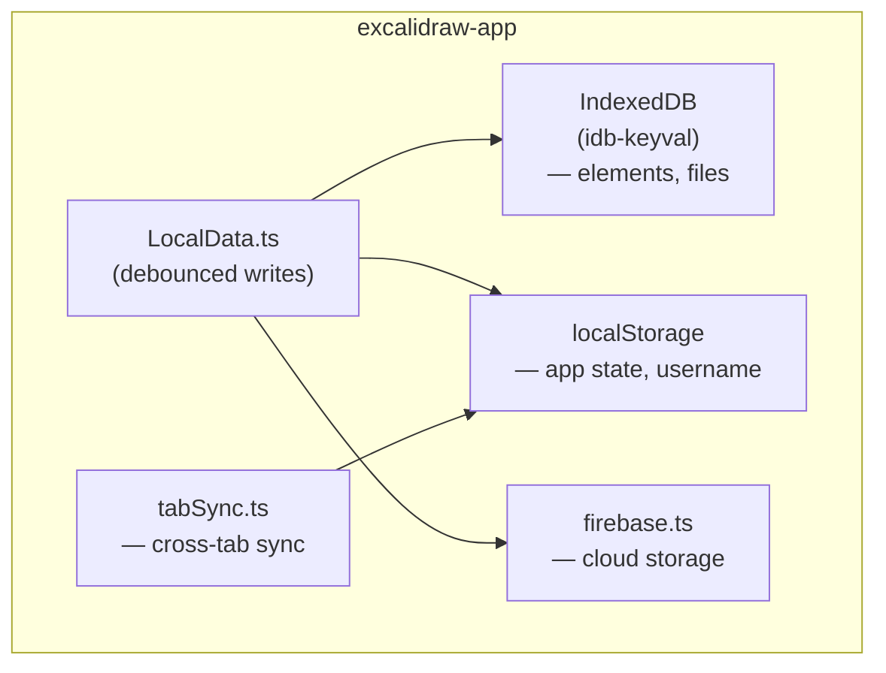
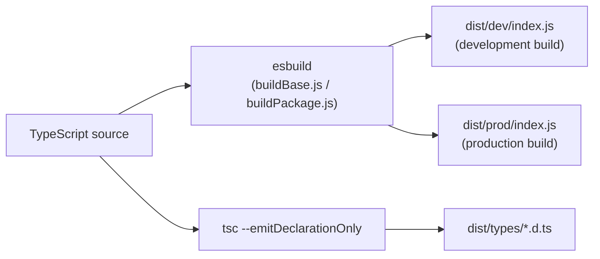
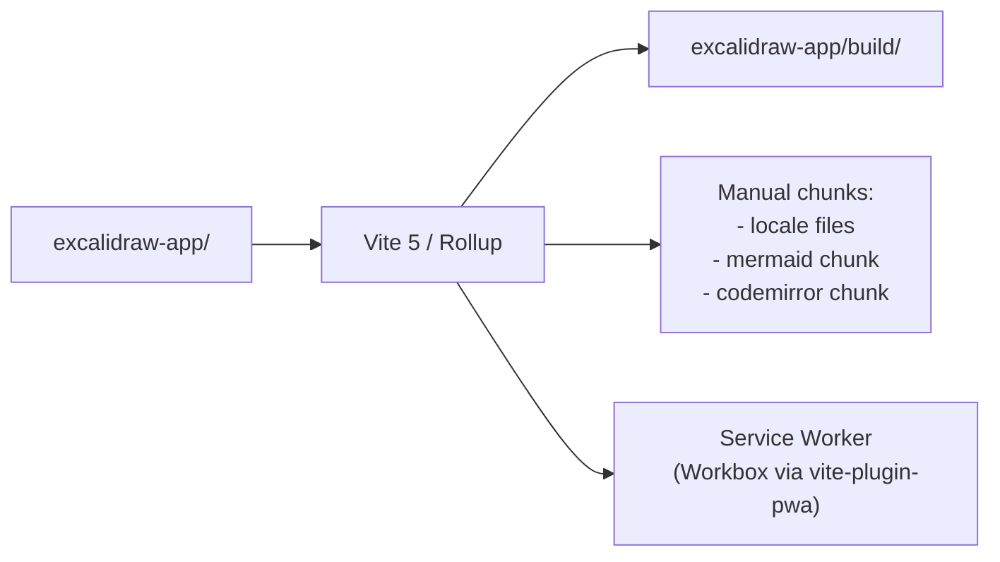

# Excalidraw — New Engineer Onboarding Guide

Welcome to the Excalidraw project! This guide will help you understand the codebase, get set up for development, and feel productive as quickly as possible.

---

## Table of Contents

1. [What Is Excalidraw?](#1-what-is-excalidraw)
2. [Repository at a Glance](#2-repository-at-a-glance)
3. [Package Dependency Graph](#3-package-dependency-graph)
4. [Getting Started](#4-getting-started)
5. [Package Deep-Dives](#5-package-deep-dives)
6. [The Web Application](#6-the-web-application)
7. [Architecture — How It All Works](#7-architecture--how-it-all-works)
8. [State Management](#8-state-management)
9. [Rendering Pipeline](#9-rendering-pipeline)
10. [Collaboration Architecture](#10-collaboration-architecture)
11. [Persistence & Storage](#11-persistence--storage)
12. [Testing](#12-testing)
13. [Build System](#13-build-system)
14. [Key Workflows](#14-key-workflows)
15. [Where to Find Things](#15-where-to-find-things)
16. [Glossary](#16-glossary)

---

## 1. What Is Excalidraw?

Excalidraw is an open-source, browser-based whiteboard tool for sketching hand-drawn-style diagrams. It lives at [excalidraw.com](https://excalidraw.com) and is also published as an embeddable React component (`@excalidraw/excalidraw`) that other applications can integrate.

**There are two distinct products in this repo:**

| Product | Description | Audience |
|---|---|---|
| `@excalidraw/excalidraw` (npm) | Embeddable React component library | Third-party developers |
| excalidraw.com app | Full-featured collaborative whiteboard | End users |

Both live in the same monorepo and share the same underlying code.

---

## 2. Repository at a Glance

```
excalidraw-master/
├── packages/
│   ├── excalidraw/     ← @excalidraw/excalidraw  (main React component, npm published)
│   ├── common/         ← @excalidraw/common       (shared constants, utils, colors)
│   ├── element/        ← @excalidraw/element       (element types, rendering, history)
│   ├── math/           ← @excalidraw/math          (2D geometry primitives)
│   └── utils/          ← @excalidraw/utils         (export utilities for host apps)
│
├── excalidraw-app/     ← excalidraw.com (private app, NOT published to npm)
│
├── examples/
│   ├── with-nextjs/                ← Next.js integration example
│   └── with-script-in-browser/     ← plain HTML / <script> tag example
│
├── scripts/            ← build, release, locale helper scripts
├── dev-docs/           ← developer documentation source
├── public/             ← static assets (icons, screenshots)
│
├── package.json        ← Yarn workspaces root
├── tsconfig.json       ← TypeScript config with path aliases
├── vitest.config.mts   ← Vitest test runner config
└── docker-compose.yml  ← Docker setup for local backend services
```

**Toolchain summary:**

| Tool | Version | Purpose |
|---|---|---|
| Yarn | 1.22.22 | Package manager & workspaces |
| TypeScript | 5.9 | Type-safe development throughout |
| Vite 5 | app build | Dev server + production bundler for the app |
| esbuild | 0.19 | Fast bundler for the library packages |
| Vitest | 3.x | Unit & integration test runner |
| React | 17/18/19 | UI framework (peer dep) |
| Jotai | 2.x | Atom-based state management |
| rough.js | — | Hand-drawn aesthetic rendering |

---

## 3. Package Dependency Graph

All internal packages resolve to TypeScript source during development (via path aliases in `tsconfig.json`). No pre-build step is needed for the inner development loop.



**Dependency rule:** lower-level packages never import from higher-level ones. `common` knows nothing about `element`; `element` knows nothing about the React component.

---

## 4. Getting Started

### Prerequisites

- Node.js ≥ 18
- Yarn 1.22+ (`npm install -g yarn`)
- Git

### Installation

```bash
# Clone the repo
git clone https://github.com/excalidraw/excalidraw.git
cd excalidraw

# Install all dependencies (all workspaces at once)
yarn install
```

### Start the development server

```bash
# Starts the excalidraw.com app with HMR at http://localhost:3000
yarn start
```

You do **not** need to build the packages first. During development, all `@excalidraw/*` imports resolve directly to TypeScript source via path aliases.

### Useful development commands

```bash
yarn start               # Start the app dev server (HMR, http://localhost:3000)
yarn test                # Run unit tests (watch mode)
yarn test:update         # Run all tests and update snapshots
yarn test:typecheck      # TypeScript type checking (tsc --noEmit)
yarn test:code           # ESLint
yarn test:other          # Prettier formatting check
yarn fix                 # Auto-fix formatting + lint issues
yarn build:app           # Production build of the web app → excalidraw-app/build/
yarn build:packages      # Build all library packages → packages/*/dist/
```

### Environment Variables

The app reads environment variables from `.env` files (not committed). Copy the example:

```bash
cp .env.development .env.development.local
```

Key variables (see `excalidraw-app/vite.config.mts` for the full list):

| Variable | Purpose |
|---|---|
| `VITE_APP_FIREBASE_CONFIG` | Firebase project config (JSON) |
| `VITE_APP_BACKEND_V2_GET_URL` | Collaboration backend URL |
| `VITE_APP_PORTAL_URL` | Socket.IO collab server URL |
| `VITE_APP_AI_BACKEND` | AI feature backend URL |

---

## 5. Package Deep-Dives

### `@excalidraw/common`

The foundation everything else builds on. No monorepo dependencies.

Key files:

```
packages/common/src/
├── constants.ts      ← All magic numbers, enums (EVENT, THEME, CURSOR_TYPE, …)
├── colors.ts         ← Color palette definitions
├── utils.ts          ← General utility functions
├── bounds.ts         ← Bounding-box helpers
├── emitter.ts        ← Typed event emitter
├── appEventBus.ts    ← Global cross-component event bus
└── editorInterface.ts← TypeScript interface for the editor API
```

---

### `@excalidraw/math`

Pure 2D geometry — no DOM, no React, no side effects. Safe to use server-side.

Key files:

```
packages/math/src/
├── vector.ts     ← 2D vector operations
├── point.ts      ← Point types and arithmetic
├── segment.ts    ← Line segments (intersection, distance, …)
├── curve.ts      ← Bézier curves
├── ellipse.ts    ← Ellipse geometry
├── polygon.ts    ← Polygon containment and intersection
└── angle.ts      ← Angle normalization and conversion
```

---

### `@excalidraw/element`

The heart of the canvas domain logic.

```
packages/element/src/
├── types.ts               ← All element type definitions
├── Scene.ts               ← SceneElementsMap, scene queries
├── store.ts               ← CaptureUpdateAction + delta store
├── delta.ts               ← ElementsDelta, AppStateDelta (undo/redo)
├── mutateElement.ts       ← Safe element mutation helper
├── newElement.ts          ← Element factory functions
├── binding.ts             ← Arrow-to-element binding logic
├── linearElementEditor.ts ← Point editing for lines/arrows
├── textElement.ts         ← Text wrapping, measurement
├── renderElement.ts       ← Per-element draw calls (rough.js)
├── bounds.ts              ← Element bounding boxes
├── selection.ts           ← Selection hit-testing
├── frame.ts               ← Frame element logic
├── groups.ts              ← Group element logic
├── flowchart.ts           ← Flowchart auto-layout
└── elbowArrow.ts          ← Elbow (orthogonal) arrow routing
```

**Every element type** extends `_ExcalidrawElementBase`:

```typescript
interface _ExcalidrawElementBase {
  id: string;               // nanoid
  x: number; y: number;    // scene coordinates
  width: number; height: number;
  angle: number;            // radians
  strokeColor: string;
  backgroundColor: string;
  fillStyle: FillStyle;
  strokeStyle: StrokeStyle;
  roughness: number;        // 0–2 (rough.js roughness)
  opacity: number;          // 0–100
  seed: number;             // controls rough.js shape randomness
  version: number;          // incremented on every mutation
  versionNonce: number;     // random — used for collab reconciliation
  index: FractionalIndex;   // stable ordering in multiplayer
  isDeleted: boolean;
  groupIds: string[];
  frameId: string | null;
  boundElements: BoundElement[] | null;
  locked: boolean;
  link: string | null;
  customData?: Record<string, unknown>;
}
```

**Concrete element types:** `rectangle`, `ellipse`, `diamond`, `line`, `arrow`, `freedraw`, `text`, `image`, `frame`, `magicframe`, `embeddable`, `laser`.

---

### `@excalidraw/excalidraw`

The published React component. Entry point: `packages/excalidraw/index.tsx`.

Key exports:

| Category | Exports |
|---|---|
| Components | `<Excalidraw>`, `<MainMenu>`, `<WelcomeScreen>`, `<Footer>`, `<Sidebar>`, `<TTDDialog>` |
| Hooks | `useExcalidrawAPI()`, `useExcalidrawStateValue()`, `useOnExcalidrawStateChange()` |
| Export utils | `exportToCanvas`, `exportToBlob`, `exportToSvg`, `exportToClipboard` |
| Serialization | `serializeAsJSON`, `loadFromBlob`, `restoreAppState`, `restoreElements` |
| Element helpers | `mutateElement`, `newElementWith`, `convertToExcalidrawElements` |
| Constants | `FONT_FAMILY`, `THEME`, `MIME_TYPES`, `ROUNDNESS` |

**Minimal integration example:**

```tsx
import { Excalidraw } from "@excalidraw/excalidraw";

export default function App() {
  return (
    <div style={{ height: "100vh" }}>
      <Excalidraw />
    </div>
  );
}
```

---

### `@excalidraw/utils`

Utility functions intended for host application use (not for internal library code).

```
packages/utils/src/
├── export.ts        ← exportToCanvas, exportToBlob, exportToSvg
├── withinBounds.ts  ← Hit-testing helpers
├── bbox.ts          ← Bounding box calculations
└── shape.ts         ← Shape geometry helpers
```

---

## 6. The Web Application

`excalidraw-app/` is the full excalidraw.com application. It is **private** (not published to npm) and uses `@excalidraw/excalidraw` as a dependency.

### Application Layers



### Key App Files

| File | Responsibility |
|---|---|
| `App.tsx` | Root component; wraps `<Excalidraw>` with providers |
| `index.tsx` | React DOM root mount, service worker registration |
| `collab/Collab.tsx` | Real-time collaboration (Socket.IO + Firebase) |
| `collab/Portal.tsx` | WebSocket abstraction layer |
| `data/LocalData.ts` | Debounced local save (IndexedDB + localStorage) |
| `data/firebase.ts` | Firebase Firestore/Storage read/write |
| `data/tabSync.ts` | Cross-tab state synchronization |
| `components/AI.tsx` | AI feature (text-to-diagram) UI |
| `app-jotai.ts` | App-level Jotai atom store |
| `app_constants.ts` | App-specific constants, storage keys |

---

## 7. Architecture — How It All Works

### The Core Event Loop



### The Action System

Every editor operation is an `Action` object:

```typescript
interface Action {
  name: ActionName;
  perform(
    elements: readonly ExcalidrawElement[],
    appState: AppState,
    value: unknown,
    app: AppClassProperties,
  ): ActionResult;
  PanelComponent?: React.FC;   // Properties panel UI for this action
  trackEvent?: EventDescriptor;
}
```

Actions are registered in `packages/excalidraw/actions/` and dispatched through `ActionManager`. This cleanly separates UI from logic and makes unit testing straightforward.

---

## 8. State Management

### Dual Jotai Store Architecture

The project uses two completely isolated Jotai stores to support multiple `<Excalidraw>` instances on the same page:



| Store | Location | Contains |
|---|---|---|
| `editorJotaiStore` | `packages/excalidraw/editor-jotai.ts` | Editor atoms (tool mode, UI state, font loading, …) |
| `appJotaiStore` | `excalidraw-app/app-jotai.ts` | App atoms (collab state, share dialog, offline status) |

**React class component state (`App.tsx`)** is used for high-frequency rendering concerns (element positions, current app state) because class components avoid hook overhead in hot paths.

### Undo / Redo: Delta-Based Store

Changes are captured as immutable `StoreDelta` objects containing:

- `ElementsDelta` — what changed at the element level
- `AppStateDelta` — what changed in app state (selected elements, viewport, etc.)



`CaptureUpdateAction` enum controls when deltas are captured:

| Value | When to use |
|---|---|
| `IMMEDIATELY` | Discrete actions the user should be able to undo individually |
| `EVENTUALLY` | Continuous drags (batched into one undo step) |
| `NEVER` | View-only changes (zoom, pan) — not undoable |

---

## 9. Rendering Pipeline

### Dual-Canvas Architecture

Two HTML5 `<canvas>` elements are layered on top of each other:

```
┌──────────────────────────────────────────┐
│  Interactive Canvas  (top layer)          │
│  - selection handles                      │
│  - transform handles                      │
│  - bound text cursors                     │
│  - snap lines                             │
│  - collaborator cursors                   │
│  - laser pointer trails                   │
└──────────────────────────────────────────┘
┌──────────────────────────────────────────┐
│  Static Canvas  (bottom layer)            │
│  - all non-interactive elements           │
│  - throttled via throttleRAF              │
└──────────────────────────────────────────┘
```

| Canvas | File | Render trigger |
|---|---|---|
| Static | `packages/excalidraw/renderer/staticScene.ts` | Throttled via `throttleRAF` on element or zoom change |
| Interactive | `packages/excalidraw/renderer/interactiveScene.ts` | Every pointer event / state change |

### How an Element Gets Drawn



rough.js shapes are **cached by element `seed`** — the same seed always produces the same hand-drawn shape, enabling consistent rendering across collaborators.

---

## 10. Collaboration Architecture

Collaboration is entirely in `excalidraw-app/` and uses two real-time backends:



**Key principle:** The library (`@excalidraw/excalidraw`) does **not** contain any collaboration code. It only exposes:
- `isCollaborating` prop — signals the UI to show collaboration indicators
- `reconcileElements()` export — merges remote elements with local state

The app layer in `excalidraw-app/collab/` owns all Socket.IO connections and Firebase calls.

### Element Reconciliation

When remote elements arrive, `reconcileElements()` merges them:

1. Remote element `version` > local `version` → use remote
2. Same `version` but different `versionNonce` → use element with higher `versionNonce` (deterministic tiebreak)
3. Local element has no remote counterpart → keep local
4. Remote element has no local counterpart → add it

---

## 11. Persistence & Storage



| Storage | What's stored | Library |
|---|---|---|
| IndexedDB | Canvas elements, binary files (images) | `idb-keyval` |
| `localStorage` | App state, user preferences, scene version counter | Native |
| Firebase Firestore | Shared room state for collaboration | Firebase 11 |
| Firebase Storage | Shared image files for collaboration | Firebase 11 |

**Write strategy:** `LocalData.ts` uses debounced writes — rapid element mutations don't thrash the storage. A save happens at most once per 300ms window.

---

## 12. Testing

### Test Locations

| Location | What's tested |
|---|---|
| `packages/excalidraw/tests/` | Main component tests (~30 files: App, actions, clipboard, drag, export, history, …) |
| `packages/element/src/__tests__/` | Element domain logic unit tests |
| `packages/math/tests/` | Geometry unit tests |
| `packages/common/tests/` | Utility unit tests |
| `excalidraw-app/tests/` | App integration tests |

### Test Setup

| Mock | What it does |
|---|---|
| `vitest-canvas-mock` | Mocks `<canvas>` 2D rendering context |
| `fake-indexeddb` | In-memory IndexedDB for tests |
| `throttleRAF` | Replaced with synchronous stub so renders happen immediately |
| `window.FontFace` / `document.fonts` | Mocked so font loading tests are deterministic |

### Running Tests

```bash
yarn test                  # Watch mode
yarn test:update           # Run all tests, update snapshots
yarn test:typecheck        # TypeScript type check
yarn test:code             # ESLint
yarn test:other            # Prettier

# Run a specific test file
yarn test packages/excalidraw/tests/history.test.tsx
```

### Coverage Thresholds

| Metric | Minimum |
|---|---|
| Lines | 60% |
| Statements | 60% |
| Branches | 70% |
| Functions | 63% |

---

## 13. Build System

### Library Packages (esbuild)



Build order (enforced by `yarn build:packages`): `common` → `math` → `element` → `excalidraw`

### App (Vite + Rollup)



**PWA features:** The app ships with a Workbox service worker that precaches the app shell, lazy-loads locale files, and caches Google Fonts. This enables offline usage.

---

## 14. Key Workflows

### Adding a New Element Type

1. **Define the type** in `packages/element/src/types.ts` — extend `_ExcalidrawElementBase`
2. **Add a factory function** in `packages/element/src/newElement.ts`
3. **Add rendering logic** in `packages/element/src/renderElement.ts`
4. **Add hit-testing** in `packages/element/src/bounds.ts`
5. **Add selection logic** in `packages/element/src/selection.ts`
6. **Register the tool** in the toolbar (`packages/excalidraw/components/`)
7. **Add tests** in `packages/excalidraw/tests/`

### Adding a New Action

1. Create a file in `packages/excalidraw/actions/`
2. Implement `Action` interface with `name` and `perform()`
3. Optionally add a `PanelComponent` for the properties panel
4. Register in `packages/excalidraw/actions/index.ts`
5. Add `ActionName` to the union type in `packages/excalidraw/actions/types.ts`

### Adding a New Translation String

1. Add the key/value to `packages/excalidraw/locales/en.json` (English is the source of truth)
2. Use `t("my.new.key")` in the component
3. Other locales are updated separately by translators

### Making a Library Release

```bash
yarn build:packages         # Build all packages
# Update versions in packages/*/package.json
# Update CHANGELOG.md
yarn publish:packages       # Publishes to npm
```

---

## 15. Where to Find Things

| I want to… | Look here |
|---|---|
| Change a toolbar button | `packages/excalidraw/components/toolBar/` |
| Change the properties panel | `packages/excalidraw/components/Stats.tsx` and `packages/excalidraw/actions/` |
| Change how an element renders | `packages/element/src/renderElement.ts` |
| Add/change an element type | `packages/element/src/types.ts` + `newElement.ts` |
| Change collaboration behavior | `excalidraw-app/collab/Collab.tsx` |
| Change local save behavior | `excalidraw-app/data/LocalData.ts` |
| Change keyboard shortcuts | `packages/excalidraw/actions/` (each action defines its own shortcut) |
| Change colors/theming | `packages/common/src/colors.ts` + `packages/excalidraw/css/` |
| Add a new localization string | `packages/excalidraw/locales/en.json` |
| Change the undo/redo behavior | `packages/element/src/store.ts` + `packages/excalidraw/history.ts` |
| Change export (PNG/SVG/JSON) | `packages/utils/src/export.ts` |
| Change the welcome screen | `excalidraw-app/components/AppWelcomeScreen.tsx` |
| Change AI features | `excalidraw-app/components/AI.tsx` |

---

## 16. Glossary

| Term | Meaning |
|---|---|
| **Scene** | The entire set of elements on the canvas at a given time |
| **AppState** | The editor's non-element state: selected elements, current tool, viewport, zoom, theme, etc. |
| **Element** | A single drawable object (rectangle, arrow, text, image, …) |
| **Seed** | A random number stored on each element that controls rough.js's hand-drawn randomness — same seed = same shape |
| **FractionalIndex** | A string-based ordering value that allows inserting between two existing elements without renumbering |
| **Delta** | An immutable record of what changed between two states (used for undo/redo) |
| **CaptureUpdateAction** | Enum that controls whether/when a state change is recorded in the undo history |
| **Binding** | The linkage between an arrow element and the shapes at its endpoints |
| **Frame** | A named container element that logically groups other elements |
| **rough.js** | The third-party library that gives Excalidraw its hand-drawn aesthetic |
| **perfect-freehand** | The library used to render pressure-sensitive free-draw strokes |
| **Reconciliation** | The process of merging remote (collaborator) element changes with local state |
| **Portal** | The WebSocket abstraction layer in `excalidraw-app/collab/Portal.tsx` |
| **editorJotaiStore** | The isolated Jotai atom store belonging to a single `<Excalidraw>` instance |
| **appJotaiStore** | The app-level Jotai atom store for excalidraw.com-specific state |
| **throttleRAF** | A utility that throttles a function to fire at most once per animation frame |
| **PWA** | Progressive Web App — the app ships a service worker for offline support and installability |

---

## Further Reading

- [Official Documentation](https://docs.excalidraw.com) — API reference, installation guide, contributing guide
- [`packages/excalidraw/CHANGELOG.md`](packages/excalidraw/CHANGELOG.md) — library release history
- [`CONTRIBUTING.md`](CONTRIBUTING.md) — contribution guidelines
- [`dev-docs/`](dev-docs/) — developer documentation sources
- [excalidraw.com](https://excalidraw.com) — the live application

---

*Happy drawing! If something in this document is out of date, please update it — the best onboarding doc is one the team keeps current.*
