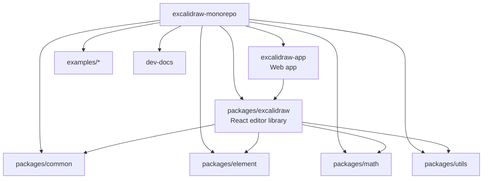
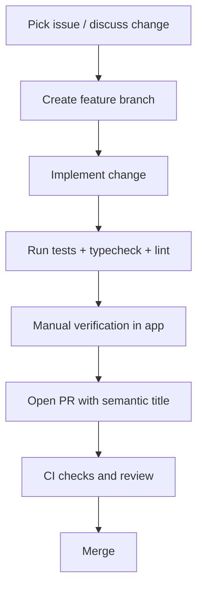

# Excalidraw Engineering Onboarding Guide

This guide is for new engineers, especially developers with limited open-source/monorepo experience. It explains what this repository contains, how it is organized, and how to start making safe contributions quickly.

---

## 1) What this project is

Excalidraw is an open-source, hand-drawn style virtual whiteboard.

This repository is a monorepo that contains:
- The reusable React editor library published as `@excalidraw/excalidraw`
- The production web app (`excalidraw-app`) powering excalidraw.com
- Supporting internal packages (`@excalidraw/common`, `@excalidraw/element`, `@excalidraw/math`, `@excalidraw/utils`)
- Integration examples and documentation sources

Core user-facing capabilities include:
- Infinite canvas drawing and diagramming
- Local-first behavior
- Export/import of drawing data
- Real-time collaboration (app side)
- End-to-end encryption for collaboration features

---

## 2) Monorepo architecture at a glance



### Directory map

- `packages/excalidraw/`: main editor implementation and package entrypoints
- `excalidraw-app/`: app-specific integrations (hosting, app services, runtime env, etc.)
- `packages/common/`: shared constants/types/utilities used across packages
- `packages/element/`: element logic (geometry, transforms, element-level operations)
- `packages/math/`: math helpers (vectors, geometry primitives)
- `packages/utils/`: export/utility helpers for consumers
- `examples/`: reference integrations (for example Next.js)
- `dev-docs/`: docs site content and contributor docs
- `.github/workflows/`: CI/CD automation and repository checks

---

## 3) Technical stack

### Runtime and languages
- TypeScript (strict mode enabled)
- React 19
- Node.js `>=18.0.0`
- Yarn workspaces (package manager pinned to `yarn@1.22.22`)

### Build/dev tooling
- Vite for app dev/build
- esbuild-based package build scripts
- Vitest for tests
- jsdom as browser-like test environment

### Quality tooling
- ESLint (`@excalidraw/eslint-config` + `react-app`)
- Prettier (`@excalidraw/prettier-config`)
- Husky + lint-staged for pre-commit checks
- EditorConfig for baseline editor consistency

### App/platform dependencies (selected)
- Firebase
- Socket.IO client
- Sentry
- i18n/language detection tooling

---

## 4) Dependency and import model

The workspace uses TypeScript path aliases and matching Vitest aliases so internal packages can be imported as `@excalidraw/*` during development.

```mermaid
flowchart LR
  A[Code in monorepo] --> B[@excalidraw/common]
  A --> C[@excalidraw/element]
  A --> D[@excalidraw/math]
  A --> E[@excalidraw/utils]
  A --> F[@excalidraw/excalidraw]
  B --> G[packages/common/src]
  C --> H[packages/element/src]
  D --> I[packages/math/src]
  E --> J[packages/utils/src]
  F --> K[packages/excalidraw]
```

Important convention:
- In `packages/excalidraw`, avoid barrel self-imports from `@excalidraw/excalidraw` and prefer direct relative imports for implementation modules.

---

## 5) Daily development workflow

### 5.1 First setup

1. Install prerequisites:
   - Node.js 18+
   - Yarn
   - Git
2. Clone repo
3. Install dependencies:
   - `yarn`
4. Start app locally:
   - `yarn start`
5. Open:
   - `http://localhost:3000`

### 5.2 Main commands you will use

- `yarn start`: run app in development mode
- `yarn test`: run tests (Vitest)
- `yarn test:update`: update snapshots + run tests without watch
- `yarn test:typecheck`: TypeScript type check
- `yarn test:code`: ESLint checks
- `yarn test:other`: Prettier check mode
- `yarn fix`: auto-format and lint-fix where possible
- `yarn build`: app production build
- `yarn build:packages`: build internal packages

### 5.3 Recommended "before PR" checklist

- Run `yarn test:update`
- Run `yarn test:typecheck`
- Run `yarn test:code`
- Run `yarn test:other`
- Manually test changed behavior locally

---

## 6) Contribution workflow



Guidelines:
- Prefer small, focused PRs
- Follow semantic PR title prefixes such as:
  - `feat`, `fix`, `docs`, `refactor`, `test`, `perf`, `ci`, `chore`
- Add tests for bug fixes and new behavior
- If scope is large, open/align on an issue first

---

## 7) CI/CD and automation overview

This repository uses GitHub Actions to enforce quality and automate releases/deployments.

Important workflows include:
- `lint.yml`: lint + type checks
- `test.yml`: test execution
- `test-coverage-pr.yml`: coverage reporting
- `size-limit.yml`: package size control
- `semantic-pr-title.yml`: PR title convention check
- Release/deployment workflows for package and docker pipelines

What this means for you:
- Local checks should match CI expectations
- If CI fails, reproduce locally with the matching command and fix before re-requesting review

---

## 8) Code style and best practices

### Formatting and style
- 2-space indentation, LF endings, UTF-8, trailing whitespace trimmed
- Keep imports consistently ordered (lint-enforced)
- Use `import type` where appropriate (lint-enforced)

### Architecture and design habits
- Keep package boundaries clean (do not couple app-specific logic into reusable package layers)
- Prefer small, composable functions over large monolithic logic
- Preserve backward compatibility for public package APIs
- Place logic in the most specific package that owns the concern

### Testing habits
- Add regression tests when fixing bugs
- Update snapshots only when the behavior change is intentional
- Do not skip manual testing for interaction-heavy UI changes

### PR and review habits
- Explain "why" in PR description, not just "what changed"
- Call out risky areas and what was tested
- Keep commits understandable and scoped

---

## 9) How to orient quickly in the codebase

If you are new and unsure where to start:

1. Read:
   - `README.md`
   - `dev-docs/docs/introduction/development.mdx`
   - `dev-docs/docs/introduction/contributing.mdx`
2. Run app and interact with core flows in browser
3. Pick one small issue (docs/easy/fix) and trace code path end-to-end
4. For feature work:
   - start from UI action handler
   - follow state/data flow to element/data modules
   - verify export/import and rendering effects if touched

---

## 10) Common beginner pitfalls (and how to avoid them)

- Editing the wrong package:
  - confirm if change belongs to reusable editor (`packages/excalidraw`) or app shell (`excalidraw-app`)
- Forgetting full quality checks:
  - run typecheck/lint/tests before PR
- Accidentally introducing boundary leaks:
  - keep app-specific dependencies out of shared packages
- Snapshot churn:
  - review snapshot diffs carefully; never update blindly
- Missing manual verification:
  - canvas/editor behavior often needs interactive validation, not just unit tests

---

## 11) Suggested first-week plan for a new engineer

Day 1:
- Set up environment
- Run app, tests, and typecheck
- Read onboarding + contributing docs

Day 2-3:
- Shadow one merged PR and trace impacted modules
- Fix one small issue (docs or low-risk bug)

Day 4-5:
- Implement a scoped improvement with tests
- Submit PR with semantic title and clear test notes

By end of week 1, goal is confidence in:
- Monorepo navigation
- Local quality pipeline
- Safe contribution flow

---

## 12) Handy reference list

- Root project overview: `README.md`
- Contribution entrypoint: `CONTRIBUTING.md`
- Development setup guide: `dev-docs/docs/introduction/development.mdx`
- Contribution guide: `dev-docs/docs/introduction/contributing.mdx`
- Main editor package docs: `packages/excalidraw/README.md`
- Root scripts and workspace config: `package.json`
- TypeScript aliases/config: `tsconfig.json`
- Lint rules: `.eslintrc.json`
- Formatting rules: `.editorconfig`
- Test config and thresholds: `vitest.config.mts`

