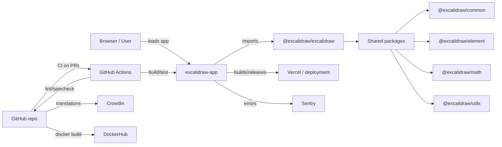
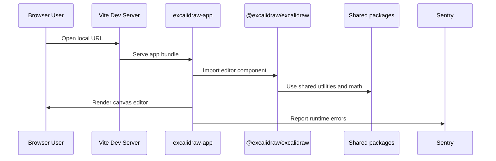

# Architecture

## System Overview

The repository is a monorepo centered on the Excalidraw editor package and the production showcase app. The core library lives under `packages/excalidraw`, while shared functionality lives in supporting packages such as `packages/common`, `packages/element`, `packages/math`, `packages/utils`, and `packages/fractional-indexing`.

The public-facing app code is in `excalidraw-app`, which bundles the editor package and builds with Vite for browser delivery. CI and release tooling are managed from the root `package.json` and `.github/workflows`, while Docker publish logic lives on a dedicated release branch.

Observability and integration points include Sentry for runtime error tracking, Crowdin for localization, GitHub Actions for CI, Vercel for deployment, and DockerHub for container publishing.

## Architecture diagram

### Key things to notice

- The repo is a monorepo combining `excalidraw-app` and reusable packages.
- GitHub Actions validates PRs and pushes to `master`.
- `release` branch is reserved for Docker build and publish flows.
- Sentry captures runtime app errors and Crowdin manages translations.
- Vercel is the deployment target for the public application.

## Tech Stack

| Layer | Technology | Why We Use It |
| --- | --- | --- |
| Language / Runtime | TypeScript + Node.js | Strong typing, modern JS tooling, monorepo support |
| Frontend framework | React + Vite | Fast developer feedback loop and modern browser build support |
| Package management | Yarn workspaces | Monorepo package dependency management |
| Build system | Vite + esbuild | Fast production and development builds |
| CI/CD | GitHub Actions | GitHub-native PR checks and pipeline automation |
| Deployment | Vercel / DockerHub | Static app hosting and container publishing |
| Observability | Sentry | Runtime error monitoring |
| Localization | Crowdin | Translation management for locale JSON files |

## Component Breakdown

### `excalidraw-app`
- Purpose: The public app that showcases Excalidraw editor features and provides the browser experience.
- Responsibilities: local app startup, production build, app routing, preview, and Sentry integration.
- Interfaces consumed: `@excalidraw/excalidraw`, Firebase, Socket.IO, `vite-plugin-html`.

### `packages/excalidraw`
- Purpose: The core editor package published to npm.
- Responsibilities: rendering the canvas editor, tools, shapes, export/import, localization support.
- Interfaces exposed: editor React component, API props for integration, events for application wiring.

### `packages/common`
- Purpose: Shared utilities and runtime helpers used across editor packages.
- Responsibilities: general helper functions, shared constants, and package infrastructure.
- Interfaces consumed: internal package imports from editor packages and examples.

### `packages/element`
- Purpose: Shape and element model logic for editor graphics.
- Responsibilities: element geometry, element types, and serialization.
- Interfaces consumed: shared package utilities and editor rendering.

### `packages/math`
- Purpose: Geometry and math utilities for editor shapes.
- Responsibilities: point math, collision detection, and geometry calculations.
- Interfaces consumed: editor geometry routines and shape libraries.

### `packages/utils`
- Purpose: General-purpose utility functions and helpers for Excalidraw packages.
- Responsibilities: functions used by tests, serialization helpers, and shared logic.
- Interfaces consumed: package internals and examples.

## Data Flow

### Key things to notice

- Local development begins in the browser and goes through Vite to the app code.
- The app imports the core editor package and shared library packages.
- Runtime errors are sent to Sentry.
- CI validation is a separate path triggered by GitHub pushes and pull requests.

## Key Design Decisions

- **Decision:** Monorepo with Yarn workspaces
  **Why:** Allows shared package development, consistent build tooling, and easier integration between `excalidraw-app` and library packages.

- **Decision:** React + Vite for the app
  **Why:** Provides fast local reloads, modern build output, and a lightweight development experience.

- **Decision:** GitHub Actions for CI
  **Why:** Keeps PR validation and release automation close to the repository and reduces external dependency on separate CI vendors.

- **Decision:** Semantic PR title enforcement
  **Why:** Ensures PRs are scoped, labeled automatically, and easier to review across packages.

- **Decision:** Docker build and publish on `release` branch
  **Why:** Keeps the container publishing flow isolated from normal feature work and ensures release artifacts are built from a stable branch.

- **Decision:** Use Sentry and Crowdin integrations
  **Why:** Provides production error monitoring and centralized translation management for the public app.

## What to Read Next

- `README.md`
- `CONTRIBUTING.md`
- `.github/workflows/test.yml`
- `.github/workflows/lint.yml`
- `package.json`
- `excalidraw-app/package.json`
- `packages/excalidraw/README.md`
- `scripts/release.js`

