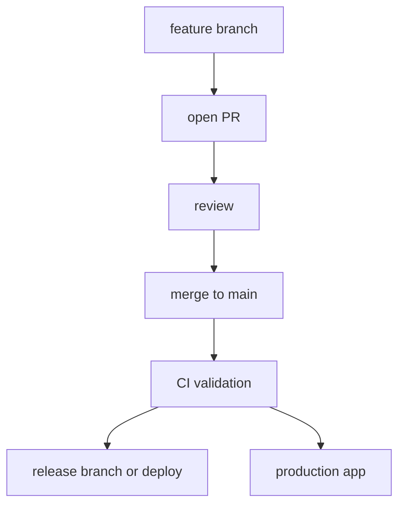
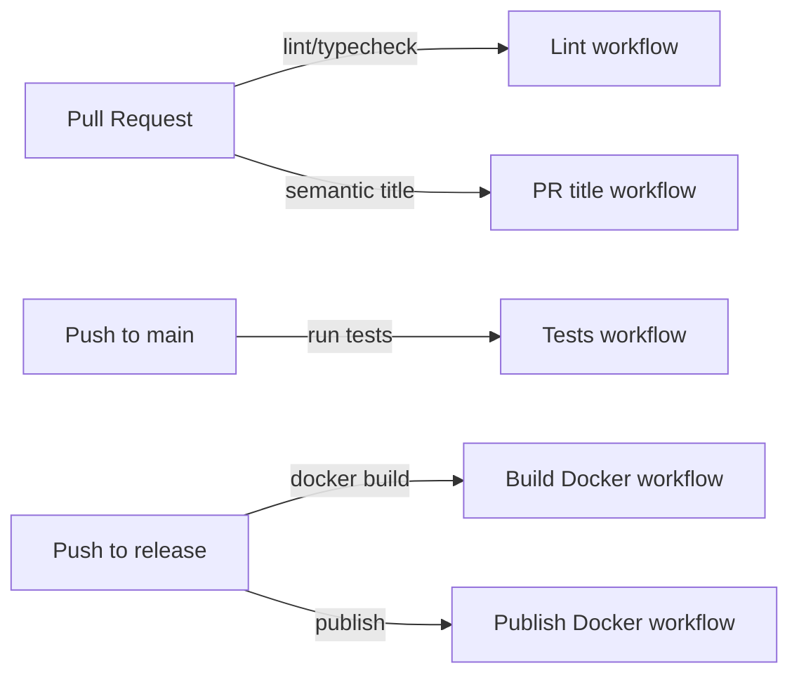
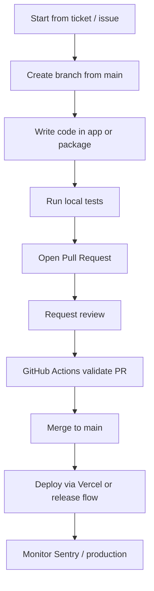

# Workflows

## Branching Strategy

The repository uses `main` as the main development branch and a separate `release` branch for Docker image builds and publish automation. Feature work should start from `main` and be merged back through Pull Requests.

Naming conventions are implied by semantic PR title scope enforcement rather than strict branch names.

### Suggested branch naming

- `feature/<description>`
- `fix/<description>`
- `chore/<description>`
- `release/<version>`

## Making a Change — Step by Step

1. Pick up a ticket or issue assigned to the repository.
2. Create a new branch from `main`.
3. Implement the change in the appropriate package or `excalidraw-app`.
4. Run local tests: `yarn test:app`, `yarn test:code`, `yarn test:typecheck`.
5. Add or update documentation if the change affects usage or developer setup.
6. Open a Pull Request with a semantic title that includes a scope, e.g. `feat(app): add new toolbar item`.
7. Request review from team members and address feedback.
8. Merge the PR into `main` once approvals and CI checks pass.
9. If the change requires a release build, follow the release process in `scripts/release.js` and the `release` branch conventions.

## Code Review

- Ensure tests and lint pass before requesting review.
- Use a semantic PR title with a scope such as `app`, `editor`, `packages/excalidraw`, `packages/utils`, or `docker`.
- Reviewers focus on correctness, package boundaries, test coverage, CI status, and documentation updates.
- Address comments promptly and keep the PR updated.
- Do not merge until CI passes on `main` and PR checks are green.

## CI/CD Pipeline

Pull requests trigger linting and typechecking via GitHub Actions. Pushes to `main` run the core app tests. Pushes to `release` run Docker build and publish workflows.

## Developer workflow

### Key things to notice

- Work starts from `main` and goes through a PR.
- Local testing is expected before opening a PR.
- GitHub Actions are the gatekeeper for PR validation.
- Deployment happens after merge and is monitored in production.

## Deployments

- `main` is the main active branch for development and PR validation.
- `release` is used for Docker image build and publishing.
- The public app is deployed via Vercel.

### How to check status

- GitHub Actions tab for PR and branch workflow status.
- Vercel dashboard for app deployment status.
- Sentry for production error and performance monitoring.

## Incident Response

- Detect incidents with Sentry alerts and failed deployment checks.
- Confirm the scope of the incident and affected environment.
- Notify the appropriate team or on-call engineer.
- Triage the issue, create a GitHub issue if one does not already exist, and begin remediation.
- After resolution, document the incident and add notes to a postmortem.
