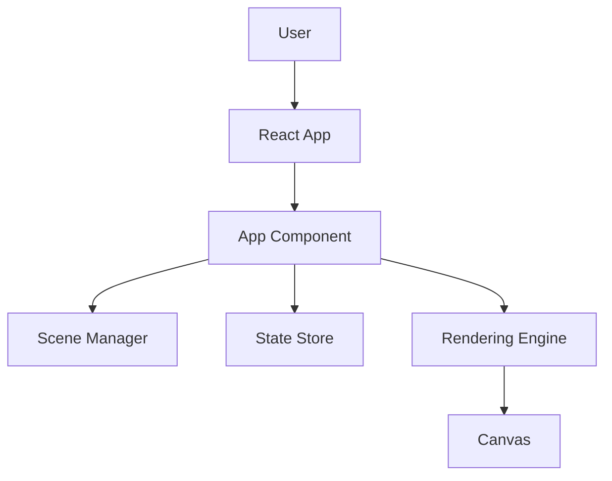

# Architecture Documentation for Excalidraw Project

## High-Level Architecture

### Component Diagram

This diagram illustrates the flow of user interactions through the React app (`UI`) to the core components (`AppCore`), which manage the scene, state, and rendering.

### Core Components

1. **App Component**
   - Acts as the main orchestrator of the application.
   - Coordinates interactions between the UI, scene, store, and renderer.

2. **Scene**
   - Manages all drawing elements, including their creation, modification, and deletion.
   - Ensures consistency and synchronization of elements.

3. **Store**
   - Tracks changes and updates the application state.
   - Implements unidirectional data flow to ensure predictable state management.

4. **Renderer**
   - Handles drawing on the canvas.
   - Optimizes rendering performance using a dual canvas system (static and interactive layers).

5. **Canvas**
   - The visual layer where all drawings are rendered.
   - Supports both static and interactive rendering.

### Data Flow

1. **User Action**: A user action (e.g., draw, move, delete) triggers an event.
2. **Action Triggered**: The event is processed by the `App Component`.
3. **Scene Updated**: The `Scene` manager updates the drawing elements.
4. **Store Records Changes**: The `Store` records the changes and updates the state.
5. **UI Re-renders**: The UI updates to reflect the changes.

This follows a unidirectional data flow, ensuring that data flows in a single direction for better predictability and debugging.

### Rendering System

- **Dual Canvas System**:
  - Separates static rendering (background elements) from interactive rendering (active elements).
  - Improves performance by minimizing re-renders.
- **Optimization Techniques**:
  - Uses requestAnimationFrame for smooth animations.
  - Implements lazy loading for large assets.

### Collaboration

- **Real-Time Updates**:
  - Uses WebSocket-based communication for real-time collaboration.
  - Ensures low latency and high reliability.
- **Encryption**:
  - Supports end-to-end encryption for secure data transmission.
  - Uses industry-standard protocols (e.g., TLS).

## Component Interaction

- **App Entry**: `App.tsx` initializes the application.
- **UI Components**: Located in `components/`, interact with core logic.
- **State Management**: Managed using Jotai in `app-jotai.ts`.
- **Collaboration**: Real-time features in `collab/`.

## Deployment

- **Static Assets**: Served from `public/`.
- **Build Scripts**: Located in `scripts/`.
