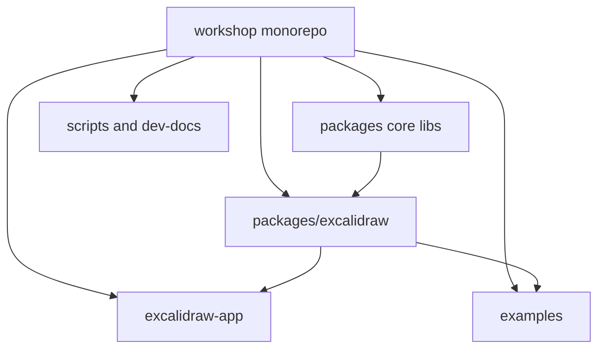
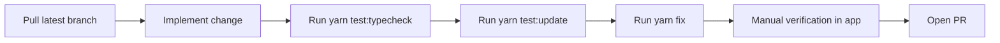
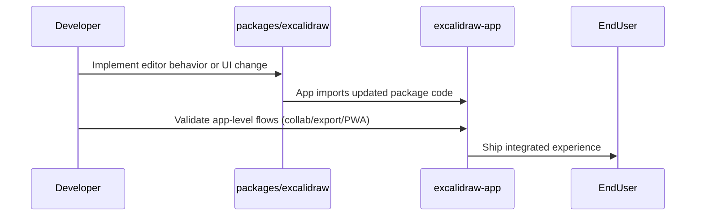
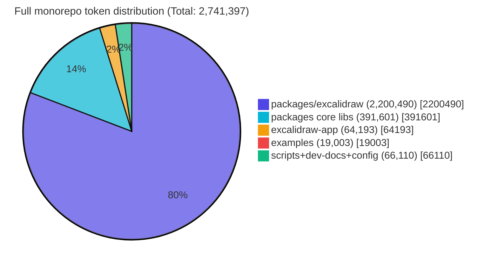

# Excalidraw Onboarding Guide for New Team Members

## Why this project exists

Excalidraw is an open-source, hand-drawn style whiteboard and diagramming tool. This monorepo contains both:

- the reusable React package published as `@excalidraw/excalidraw`
- the full web app behind `excalidraw.com`

If you are joining the team, the fastest way to become productive is to understand which folder owns which responsibility, then follow a predictable local workflow for edits, tests, and validation.

## Monorepo map

### What lives where

- `packages/excalidraw`: main editor package and most core editor logic
- `packages/common`, `packages/element`, `packages/math`, `packages/utils`: shared internals used by the editor/app
- `excalidraw-app`: product app layer (collab, PWA behavior, app-level concerns)
- `examples`: integration examples for external usage
- `scripts` and `dev-docs`: maintenance scripts and internal docs/process material

## First-week onboarding path

### Day 1: run and orient

1. Clone repository and install dependencies
2. Run the app locally
3. Open `packages/excalidraw` and follow one feature from UI interaction to state change
4. Open `excalidraw-app` and identify app-specific behavior vs package behavior

### Day 2: make a tiny safe change

1. Pick a small UI or behavior tweak in package code
2. Run type check and tests
3. Validate app behavior end-to-end
4. Prepare a small PR with concise description and screenshots when relevant

### Day 3+: take ownership of one slice

Good first ownership slices:

- element rendering behavior
- editor interactions and tool UX
- export/import flows
- app-level integrations in `excalidraw-app`

## Local development workflow

Use this baseline command set:

- `yarn test:typecheck`
- `yarn test:update`
- `yarn fix`

Recommended execution flow:

## How package and app work together

The package is the editor engine and component surface. The app consumes it and adds product-level capabilities.

## Contribution guidance for new employees

- Start from `packages/excalidraw` unless your task is explicitly app-only
- Keep changes narrow in scope and easy to review
- Prefer tests and type safety checks before opening PR
- Confirm whether behavior belongs to package layer or app layer before coding
- Use examples to verify external integration impact when changing public behavior

## Token-based evaluation of project parts

### Method

Token counts are estimated from text size using:

- `estimated_tokens ~= characters / 4`

This is an approximation commonly used for mixed code/documentation corpora and is enough for relative sizing.

Scope for this homework is the full `workshop` monorepo, grouped into practical onboarding areas.

### Results

| Project part | Estimated tokens | Share |
|---|---:|---:|
| `packages/excalidraw` | 2,200,490 | 80.27% |
| `packages` core libs (excluding `excalidraw`) | 391,601 | 14.28% |
| `excalidraw-app` | 64,193 | 2.34% |
| `examples` | 19,003 | 0.69% |
| `scripts + dev-docs + config/public` | 66,110 | 2.41% |
| **Total** | **2,741,397** | **100%** |

### Pie diagram

### Interpretation

- Most project complexity is concentrated in `packages/excalidraw`
- Shared core libs in `packages/*` are the second biggest context block
- `excalidraw-app` is smaller in raw size but still critical for product behavior validation
- For AI-assisted onboarding, split context by area instead of pasting the full repo in one prompt
- A practical sequence is: package core first, app integration second, examples/scripts last

## Suggested onboarding checkpoints for managers

- New employee can explain package vs app boundary in their own words
- New employee can run full local validation loop without help
- New employee can deliver one small PR touching the right layer
- New employee can identify which project area to load into AI context for a given task
