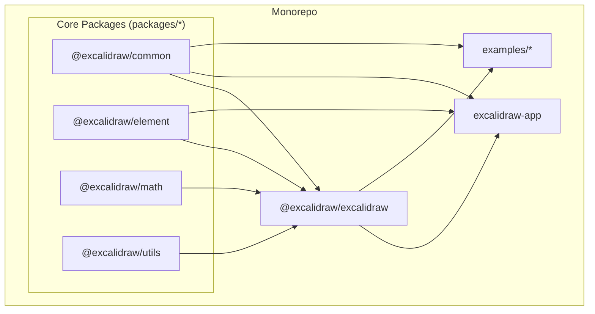
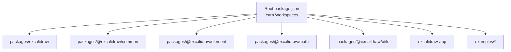
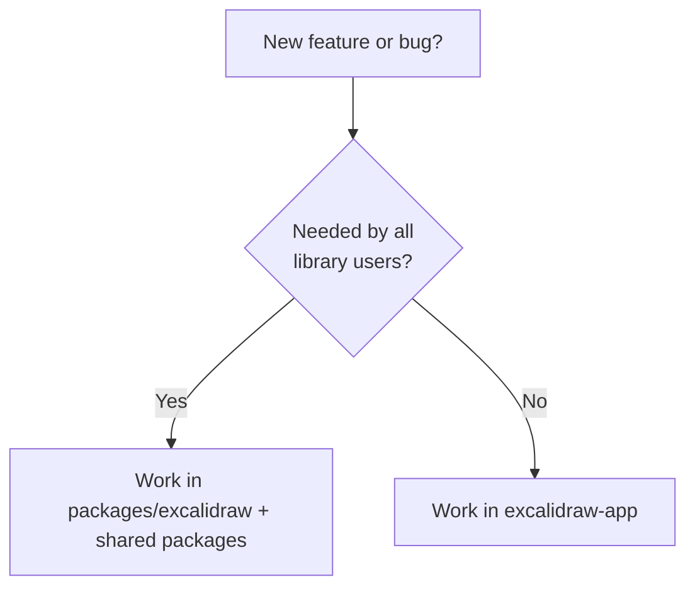
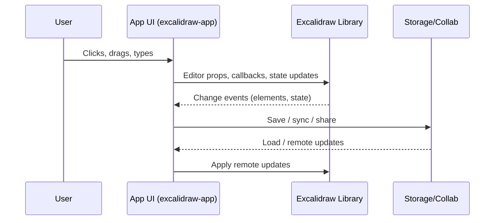

## Excalidraw Engineering Onboarding Guide

## 1. Product & System Overview

### 1.1 What is Excalidraw?

**Excalidraw** is an open‑source, hand‑drawn style whiteboard. It exists in two main forms:

- **Embeddable React library**: `@excalidraw/excalidraw` (used by Notion, Google, Replit, etc.)
- **Full web application**: `excalidraw.com`, a production PWA built on that library

**Core capabilities**:

- Infinite, canvas‑based whiteboard with pan and zoom
- Hand‑drawn style shapes, arrows, text, freehand drawing, eraser
- Image and shape library support
- Export to PNG, SVG, clipboard, and `.excalidraw` JSON
- Localization, dark mode, keyboard shortcuts
- App‑level features: real‑time collaboration, E2E encryption, local‑first autosave, shareable links, offline PWA

### 1.2 High‑level architecture

At a high level, the repo separates:

- **Core editor logic and UI**: reusable across apps
- **The main product app**: `excalidraw.com`
- **Examples**: showing how to embed Excalidraw in different environments



- **Core packages** implement drawing primitives, data types, geometry, utilities.
- **`@excalidraw/excalidraw`** composes these into the React editor.
- **`excalidraw-app`** adds product UX (menus, collaboration, PWA, etc.).
- **`examples`** demonstrate integration patterns.

---

## 2. Repository Structure & Layout

### 2.1 Top‑level directories

- **`packages/excalidraw/`**
  - The published **React editor library**: `@excalidraw/excalidraw`
  - Exports `<Excalidraw />` and library APIs
  - Consumed by external apps and `excalidraw-app`

- **`packages/@excalidraw/common`, `element`, `math`, `utils`**
  - Internal, versioned packages with domain‑specific logic:
    - **`common`**: shared types, utilities
    - **`element`**: element models, mutations, rendering logic
    - **`math`**: geometry, hit‑testing, transforms
    - **`utils`**: shared helpers

- **`excalidraw-app/`**
  - **Production web app** behind `https://excalidraw.com`
  - Uses `@excalidraw/excalidraw` and the internal packages
  - App‑specific concerns: collab, persistence, routing, PWA, etc.

- **`examples/`**
  - Minimal, focused samples:
    - `with-nextjs` — SSR environment with client‑side editor
    - `with-script-in-browser` — script tag integration

- **Root config**
  - `package.json` (Yarn workspaces)
  - TypeScript configs
  - `vitest.config.mts`, ESLint/Prettier configs, etc.

### 2.2 Monorepo & workspace model

The repo uses **Yarn workspaces** to manage multiple packages:

- Dependencies are installed once at the root.
- Workspace packages are symlinked to each other.
- The build/test tooling is aware of this structure.

Conceptual view:



---

## 3. Tech Stack

### 3.1 Languages & frameworks

- **Language**: TypeScript (strict)
- **UI framework**: React
- **Bundlers / dev tools**:
  - **esbuild** for packaging internal libraries
  - **Vite** for the app dev server and bundling
- **Testing**: Vitest (plus snapshot tests)
- **Formatting / linting**:
  - ESLint
  - Prettier
  - Project‑specific lint rules

### 3.2 Architectural style

- **Componentized editor**: `@excalidraw/excalidraw` is a single high‑level React component that manages:
  - Canvas rendering
  - Tool state and interactions
  - Layout and theming
- **Functional core, React shell**:
  - Core logic (element transforms, hit‑testing, geometry) lives in pure TS modules under `packages/@excalidraw/*`.
  - React mainly orchestrates user interactions and rendering.

### 3.3 Data & state

- **In‑app state**: managed inside the editor and app via React state and internal state machines.
- **Persistence**:
  - Local storage / IndexedDB for local‑first behavior (in `excalidraw-app`)
  - JSON `.excalidraw` format for export/import
- **Collaboration**:
  - Real‑time sync (e.g. via WebSockets or similar) with E2E encryption layered on top.
  - Details live in `excalidraw-app` (not in the core library).

---

## 4. Local Setup & First Run

### 4.1 Prerequisites

- **Node.js**: use the LTS version recommended in the project (check `package.json` or internal docs).
- **Yarn**: project uses Yarn workspaces.

Quick verification:

```bash
node -v   # Node version
yarn -v   # Yarn version
```

### 4.2 Install dependencies

From the repository root:

```bash
yarn install
```

This will:

- Install all dependencies once
- Link each workspace under `packages/*`, `excalidraw-app`, `examples/*`

### 4.3 Run the main app (`excalidraw-app`)

From the root:

```bash
cd excalidraw-app
yarn dev    # or yarn start (check package.json scripts)
```

Then open the logged URL (typically `http://localhost:<port>`). This is your **primary playground** for manual testing and feature work.

### 4.4 Run tests, type checks, and formatting

From the root, as documented in `CLAUDE.md`:

```bash
# TypeScript type checking
yarn test:typecheck

# Run tests (with snapshot updates)
yarn test:update

# Auto-fix formatting and linting issues
yarn fix
```

**Expectation**: these pass before your code is considered ready for review.

---

## 5. Core Library: `@excalidraw/excalidraw`

### 5.1 What the library provides

`packages/excalidraw` exports the **Excalidraw editor component** and related APIs.

Minimal integration:

```tsx
import { Excalidraw } from "@excalidraw/excalidraw";
import "@excalidraw/excalidraw/index.css";

export default function App() {
  return (
    <div style={{ height: "100vh" }}>
      <Excalidraw />
    </div>
  );
}
```

Two **non‑negotiable** requirements:

1. **CSS import**: `import "@excalidraw/excalidraw/index.css";`
2. **Container height**: parent element must have a **non‑zero height** (e.g. `height: 100vh`)

### 5.2 Editor in SSR / Next.js

The editor is **client‑only**. In Next.js or similar SSR frameworks:

- Use a `"use client"` component that renders `<Excalidraw />`.
- Load it dynamically with `dynamic(..., { ssr: false })`.

Pseudocode:

```tsx
// app/components/ExcalidrawClient.tsx
"use client";

import { Excalidraw } from "@excalidraw/excalidraw";
import "@excalidraw/excalidraw/index.css";

export default function ExcalidrawClient() {
  return (
    <div style={{ height: "100vh" }}>
      <Excalidraw />
    </div>
  );
}
```

```tsx
// app/page.tsx
import dynamic from "next/dynamic";

const ExcalidrawClient = dynamic(
  () => import("./components/ExcalidrawClient"),
  { ssr: false },
);

export default function Page() {
  return <ExcalidrawClient />;
}
```

### 5.3 Type imports and versioning notes

In versions `0.18.x+`, deep type imports use new subpaths (without `types/` and without `.js`):

- `@excalidraw/excalidraw/element/types`
- `@excalidraw/excalidraw/data/types`
- `@excalidraw/excalidraw/common/utility-types`
- `@excalidraw/excalidraw/types`

Example:

```ts
import type { ExcalidrawElement } from "@excalidraw/excalidraw/element/types";
import { exportToSvg } from "@excalidraw/excalidraw";
```

---

## 6. App (`excalidraw-app`) vs. Library

### 6.1 When to touch which

- **Library (`packages/excalidraw` + core packages)**:
  - Editor features that should also be available to **external integrators**
  - Drawing tools, element behaviors, rendering performance, core APIs

- **App (`excalidraw-app`)**:
  - Everything specific to **`excalidraw.com`**:
    - Menus, layout, onboarding UI
    - Collaboration UX and sharing flows
    - PWA behavior, offline indicators
    - Integration with storage / URLs / routing

Decision flow:



### 6.2 Data flow at a high level

- User interacts with the **React app UI**.
- App routes those events into the **core editor** (library) and shared logic.
- App adds collaboration / persistence / routing on top.



---

## 7. Typical Development Workflows

### 7.1 General workflow

1. **Understand the request**
   - Is it an editor feature, app feature, or both?
2. **Locate relevant code**
   - Use search in `packages/*` or `excalidraw-app` as appropriate.
3. **Create a feature branch**
   - Follow team naming conventions (e.g. `feature/...`, `fix/...`).
4. **Implement changes**
   - Stay consistent with existing patterns.
5. **Run checks**
   - `yarn test:typecheck`
   - `yarn test:update`
   - `yarn fix`
6. **Manual testing**
   - Use `excalidraw-app` locally.
   - For library changes, optionally validate in `examples/*`.
7. **Open a PR**
   - Explain **what**, **why**, and **how tested**.
   - Link to any related issues / design docs.

### 7.2 Adding a new editor feature (library‑centric)

- **Examples**: New tool, constraint behavior, snapping, export mode.

Steps:

1. **Find where similar behavior lives**:
   - Tools / commands: under `packages/excalidraw` and/or `@excalidraw/element`
   - Exports: in `packages/excalidraw` entrypoints
2. **Modify or extend core logic**:
   - Add new element types or operations in `@excalidraw/element`.
   - Wire into render / hit‑test / selection logic as needed.
3. **Expose via editor UI**:
   - Update toolbar / shortcuts / menus in `packages/excalidraw`.
4. **Test in app**:
   - Run `excalidraw-app`, verify UX.
5. **Add/adjust tests**:
   - Unit tests in core packages.
   - Snapshot tests if applicable.

### 7.3 Changing app UX only (app‑centric)

- **Examples**: New menu, different sharing flow, collaboration banner.

Steps:

1. Work primarily in `excalidraw-app`:
   - App routes/pages
   - UI components
   - Hooks that orchestrate editor + collab state
2. Reuse editor APIs instead of forking behavior.
3. Keep editor library changes minimal unless something is broadly useful.

### 7.4 Integrating Excalidraw into another system

- Start from `examples/with-nextjs` or `examples/with-script-in-browser`.
- Ensure:
  - CSS imported
  - Container has height
  - Client‑only rendering in SSR environments
- Add persistence, auth, and storage according to your host app.

---

## 8. Testing, Quality, and Conventions

### 8.1 Commands to know

From the repo root:

- **Type checking**:
  ```bash
  yarn test:typecheck
  ```
- **Tests + snapshot updates**:
  ```bash
  yarn test:update
  ```
- **Lint + format fix**:
  ```bash
  yarn fix
  ```

These are the **baseline checks** expected to pass before merging.

### 8.2 TypeScript & API design guidelines

- Prefer **explicit types** and avoid `any`.
- Keep **public API** of `@excalidraw/excalidraw` clean and minimal:
  - Break large changes into smaller ones.
  - Use deprecations where necessary, not silent breakages.
- When adding types for external consumption:
  - Use the documented type subpaths (e.g. `@excalidraw/excalidraw/element/types`).

---

## 9. Troubleshooting & Common Pitfalls

### 9.1 Canvas is blank in an integration

Checklist:

- **CSS imported?**
  - `import "@excalidraw/excalidraw/index.css";`
- **Parent has height?**
  - Use `height: 100vh` or similar.
- **Rendered on client?** (for SSR)
  - `"use client"` and `dynamic(..., { ssr: false })` in Next.js.

### 9.2 `window is not defined` / hydration errors

- You’re likely trying to render Excalidraw on the server.
  - Wrap it in a client‑only component.
  - Use dynamic import blocking SSR.

### 9.3 Fonts not loading / UI looks broken

- By default, fonts are loaded from a CDN.
- To **self‑host fonts**:
  - Copy `node_modules/@excalidraw/excalidraw/dist/prod/fonts` into your static assets (`public/` or similar).
  - Set:

    ```html
    <script>
      window.EXCALIDRAW_ASSET_PATH = "/";
    </script>
    ```

### 9.4 Tests fail after UI changes

- Many tests use **snapshots**.
- If behavior/markup changed intentionally:
  - Re‑run `yarn test:update` to regenerate snapshots.
- If failures look unrelated:
  - Investigate; avoid blindly updating snapshots.

---

## 10. Quick Reference Cheat Sheet

- **Install dependencies**:
  ```bash
  yarn install
  ```

- **Run the app**:
  ```bash
  cd excalidraw-app
  yarn dev
  ```

- **Type check**:
  ```bash
  yarn test:typecheck
  ```

- **Tests + snapshots**:
  ```bash
  yarn test:update
  ```

- **Lint & format**:
  ```bash
  yarn fix
  ```

- **Minimal embed**:

  ```tsx
  import { Excalidraw } from "@excalidraw/excalidraw";
  import "@excalidraw/excalidraw/index.css";

  export default function App() {
    return (
      <div style={{ height: "100vh" }}>
        <Excalidraw />
      </div>
    );
  }
  ```
