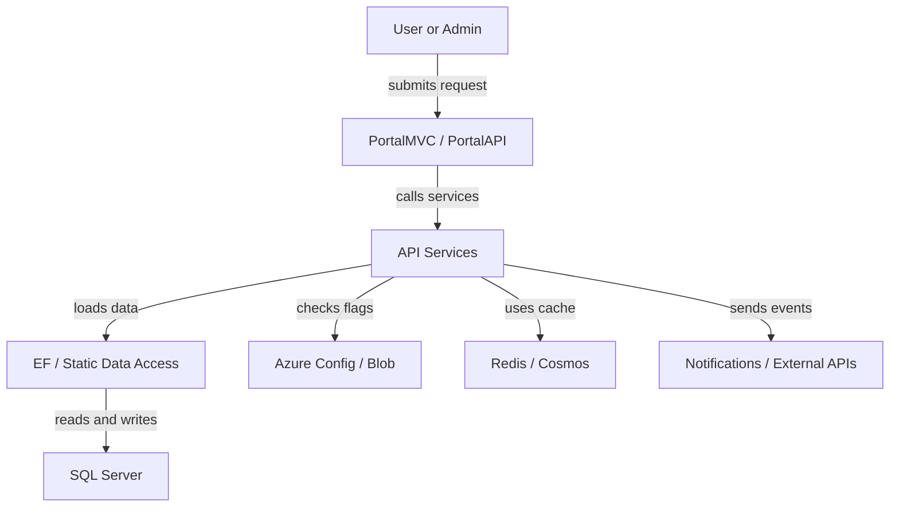
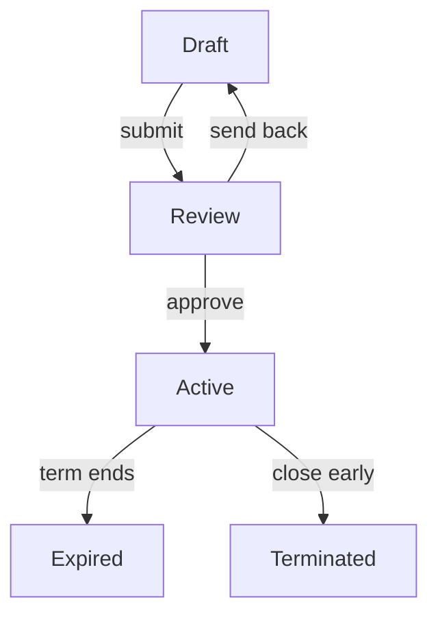
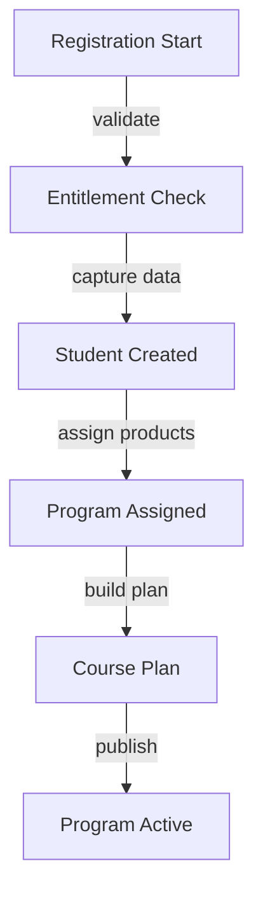
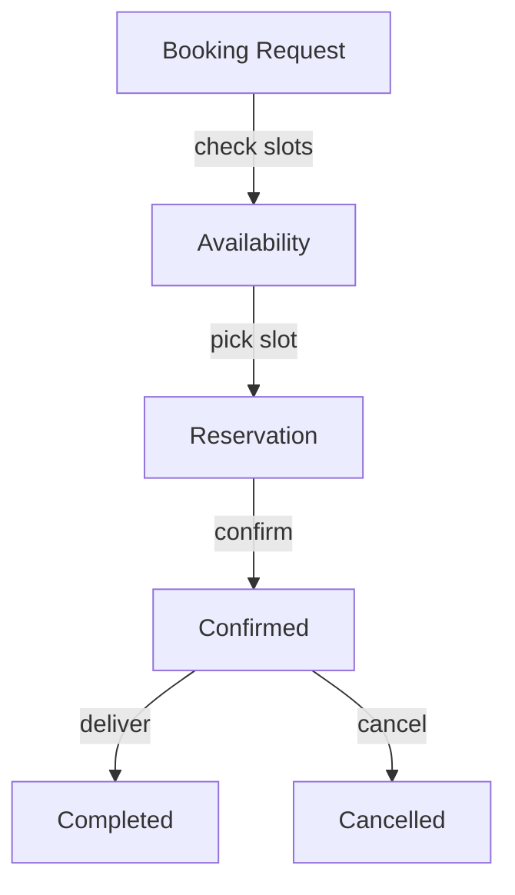
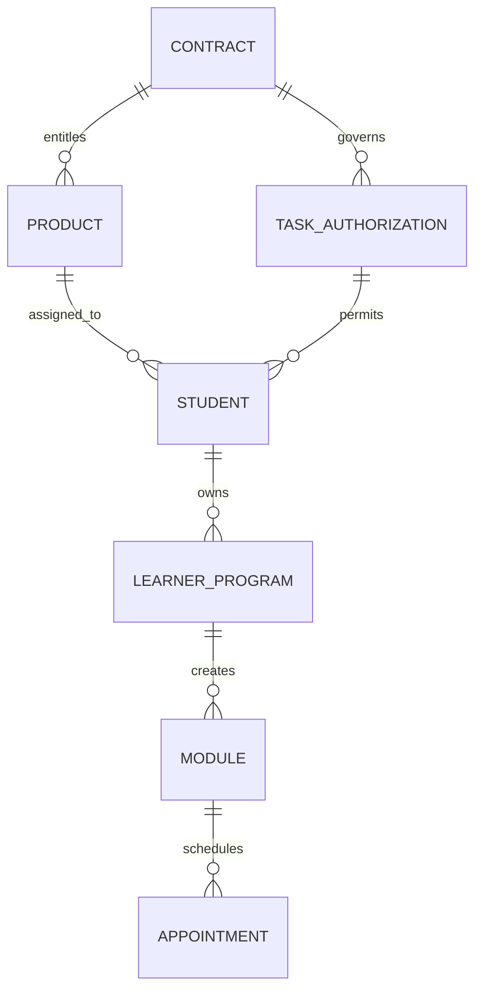
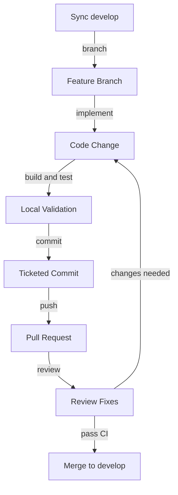

# LRDG Portal Engineering Onboarding Guide

## 1. Project Overview and Purpose

### What the LRDG Portal is

The LRDG Portal is the operational platform for LRDG, the Language Research Development Group. In business terms, LRDG delivers language training, learner administration, evaluation, and scheduling services for employer-sponsored programs. The portal is the system staff, coordinators, tutors, and learners use to move that work from contract entitlement to active learning delivery.

The product is not just a learner-facing application. It is also the back-office system for contract administration, learner onboarding, program planning, booking, reporting, notifications, and operational support. A single user workflow often crosses more than one of those areas.

### What business problem it solves

The platform solves a coordination problem that would otherwise be spread across spreadsheets, email, calendars, and separate reporting tools. It keeps three business questions aligned:

- What training is the client entitled to purchase and use?
- Which learner is assigned to which program and at what stage?
- Which sessions, evaluations, and appointments have actually been scheduled and delivered?

### Day-one mental model

A new engineer should think about the portal as a three-stage system:

1. Contracts define entitlement.
2. Learner Program turns entitlement into a training plan.
3. Booking Features turn the plan into scheduled delivery.

If you can trace one learner from contract coverage to program assignment to booked appointment, you understand the backbone of the product. Most defects, feature requests, and support issues are variations of that path.

## 2. High-Level Architecture

### Technical layers

The repository is organized as a layered .NET platform with two web entry points, a shared business layer, relational data access, and Azure-backed integration services. `PortalMVC` serves the main server-rendered portal experience, `PortalAPI` exposes API endpoints used by newer flows and reporting features, and `ca.techinnov.API.Services` contains most of the business logic that matters to day-to-day development.

Below that service layer, the system uses `ca.techinnov.DataAccess.EF` for entity-backed relational access, `ca.techinnov.DataAccess.Static` for older query and stored-procedure-driven paths, and SQL Server as the system of record. Supporting concerns such as feature flags, notifications, cache, document-style projections, and external integrations are wrapped in infrastructure projects and Azure-connected services.

### How a request moves through the system

For a typical request, a user action starts in an MVC controller or API controller, the controller delegates to a service, the service validates business rules and loads the required entities, and then the response is returned either as HTML, JSON, or a side effect such as an email, report, or notification. In practice, most meaningful behavior lives in the service layer, not in the controller.

The infrastructure nodes below are grouped for clarity. In the actual solution, Azure-hosted configuration, blob-backed assets, Redis, and Cosmos DB are separate services with different responsibilities.



### What matters most for onboarding

- Start with controllers only to identify the entry point.
- Move quickly to the matching service class to understand business rules.
- Expect older and newer patterns to coexist in the same feature.
- Treat feature flags and data shape as part of the behavior, not just configuration.

## 3. Repository and Folder Structure

### Solution shape

The main solution is `PortalMVC.sln`. The projects that matter most during onboarding are the web applications, the shared service layer, and the data-access projects.

### Where to start by domain

- Contracts: start in `ca.techinnov.API.Services/Services/ContractService.cs`, `ca.techinnov.API.Services/Services/TaskAuthorizationService.cs`, and the related entities in `ca.techinnov.DataAccess.EF/Entities/Contract*.cs` and `TaskAuthorization*.cs`.
- Learner Program: start in `PortalAPI/V2/Controllers/RegistrationFormController.cs`, `PortalAPI/V2/Controllers/LearnerProgramOverviewController.cs`, `ca.techinnov.API.Services/Services/RegistrationFormService.cs`, and `LearnerProgramOverviewService.cs`.
- Booking Features: start in `PortalAPI/V2/Controllers/LessonsController.cs`, `PortalAPI/V2/Controllers/EvaluationController.cs`, `ca.techinnov.API.Services/Services/LessonsService.cs`, and the `Module`, `Session`, and `Appointment` entities.

### Important projects and directories

- `PortalMVC/`
  Main ASP.NET MVC application, Razor views, layouts, scripts, release-time database updater, and environment config.

- `PortalAPI/`
  ASP.NET Web API application. `V2/Controllers` is the most useful starting point for domain endpoints.

- `ca.techinnov.API.Services/`
  Shared business logic. This is usually the best place to understand true system behavior.

- `ca.techinnov.API.Contracts/`
  Shared DTOs, request models, report contracts, and service-facing payloads.

- `ca.techinnov.DataAccess.EF/`
  Entity models and relational data access objects. Use this project to understand the real data model.

- `ca.techinnov.DataAccess.Static/`
  Legacy access patterns and older query implementations that still matter for reports and special workflows.

- `ca.techinnov.External.Infrastructure.Services/`
  Feature flags, Azure-connected infrastructure wrappers, cache, and external integrations.

- `PortalMVC/SQLScriptFix/`
  Versioned SQL scripts used by the database updater for schema and database object changes.

- `ca.techinnov.API.UnitTests/` and `UnitTestProject/`
  Automated tests. Start here when you want examples of service usage and validation behavior.

## 4. Key Technologies and Why They Were Chosen

- **ASP.NET MVC 5**
  Chosen because the portal has long-lived server-rendered workflows, role-aware layouts, and operational screens that fit well in an MVC application.

- **ASP.NET Web API**
  Chosen to expose endpoint-driven workflows without duplicating the business layer used by the MVC application.

- **.NET Framework 4.x**
  Chosen because the portal is a mature enterprise platform with significant existing investment in libraries, integrations, and deployment tooling.

- **Entity Framework 6**
  Chosen to provide structured relational access for core entities while still allowing legacy SQL-heavy paths where needed.

- **SQL Server**
  Chosen as the source of truth because contracts, learner records, sessions, and reports all require strong relational consistency.

- **Stored procedures and scripted SQL updates**
  Chosen for release-controlled data changes and specialized reporting or migration scenarios that are awkward to express in ORM-only form.

- **Azure Blob Storage and CDN-hosted configuration**
  Chosen so runtime configuration such as feature flags and external service settings can be managed centrally without redeploying the application.

- **Redis**
  Chosen to reduce repeat load on frequently accessed data and improve responsiveness for operational screens.

- **Azure Cosmos DB**
  Chosen for document-style or projection-based data that does not map cleanly to the core transactional schema.

- **Ninject**
  Chosen to keep service wiring and dependency boundaries manageable in a multi-project legacy .NET application.

- **FluentValidation**
  Chosen so business validation rules stay explicit, reusable, and testable.

- **MSTest and Moq**
  Chosen as the established test stack for unit-level coverage in the current solution.

## 5. Domain Onboarding - Contracts

### Purpose and business context

The Contracts domain answers the question, "What is this client allowed to consume, for how long, and under what limits?" In LRDG Portal, contracts are operational entitlement records, not just commercial paperwork. They control whether a learner can register, which products can be assigned, and whether downstream booking should be allowed at all.

This domain also includes task authorization behavior, which adds a more granular layer for budget, seat count, product selection, and registration controls. A new engineer should treat contract logic as a gatekeeper for the other two domains.

### Key entities and data models

- **Contract**
  Top-level agreement for a client. Holds status, ownership, dates, and the umbrella commercial relationship.

- **ContractItem**
  Time-bounded slice of a contract. This is often the record that determines whether entitlement is active for a specific delivery window.

- **ContractItemProduct**
  Junction between a contract item and a product. This is where commercial entitlement becomes something the platform can assign or schedule.

- **Product**
  Definition of the training or evaluation offering tied to language, module behavior, and reporting expectations.

- **TaskAuthorization**
  Control layer under a contract for budget, learner capacity, date validity, and product restrictions.

- **TaskAuthorizationProduct**
  Product mapping for a task authorization.

- **TaskAuthorizationLearner**
  Learner membership record used to enforce seat usage and authorization-specific rules.

The core relationship chain is: `Client -> Contract -> ContractItem -> ContractItemProduct -> Product`. Task authorization records attach under the contract and influence whether a learner can move forward.

### Core workflows

The contract lifecycle is operationally simple but important because terminal states affect entitlement immediately.



The most common engineering workflow looks like this:

1. A client contract is created and reviewed.
2. One or more contract items define service windows.
3. Products are attached through contract item products.
4. Optional task authorizations add seat, budget, or product-specific controls.
5. Registration, program setup, and booking flows check those records before allowing downstream actions.

### Integration points with Learner Program and Booking Features

Contracts integrate with Learner Program during registration and product assignment. `RegistrationFormService` and `TaskAuthorizationService` determine whether the learner is eligible to start or continue onboarding. Contract-backed products often determine which modules or evaluation paths are available when a learner program is created.

Contracts integrate with Booking Features through session eligibility, duration, and date-window checks. The booking layer assumes the upstream entitlement is valid; if it is not, failures often surface later as missing availability, incorrect module creation, or blocked evaluations.

### Edge cases and business rules a new developer must know

- Contract header status is not enough. Active behavior usually depends on both the contract and a valid contract item window.
- Legacy contract logic and newer task authorization logic can coexist in the same feature area.
- Parent-client fallback may be used when direct entitlement is not found for a learner's employer.
- A learner can be blocked because of authorization budget limits, seat exhaustion, invalid dates, or missing product coverage.
- Contract data is often the root cause of issues that first appear in registration or booking.

## 6. Domain Onboarding - Learner Program

### Purpose and business context

The Learner Program domain answers the question, "Given valid entitlement, what learning experience should this learner receive?" This is where intake data becomes an actual program with assigned products, modules, tutors, coordinators, and progress expectations.

For the business, this domain is the bridge between sold services and delivered learning. For engineers, it is where cross-domain behavior becomes visible: contract checks happen here, booking dependencies are created here, and many notifications and state transitions originate here.

### Key entities and data models

- **Student**
  Core learner record. Stores employer, language, methodology, levels, operational state, and links to downstream training artifacts.

- **RegistrationForm**
  Intake record for learner onboarding. Different client flows may capture different required fields.

- **LearnerProgramOverview**
  Main program artifact used to hold status, schedule expectations, assigned staff, and publication state.

- **LearnerProgramOverviewModule**
  Module rows attached to a learner program overview.

- **LearnerProgramOverviewTutor**
  Tutor assignment records tied to the learner program.

- **StudentTutor**
  Ongoing learner-to-tutor relationship used by delivery and scheduling flows.

- **CoursePlan**
  Generated structure that translates entitlement and learner needs into a sequence of modules.

The main relationship chain is: `Student -> LearnerProgramOverview -> LearnerProgramOverviewModule`, with `CoursePlan` and tutor assignments shaping what can later be scheduled.

### Core workflows



The most common workflow is:

1. Registration starts through an API or portal workflow.
2. Contract and task authorization checks run.
3. A student record is created or updated.
4. Products and modules are assigned.
5. A course plan and learner program overview are prepared.
6. The program is reviewed, published, and made ready for delivery.

Progress tracking continues after publication through learner status, assigned modules, tutor relationships, and report-linked session outcomes.

### Integration points with Contracts and Booking Features

Learner Program integrates tightly with Contracts because registration, program assignment, and publication depend on upstream entitlement. If a client does not have the correct product or the authorization is invalid, the learner may never reach an active program state.

Learner Program integrates with Booking Features because the program creates the modules, staffing context, and readiness state that booking depends on. A booking defect is often really a program setup defect, especially when the learner has no valid module path or the wrong tutor context.

### Edge cases and business rules

- Publishing a learner program usually enforces stricter validation than saving a draft.
- Client-specific registration variants can require different fields and branching rules.
- A learner may have multiple program artifacts over time, so avoid assuming a single permanent plan.
- Tutor changes, first-session dates, and update types may be required for specific program update paths.
- Notifications and status transitions are part of the workflow, not optional side effects.

## 7. Domain Onboarding - Booking Features

### Purpose and business context

The Booking Features domain answers the question, "How does an entitled learner actually get time on a calendar?" It converts program structure into sessions, appointments, confirmations, cancellations, and completed delivery records.

This domain matters operationally because it is where learners and staff feel the platform most directly. If availability, appointment state, or cancellation logic is wrong, the problem becomes immediately visible to the business.

### Key entities and data models

- **Module**
  Learner-owned training unit created from an entitled product.

- **Session**
  Bookable unit within a module. Session status usually drives whether a record is available, reserved, used, or cancelled.

- **Appointment**
  Scheduled occurrence tied to a session, tutor, date, and operational metadata such as cancellation state or meeting details.

- **SessionReport**
  Delivery outcome record attached after completion.

- **ClassroomSession**
  Group delivery variant used when the workflow is not purely one learner to one tutor.

The key relationship chain is: `Student -> Module -> Session -> Appointment -> SessionReport`.

### Core workflows



The standard delivery workflow is:

1. Booking starts with a learner, module, or evaluation request.
2. Availability is checked against staffing, session state, and entitlement windows.
3. A reservation becomes an appointment.
4. The appointment is confirmed and surfaced in operational views.
5. The session is completed, cancelled, or rescheduled.

### Integration points with Contracts and Learner Program

Booking depends on Contracts for entitlement windows, product type, and sometimes session duration. If contract linkage is incorrect, the booking layer may show no valid path even when the learner appears active elsewhere.

Booking depends on Learner Program for module creation, tutor assignment, and delivery readiness. If a learner program is incomplete, unpublished, or mapped to the wrong product, booking behavior will usually reflect that immediately.

### Edge cases and business rules

- Cancellation chargeability is often determined by time-to-session thresholds and may differ for individual versus classroom delivery.
- Evaluations and lessons share similar building blocks but do not always use identical query paths.
- Session state can matter more than appointment state when debugging list visibility.
- Group workflows and individual workflows may diverge in cancellation, reporting, and visibility logic.
- Many apparent booking issues are downstream symptoms of bad contract or learner-program data.

## 8. Entity Relationship Overview



The most important cross-domain relationship is that a learner only reaches booking through valid entitlement and a usable program artifact. `Contract` and `TaskAuthorization` decide whether the learner can proceed, `Product` determines what kind of training path exists, `LearnerProgram` creates the operational structure, and `Module` is the pivot that connects planning to booked delivery. When debugging a cross-domain issue, trace the learner backward from appointment to module to program to entitlement.

## 9. Local Development Setup

### Prerequisites

Use a Windows development machine with Visual Studio or Rider, SQL Server Developer Edition, and .NET Framework support enabled. The primary solution file is `PortalMVC.sln`.

### Setup steps

1. Clone the repository.

   ```powershell
   git clone <repo-url>
   cd lrdg_portal
   ```

2. Restore packages and open the solution.

   Open `PortalMVC.sln` and let NuGet restore all dependencies before the first build.

3. Configure local application settings.

   Update local configuration values in `PortalMVC/Web.config` and `PortalAPI/Web.config`. Use placeholder values like these where team-managed secrets are not yet available:

   ```xml
   <add key="FeatureFlags:ConfigPath" value="https://dev-storage.example.net/config/flags.json" />
   <add key="Redis:ConnectionString" value="localhost:6379" />
   <add key="Cosmos:Endpoint" value="https://localhost:8081" />
   <add key="Cosmos:Key" value="C2FBB..." />
   <add key="AzureBlob:ConnectionString" value="UseDevelopmentStorage=true" />
   <add key="Notifications:FromEmail" value="portal-dev@example.com" />
   ```

4. Set the database connection string.

   Point the application to a local or team-provided SQL Server copy. A realistic local connection string is:

   ```text
   Server=localhost;Database=LRDGPortalDev;Trusted_Connection=True;MultipleActiveResultSets=True
   ```

5. Apply or verify database schema state.

   Confirm the database contains the required portal schema and the `PortalDBVersion` table. The built-in database updater lives in the portal startup path and applies scripts from `PortalMVC/SQLScriptFix/` when the application starts. Before running the app, verify that this updater points only to a safe local database instance so startup scripts cannot touch a shared environment by mistake.

6. Build the solution.

   ```powershell
   msbuild PortalMVC.sln /p:Configuration=Debug
   ```

7. Choose a startup project.

   Use `PortalMVC` for portal screens and user workflows. Use `PortalAPI` when working on API endpoints, reports, or service-driven flows.

8. Run the application and verify startup.

   Start the selected project in IIS Express or Rider. Verify that the home page or a known API health endpoint loads, authentication redirects behave normally, and startup logs show successful database connectivity.

9. Run automated checks for the area you touched.

   Use the IDE test runner or a command such as:

   ```powershell
   vstest.console.exe .\ca.techinnov.API.UnitTests\bin\Debug\ca.techinnov.API.UnitTests.dll
   ```

10. Validate one real workflow end to end.

   Good smoke tests are learner registration prevalidation, learner program retrieval, or scheduled lessons retrieval.

### What success looks like

The app is ready when the solution builds cleanly, the chosen startup project loads without configuration errors, the database is reachable, and at least one domain workflow can be exercised locally.

## 10. Contribution Workflow

### Branching strategy

The repository follows a Gitflow-style model. Feature work branches from `develop`, production releases come from `master`, and hotfixes use dedicated hotfix branches. Ticket-linked naming is expected so work is traceable from branch to PR.

### Commit conventions

Use the project ticket as the prefix for both branch names and commit messages. A practical convention is:

- Branch: `feature/PRTL-1234_short-description`
- Commit: `PRTL-1234: Add learner program publish validation`

### Pull request process

Open pull requests into `develop` unless the team explicitly directs otherwise. A good PR includes the ticket reference, a short summary of user-visible impact, configuration or schema notes, screenshots for UI changes, and proof of validation.

### Code review expectations

Reviewers will focus on business-rule correctness, regressions across MVC and API entry points, safe configuration handling, idempotent SQL behavior, and whether tests or manual verification cover the risk of the change. If a change touches Contracts, Learner Program, or Booking, reviewers will usually expect you to describe the affected workflow explicitly.

### Validation steps before merge

1. Build the full solution or the affected projects.
2. Run relevant unit tests.
3. Verify linting or front-end script checks if you changed static assets.
4. Verify SQL scripts are idempotent if the change touches the database.
5. Manually test the affected user journey.
6. Confirm CI checks complete successfully before merge.



## 11. Glossary

- **LRDG**: Language Research Development Group, the business organization whose training and learner operations are managed through the portal.
- **Contract**: Top-level client agreement that governs entitlement.
- **ContractItem**: Time-bounded slice of a contract used to determine effective service windows.
- **ContractItemProduct**: Mapping between a contract item and a product that can be assigned or scheduled.
- **Task Authorization**: Operational control record for budget, seat limits, product restrictions, and valid registration windows.
- **TaskAuthorizationLearner**: Record that links a learner to a task authorization and helps enforce authorization capacity.
- **Product**: Training or evaluation offering available under a contract.
- **Student**: Core learner record used across registration, program, and booking workflows.
- **Registration Form**: Intake structure that captures learner onboarding data.
- **Learner Program Overview**: Primary program artifact that stores planning, staffing, and publication state for a learner.
- **LearnerProgramOverviewTutor**: Tutor assignment record attached to a learner program overview and used during publication and delivery planning.
- **Course Plan**: Structured module path generated for a learner's training journey.
- **StudentTutor**: Relationship record tying a learner to one or more tutors.
- **Module**: Learner-owned training unit created from an entitled product.
- **Session**: Bookable unit within a module.
- **Appointment**: Scheduled delivery instance tied to a session.
- **SessionReport**: Outcome record created after a session is delivered.
- **ClassroomSession**: Group delivery session record used when training is scheduled as a classroom-style booking rather than an individual appointment.
- **PortalDBVersion**: Database version tracking table used by the portal's release-driven database updater.
- **SQLScriptFix**: Folder that stores versioned SQL scripts for schema and database object updates.

## 12. Token Evaluation

| Section | Word count | Est. tokens | Notes |
|---|---:|---:|---|
| Project overview and purpose | 245 | 327 | Foundational context and the core business mental model. |
| High-level architecture | 260 | 347 | Moderate cost because the diagram and request flow introduce structural tokens. |
| Repository and folder structure | 250 | 333 | Directory names are dense but easy to isolate when needed. |
| Key technologies and why they were chosen | 215 | 287 | Compact reference section with low dependency on other sections. |
| Domain onboarding - Contracts | 405 | 540 | High token cost because of entity definitions, lifecycle states, and entitlement rules. |
| Domain onboarding - Learner Program | 390 | 520 | High token cost due to workflow steps, data model terms, and cross-domain integration points. |
| Domain onboarding - Booking Features | 355 | 473 | Moderately heavy because state transitions and booking rules carry dense terminology. |
| Entity relationship overview | 140 | 187 | Small but important because it connects all three domains in one view. |
| Local development setup | 330 | 440 | Procedural section with commands and configuration examples. |
| Contribution workflow | 255 | 340 | Process-focused and easy to reuse independently. |
| Glossary | 240 | 320 | Good standalone reference for term resolution. |
| **Grand total** | **3085** | **4114** | **The three domain sections are the most expensive because they carry the highest concentration of nouns, rules, and transitions.** |

The most token-expensive sections are Contracts, Learner Program, and Booking Features because they combine business rules with workflow state and entity vocabulary. When sending this guide to an LLM, those three sections should usually be chunked together only when the problem spans entitlement, planning, and delivery in the same investigation. Architecture, repository structure, contribution workflow, and glossary can be sent independently without losing much context because they are mostly reference material. Local development setup also stands alone well and does not need the domain sections unless the task involves debugging environment-specific behavior in one workflow.
