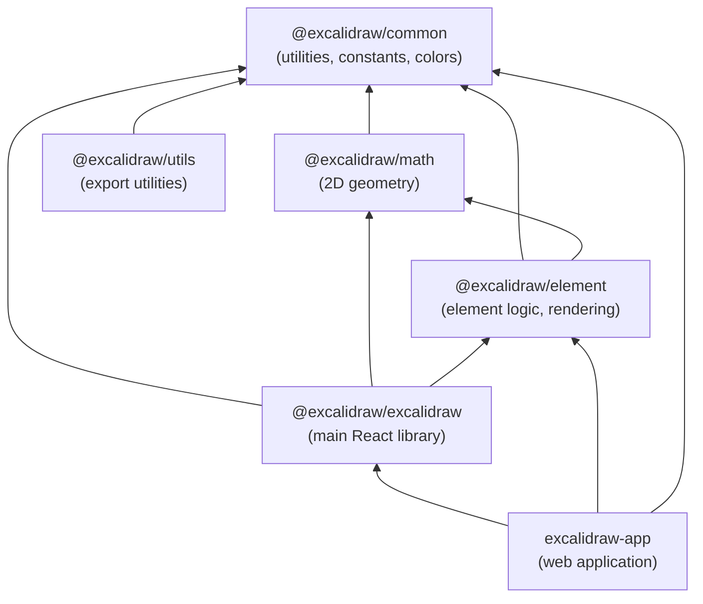
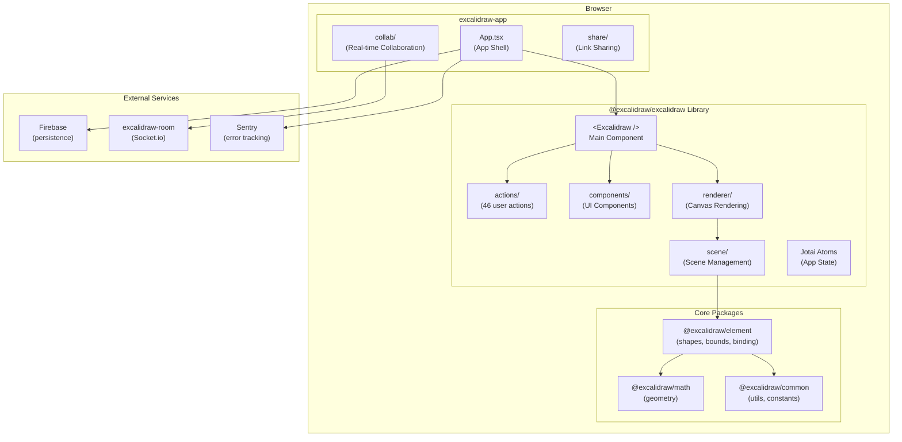
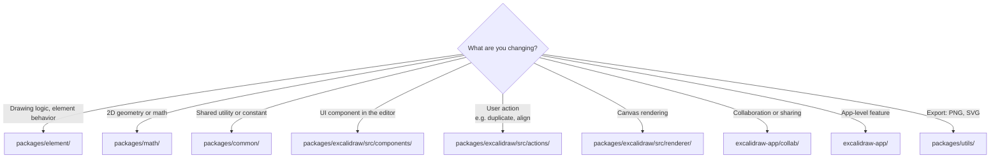
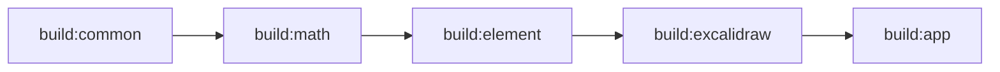
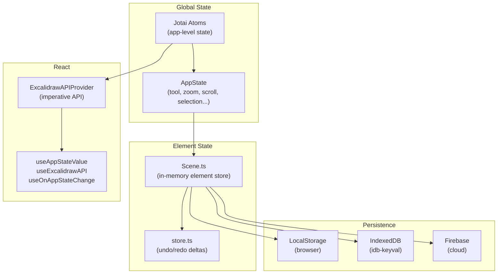
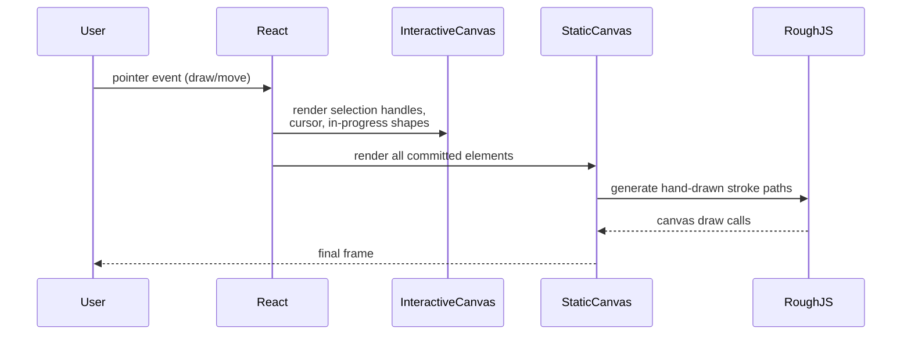
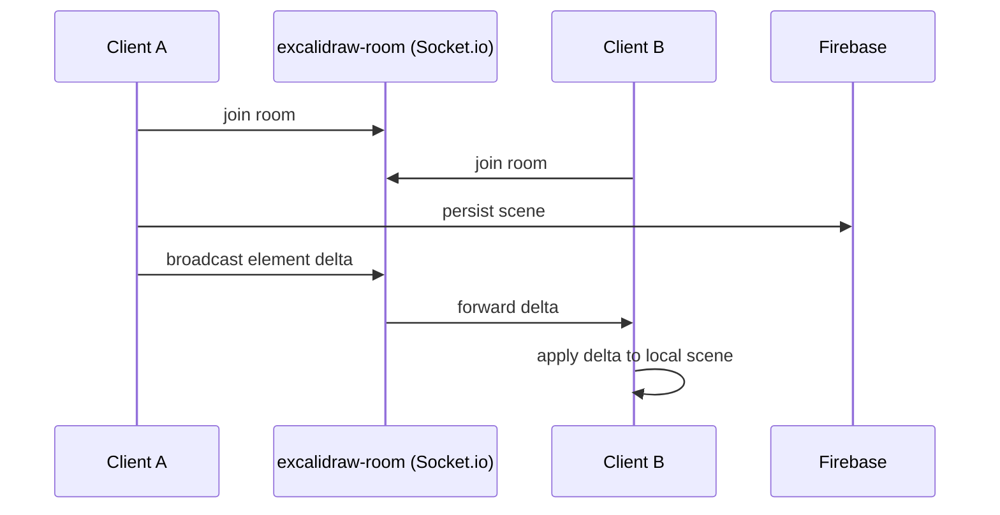
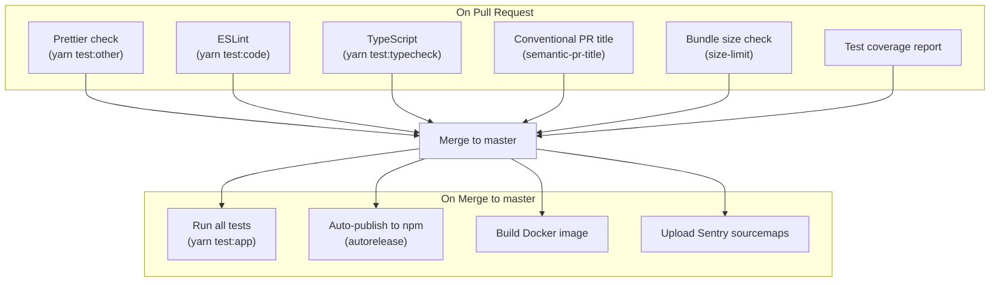

# Excalidraw Developer Onboarding Guide

Welcome to the Excalidraw team! This document will get you from zero to productive as quickly as possible.

---

## Table of Contents

1. [What is Excalidraw?](#what-is-excalidraw)
2. [Repository Overview](#repository-overview)
3. [Architecture](#architecture)
4. [Package Reference](#package-reference)
5. [Development Setup](#development-setup)
6. [Development Workflow](#development-workflow)
7. [Testing](#testing)
8. [Build System](#build-system)
9. [State Management](#state-management)
10. [Rendering Pipeline](#rendering-pipeline)
11. [Key Concepts](#key-concepts)
12. [CI/CD Pipeline](#cicd-pipeline)
13. [Common Tasks](#common-tasks)

---

## What is Excalidraw?

Excalidraw is an open-source virtual whiteboard for sketching hand-drawn-like diagrams. It has two main forms:

- **The Library** (`@excalidraw/excalidraw`) — a React component published to npm, embeddable in any application
- **The App** (excalidraw.com) — the full-featured web application built on top of the library, with real-time collaboration, Firebase storage, and sharing

---

## Repository Overview

The project is a **Yarn monorepo** with the following top-level layout:

```
excalidraw/
├── packages/               # Core npm packages
│   ├── excalidraw/         # Main React library (@excalidraw/excalidraw)
│   ├── common/             # Shared utilities (@excalidraw/common)
│   ├── element/            # Element logic (@excalidraw/element)
│   ├── math/               # 2D geometry (@excalidraw/math)
│   └── utils/              # Export utilities (@excalidraw/utils)
├── excalidraw-app/         # The web application (excalidraw.com)
├── examples/               # Integration examples
│   ├── with-nextjs/
│   └── with-script-in-browser/
├── scripts/                # Build and release scripts
├── dev-docs/               # Developer documentation
├── public/                 # Static assets
├── .github/workflows/      # CI/CD pipelines
└── firebase-project/       # Firebase config
```

### Workspace Structure

```mermaid
graph TD
    A[Root Workspace] --> B[packages/*]
    A --> C[excalidraw-app]
    A --> D[examples/*]
    B --> E[@excalidraw/common]
    B --> F[@excalidraw/math]
    B --> G[@excalidraw/element]
    B --> H[@excalidraw/excalidraw]
    B --> I[@excalidraw/utils]
```

---

## Architecture

### Package Dependency Graph

Packages form a strict dependency hierarchy. **Never create circular dependencies.**



### High-Level Application Architecture



---

## Package Reference

### `@excalidraw/common`

Shared utilities and constants used by all other packages.

| File | Purpose |
|------|---------|
| `constants.ts` | App-wide constant values |
| `colors.ts` | Color palette and manipulation |
| `utils.ts` | General-purpose utilities |
| `appEventBus.ts` | Cross-component event bus |

### `@excalidraw/math`

Pure 2D geometry — no DOM, no React, no side effects.

| Module | Purpose |
|--------|---------|
| `point.ts` | Point type and operations |
| `vector.ts` | Vector math |
| `line.ts`, `segment.ts` | Line and segment geometry |
| `curve.ts` | Bezier curve math |
| `angle.ts` | Angle and rotation |
| `polygon.ts`, `rectangle.ts`, `ellipse.ts` | Shape geometry |

### `@excalidraw/element`

All element-level logic: creation, mutation, binding, selection, rendering.

| File | Purpose |
|------|---------|
| `newElement.ts` | Factory functions for creating elements |
| `mutateElement.ts` | Immutable-style element mutation |
| `bounds.ts` | Bounding box calculations |
| `collision.ts` | Hit-testing and collision detection |
| `binding.ts` | Arrow-to-shape binding logic |
| `elbowArrow.ts` | Smart elbow arrow routing |
| `textElement.ts` | Text measurement and wrapping |
| `resizeElements.ts` | Resize and transform logic |
| `selection.ts` | Selection state and operations |
| `groups.ts` | Grouping elements |
| `zindex.ts` | Layer ordering |
| `Scene.ts` | In-memory scene graph |

### `@excalidraw/excalidraw` (Main Library)

The heart of the project. Key areas:

```
packages/excalidraw/src/
├── index.tsx               # Public API exports
├── App.tsx                 # Main component (~10k lines)
├── types.ts                # All TypeScript types
├── appState.ts             # AppState shape and defaults
├── history.ts              # Undo/redo
├── actions/                # 46 user-facing actions
├── components/             # React UI components
├── renderer/               # Canvas rendering
├── scene/                  # Scene compositing
├── data/                   # Serialization & persistence
├── fonts/                  # Font loading & subsetting
├── locales/                # 70+ i18n JSON files
├── hooks/                  # Custom React hooks
├── eraser/                 # Eraser tool
├── lasso/                  # Lasso selection
└── wysiwyg/                # Inline text editor
```

### `@excalidraw/utils`

Export utilities: convert scenes to PNG, SVG, and other formats.

### `excalidraw-app`

The full web app. Adds on top of the library:

| Directory | Purpose |
|-----------|---------|
| `collab/` | WebSocket real-time collaboration |
| `share/` | URL-based sharing and link generation |
| `components/` | App-specific UI (menus, dialogs) |
| `data/` | IndexedDB persistence |
| `app-language/` | Language detection and loading |

---

## Development Setup

### Prerequisites

- **Node.js** >= 18.0.0
- **Yarn** 1.22.x (`npm install -g yarn`)

### First-Time Setup

```bash
# Clone the repository
git clone https://github.com/excalidraw/excalidraw.git
cd excalidraw

# Install all dependencies (all workspaces)
yarn install

# Start the development server
yarn start
# App runs at http://localhost:3001
```

### Environment Variables

The app uses Vite env variables. Defaults are in `.env.development`:

| Variable | Purpose |
|----------|---------|
| `VITE_APP_BACKEND_V2_GET_URL` | Backend API for scene loading |
| `VITE_APP_WS_SERVER_URL` | WebSocket server for collaboration |
| `VITE_APP_AI_BACKEND` | AI features backend |
| `VITE_APP_PORT` | Dev server port (default: 3001) |
| `VITE_APP_ENABLE_TRACKING` | Enable analytics |

For local overrides, create `.env.development.local` (git-ignored).

---

## Development Workflow

### Where to Make Changes



### Typical Feature Flow

1. **Identify the layer** — use the decision tree above
2. **Read existing code** before writing new code
3. **Write or update tests** for your change
4. **Run the linter and type checker** before committing
5. **Run tests** — `yarn test:update`
6. **Open a PR** with a conventional commit title (e.g. `feat(editor): add snap to grid`)

### Commit Message Convention

```
<type>(<scope>): <description>

Types: feat, fix, refactor, test, docs, chore, perf
Scope: editor, element, math, collab, app, export, ...

Examples:
  feat(editor): add snap to objects
  fix(element): correct rotated arrow binding point
  perf(renderer): reduce redraws on pointer move
```

---

## Testing

### Test Stack

- **Runner**: Vitest v3
- **Environment**: jsdom (simulated browser DOM)
- **Mocks**: Canvas mocked via `vitest-canvas-mock`
- **Snapshots**: Vitest snapshot testing

### Test Locations

```
packages/excalidraw/tests/    # Main component and integration tests
packages/element/src/__tests__/ # Element logic unit tests
packages/math/src/__tests__/   # Math utility tests
packages/common/src/           # Common util tests (co-located)
excalidraw-app/tests/          # App-level integration tests
```

### Test Commands

```bash
yarn test:app          # Run all tests
yarn test:app --watch  # Watch mode during development
yarn test:update       # Run tests AND update snapshots (use before committing)
yarn test:coverage     # Generate coverage report
yarn test:ui           # Open interactive Vitest UI
```

### Quality Checks

```bash
yarn test:typecheck    # TypeScript type checking
yarn test:code         # ESLint
yarn test:other        # Prettier formatting
yarn test:all          # Run everything (what CI runs)
yarn fix               # Auto-fix all formatting and lint issues
```

### Coverage Thresholds

| Metric | Minimum |
|--------|---------|
| Lines | 60% |
| Branches | 70% |
| Functions | 63% |
| Statements | 60% |

---

## Build System

### Tools

| Layer | Tool |
|-------|------|
| Web App | Vite + Rollup |
| npm Packages | esbuild + Sass |
| Type generation | TypeScript compiler (`tsc`) |

### Build Order

Packages must be built in dependency order:



```bash
# Build everything in order
yarn build:packages    # builds common → math → element → excalidraw
yarn build:app         # builds the web application
```

### Package Build Output

Each package outputs to `dist/`:

```
packages/excalidraw/dist/
├── dev/      # Unminified with sourcemaps (development)
├── prod/     # Minified (production)
└── types/    # TypeScript .d.ts declarations
```

---

## State Management

Excalidraw uses a hybrid state model:



### Key Types

- **`AppState`** — everything about the editor UI: active tool, zoom level, scroll position, selected elements, etc.
- **`ExcalidrawElement`** — the base type for all drawn elements (rectangles, arrows, text, etc.)
- **`ExcalidrawImperativeAPI`** — the programmatic API surface exposed to host applications via `useExcalidrawAPI()`

---

## Rendering Pipeline

Excalidraw uses **two separate canvases** layered on top of each other:



- **Static Canvas** — renders all committed elements. Redrawn only when elements change. Produces the "hand-drawn" look via [Rough.js](https://roughjs.com/).
- **Interactive Canvas** — renders selection handles, resize handles, the element being currently drawn, and cursor effects. Updates on every pointer move.

This split is critical for performance: moving the cursor does not re-render every element.

---

## Key Concepts

### Elements

Every object on the canvas is an `ExcalidrawElement`. All elements share:

```typescript
{
  id: string,            // Unique stable ID
  type: string,          // "rectangle" | "ellipse" | "arrow" | "text" | ...
  x: number, y: number,  // Position (top-left)
  width: number, height: number,
  angle: number,         // Rotation in radians
  strokeColor: string,
  backgroundColor: string,
  roughness: number,     // 0=smooth, 3=very rough
  opacity: number,
  isDeleted: boolean,    // Soft delete (kept for collab sync)
  version: number,       // Incremented on every change (for sync)
  ...
}
```

**Elements are immutable** — always use `mutateElement()` rather than direct assignment, which ensures version tracking and scene invalidation.

### Actions

User actions (duplicate, align, change color, etc.) are registered in `packages/excalidraw/src/actions/`. Each action:

1. Has a `name`
2. Optionally renders a UI panel (`PanelComponent`)
3. Has a `perform` function that receives `elements`, `appState`, and `app` and returns updated state

This decoupled pattern keeps `App.tsx` from growing unbounded with one-off handler code.

### Collaboration Model



Real-time sync goes over Socket.io (room server). Long-term persistence goes to Firebase. The client reconciles incoming deltas using element `version` numbers to resolve conflicts.

---

## CI/CD Pipeline



### Pre-commit Hooks

Husky runs `lint-staged` automatically before each commit:
- **`*.{js,ts,tsx}`** → ESLint `--fix`
- **`*.{css,scss,json,md,html,yml}`** → Prettier `--write`

You should never need to fix lint issues manually — just commit and the hook fixes them.

---

## Common Tasks

### Add a New Element Type

1. Define the type in `packages/excalidraw/src/types.ts`
2. Add factory in `packages/element/src/newElement.ts`
3. Add rendering logic in `packages/element/src/renderElement.ts`
4. Add bounds calculation in `packages/element/src/bounds.ts`
5. Register the tool in `App.tsx` and the toolbar

### Add a New Action

1. Create a file in `packages/excalidraw/src/actions/`
2. Implement `register()` with `name`, `perform`, and optionally `PanelComponent`
3. Register it in `packages/excalidraw/src/actions/manager.ts`

### Add a New Translation String

1. Add the key and English text to `packages/excalidraw/src/locales/en.json`
2. Run the locales coverage check: `yarn test:locales`
3. Other languages will show the English fallback until translators update them

### Debug Rendering Issues

The two-canvas architecture means:
- **Visual glitch on static elements** → look at `renderer/renderElement.ts` and the static scene
- **Handle/cursor issue** → look at `renderer/renderInteractiveScene.ts`
- **Layout/bounds wrong** → look at `packages/element/src/bounds.ts`

### Run a Single Test File

```bash
yarn test:app packages/excalidraw/tests/your-test.test.tsx
```

### Check Bundle Size Impact

```bash
cd packages/excalidraw
yarn size-limit
```

---

## Getting Help

- **Dev docs**: `dev-docs/` in this repository
- **GitHub Issues**: for bug reports and feature discussions
- **PR Reviews**: all PRs require at least one approval before merge
- **Conventional Commits**: PR titles are validated — use `feat:`, `fix:`, `refactor:`, etc.

Good luck, and welcome to the team!
