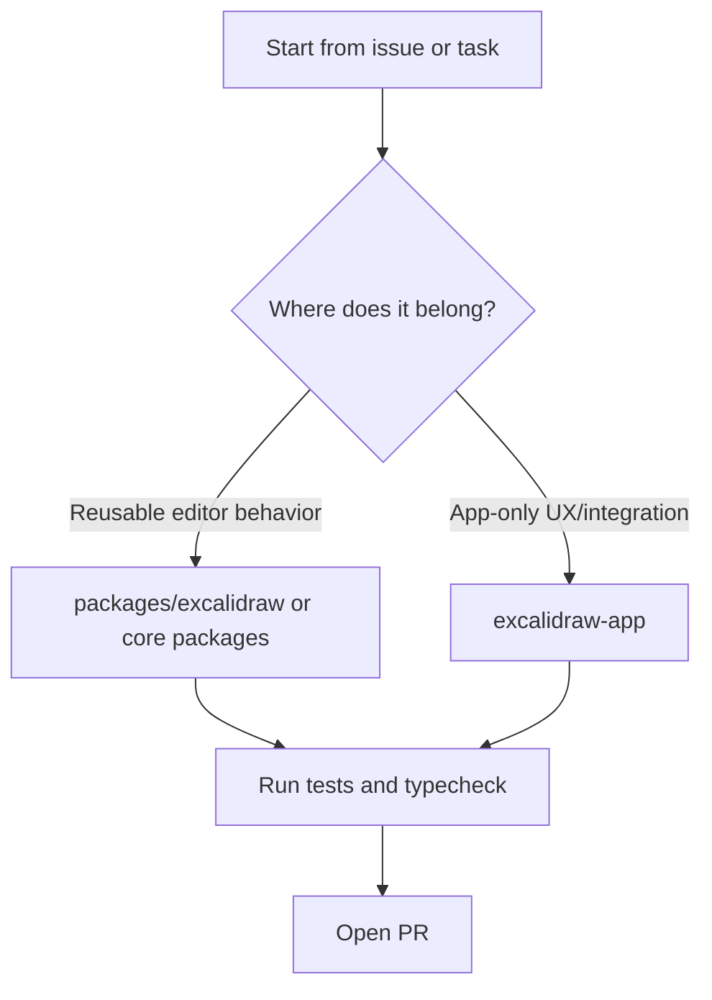

# Onboarding for New Engineers

This guide helps new employees become productive in the Excalidraw monorepo quickly, with practical setup steps, codebase orientation, and a suggested first-week path.

## What You Are Working In

Excalidraw uses a monorepo with two main product surfaces:

- `packages/excalidraw/` - the published React package `@excalidraw/excalidraw`.
- `excalidraw-app/` - the full web app (the code that powers excalidraw.com).

Supporting packages used by the editor live in `packages/`:

- `@excalidraw/common`
- `@excalidraw/element`
- `@excalidraw/math`
- `@excalidraw/utils`

```text
excalidraw/
|- excalidraw-app/            # product app
|- packages/
|  |- excalidraw/             # npm package
|  |- common/
|  |- element/
|  |- math/
|  `- utils/
|- dev-docs/                  # this documentation site
`- examples/                  # integration examples
```

## Architecture At A Glance

```mermaid
flowchart LR
  A[Excalidraw App<br/>excalidraw-app] --> B[@excalidraw/excalidraw]
  B --> C[@excalidraw/element]
  B --> D[@excalidraw/common]
  B --> E[@excalidraw/math]
  B --> F[@excalidraw/utils]
  G[Examples] --> B
```

Use this mental model:

- If it is app-specific behavior, investigate `excalidraw-app/`.
- If it should be reusable by consumers, implement in `packages/excalidraw/` or a core package.

## Local Setup

### Prerequisites

- Node.js
- Yarn (workspace-aware)
- Git

### One-time setup

```bash
git clone https://github.com/excalidraw/excalidraw.git
cd excalidraw
yarn
```

### Start development

```bash
yarn start
```

Then open `http://localhost:3000`.

## Daily Development Workflow

1. Pull latest changes and sync your branch.
1. Run the app with `yarn start`.
1. Make a focused change in the appropriate package/app area.
1. Run quality gates before opening a PR:
   - `yarn test:typecheck`
   - `yarn test:update`
   - `yarn fix` (if needed)

## Typical Change Routing



## First Week Ramp-Up Plan

### Day 1

- Complete local setup and run `yarn start`.
- Read `introduction/development` and `introduction/contributing`.
- Skim root `README.md` for product context.

### Day 2-3

- Pick a small issue (or shadow one) and trace code path from UI to data model.
- Make a small documentation or bugfix PR to validate workflow end-to-end.

### Day 4-5

- Implement one scoped change with tests.
- Request review early, incorporate feedback, and document what you learned.

## Collaboration and Expectations

- Prefer small, reviewable PRs over large batches.
- Include tests for bug fixes and non-trivial features.
- Ask for early alignment when changing shared editor behavior.
- Keep docs updated when behavior or APIs change.

## Debugging and Validation Checklist

Before requesting review, verify:

- [ ] App runs locally (`yarn start`).
- [ ] Type checks pass (`yarn test:typecheck`).
- [ ] Tests and snapshots are updated (`yarn test:update`).
- [ ] Formatting/lint checks are clean (`yarn fix` as needed).
- [ ] Manual smoke test of changed behavior in browser.

## Useful Pointers

- Development guide: `/docs/introduction/development`
- Contribution guide: `/docs/introduction/contributing`
- Package docs: `/docs/@excalidraw/excalidraw/installation`
- Mermaid parser docs: `/docs/@excalidraw/mermaid-to-excalidraw/installation`
